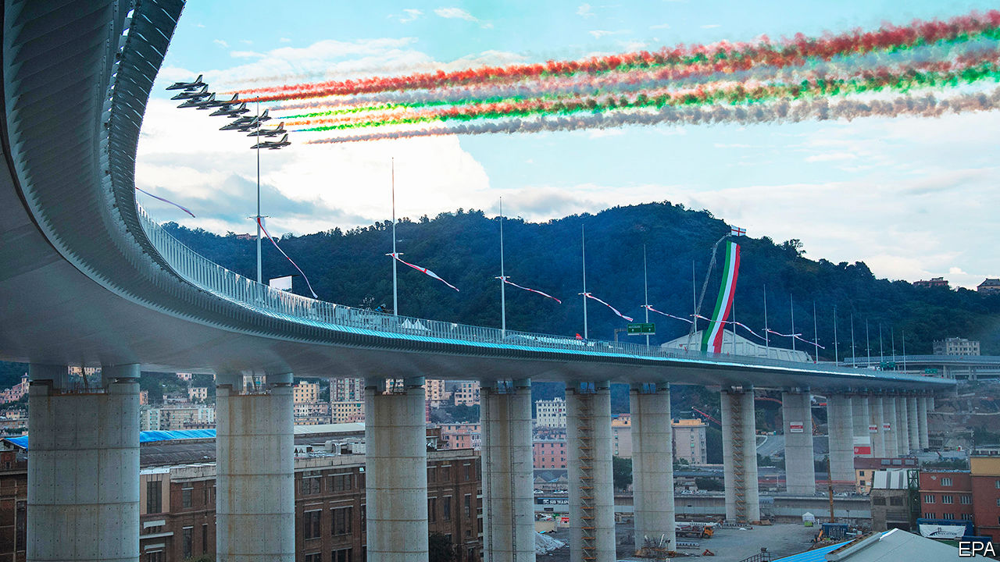

## Open again

# Genoa bridge reopens

> Aug 8th 2020

JUST TWO YEARS after its famous bridge suddenly collapsed, killing 43 people, the Italian city of Genoa inaugurated a sleek new replacement in the presence of the country’s president and prime minister, as well as an air-force flypast. The feat of engineering was impressive. But many of the victims’ relatives stayed away, objecting that the tragedy had been turned into a carnival.■

## URL

https://www.economist.com/europe/2020/08/08/genoa-bridge-reopens
