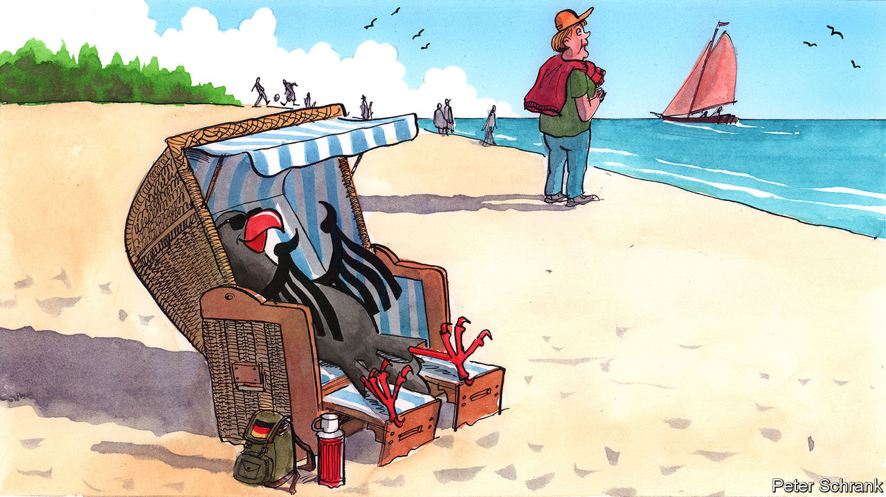

## Charlemagne

# Germans learn to love the staycation

> Thanks to covid-19, the traditional German holiday looks very different this summer

> Aug 8th 2020

GERMANS HAVE long dreaded the prospect of a European “transfer union” that would hand their hard-earned money to poorer southerners. Yet every summer they are happy to do the job themselves, travelling in their millions, and spending in their billions, to Spain, Italy, Greece and Portugal. Germans account for roughly one in every four euros dished out by European tourists. More than anyone else, it is their absence that the deserted hotels, bars and restaurants of Europe’s south have felt most acutely this summer.

Such were the thoughts that came idly to Charlemagne as he bobbed gently in the Baltic Sea this week. (Not quite as cold as you might imagine, although he didn’t linger.) A brief stay in Rügen, a resort island off Germany’s north-east coast, was enough to witness the other side of the devastation that the coronavirus has visited upon the tourist industries of southern Europe. For Germany’s holiday hotspots—the coasts, Bavaria’s mountain hideaways, the Black Forest—are booming, happily lapping up much of the displaced German tourist spend. The influx has been “extreme”, says Mario Jacobs, who runs a fish restaurant in Stralsund, a handsome town near Rügen, and can’t quite seem to decide whether the extra business is worth the extra work. Hordes of day-trippers to the North Sea coast have forced officials to impose temporary mask-wearing orders and beach closures.

In fact a good summer and, with luck, a strong autumn will hardly make up for a spring in which, like almost every other part of the economy, Germany’s resorts shuttered and furloughed their workers. Even now second-tier sites, like the Eifel region or the Harz mountains in central Germany, are struggling to attract enough locals to replace the lost foreign trade. One-third of the country plans to take no holiday at all. This is no small disruption for a place that takes its pleasure as seriously as Germany.

For many Italians, Spaniards, French folk and Greeks, holidaying anywhere other than in their home country seems perverse. By contrast, young Germans who choose to do so “might come across as a little bit backward,” says Sina Fabian, a historian at Humboldt University. “We can also do GERMANY!” is the slightly desperate motto adopted by one travel agency. If Germans took to foreign travel a little later than the British, they eventually did so with the zeal of the convert, aided by the mighty Deutschmark and some of Europe’s most generous holiday allowances: by 1968 half the West German population went abroad at least once a year. The ritual of the sun-soaked southern-Europe sojourn, traceable to Goethe’s romantic journeying in Italy, was later immortalised in Schlager songs like Udo Jürgens’s “Urlaub im Süden” (“Holiday in the South”). In 1993, when a politician said that Germany might as well buy Majorca for 50m marks, not everyone was sure he was joking.

Yet in truth Germans were starting to warm to the wonders of their own land even before covid-19, notes Hasso Spode at Berlin’s Technical University. They may travel abroad more than other folk, but trips in Germany far outnumber those to anywhere else: a quarter of Germans’ holidays last year were spent at home. The secret of Rügen, at least among Germans (foreigners, bar the odd Scandinavian, are as rare as hens’ teeth), is long out. Mile-long traffic jams and overcrowded beaches are features of every high season. Despite patchy infrastructure, and its distance from most of Germany’s big population centres, Mecklenburg-West Pomerania, the state through which most of Germany’s Baltic littoral runs, has been the country’s most popular holiday destination for years.

And why not? The virtues of the domestic holiday are much underrated, in Germany and other northern European destinations. True, Germany may not carry the languid allure of the Mediterranean, and even the geniuses that staff its tourist agencies can do nothing about its climate (mild sunburn testifies to Charlemagne’s luck in Rügen). Stepping off the train in Stralsund, this columnist admits his heart sank to see the same döner stands and strawberry kiosks he had left behind three hours earlier in Berlin.

But such trifles are surely outweighed by the advantages. More often than not the hunt for authenticity abroad results in difference-splitting compromise or, worse, surrender to tourist traps. At home the scams are easier to spot. For people-watchers the daily human comedy is enriched when conducted in a language one understands. Sightseeing becomes an investigation of one’s own national story. Just north of the beach that hosted Charlemagne’s inquiries sits a vast strength-through-joy holiday complex left unfinished by the Nazis, a jarring contrast to the innocent pleasures of the seaside resorts. And even changeable weather conceals a thrill: how much more enticing the warmth of the sun when one knows it might disappear at any moment.

Creatures of habit at the best of times, Germans have struggled to adapt to the disruption. Tourist officials in Rügen describe first-time visitors used to all-in-one package trips unfamiliar with the idea of following a map or booking a restaurant. But the island is practised at diversifying its offerings, retaining a nostalgic appeal to older east Germans who recall the communist beach holidays of their youth while reaching out to richer greenhorns. Local officials, of course, welcome the custom. “Normally you spend a lot on marketing, and this year it came for free!” exclaims one.

Yet the shift is unlikely to be permanent, reckons Ms Fabian. Previous catastrophes have not bucked long-term trends in travel habits. A good thing for southern Europeans, for whom coronavirus has delivered a vicious one-two: domestic lockdown followed by evaporating tourism. Indeed, it was hair-raising forecasts of economic collapse in Italy and Spain that recently convinced Rügen’s MP, one Angela Merkel, to consent to large-scale common EU borrowing and redistribution for the first time. Precisely because Germany’s tourists are not spending in Europe’s south this summer, its taxpayers are preparing to do just that. ■

Editor’s note: Some of our covid-19 coverage is free for readers of The Economist Today, our daily [newsletter](https://www.economist.com/https://my.economist.com/user#newsletter). For more stories and our pandemic tracker, see our [hub](https://www.economist.com//news/2020/03/11/the-economists-coverage-of-the-coronavirus)

## URL

https://www.economist.com/europe/2020/08/08/germans-learn-to-love-the-staycation
