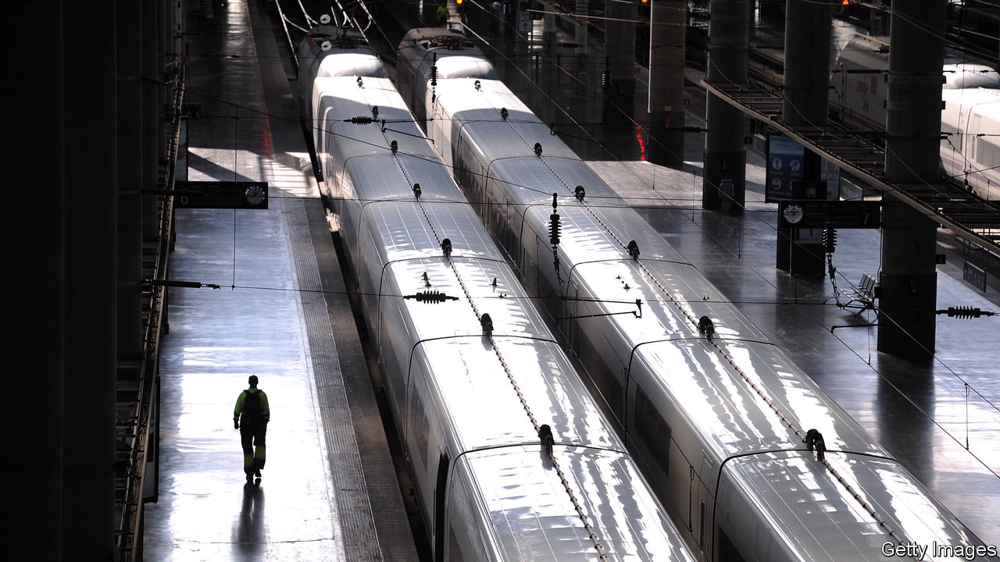

## The signal turns to red

# Spain’s high-speed trains are poor value

> Yet more are planned

> Aug 8th 2020MADRID

ATOCHA STATION in Madrid is a daily marvel. From its platforms a phalanx of sleek white high-speed trains, known as AVEs, streak across Spain. Punctual and comfortable, they have slashed journey times in a large and mountainous country long notorious for poor transport. For Spaniards, they are an icon of modernity. But many are not worth the money spent on them, says a new report by the independent fiscal authority (AIREF from its Spanish initials).

Over the past three decades Spain has poured money into transport infrastructure, including motorways and airports as well as AVEs. It now has 3,086km (1,929 miles) of high-speed rail lines (over 250km per hour), second only to China. Passenger numbers have almost doubled in the past decade, as the AVEs have grabbed business from domestic flights. Even so, per kilometre of track, there are less than a third as many as in France.

The network has cost €61bn ($72bn) so far. AIREF has now done the first thorough cost-benefit study of the trains. It finds that the benefits, including to the environment, are less than the total cost, though it thinks that could eventually change for the lines from Madrid to Seville and to Barcelona. But there are plans for a further 5,654km of high-speed lines, at a cost of at least €73bn. Far better, says AIREF, to invest in neglected commuter networks, which carry 89% of rail users. It urges the setting up of an independent agency to set transport priorities and evaluate projects.

The Socialist-led government broadly welcomed the report. It may find it hard to implement. One problem is that some of the pending lines are half-built, such as those to Galicia and in the Basque Country. It may make sense to finish them. “The important thing is to stop new lines starting,” says Ángel de la Fuente of Fedea, a think-tank. Since they would serve less-populated areas, they would have even fewer passengers.

Places that lack high-speed trains understandably feel left out. Take Extremadura, the poorest region of mainland Spain: ancient diesels take six hours to cover the 400km between Madrid and Badajoz. The covid-19 crisis means that money will be especially tight. But Spain’s Congress is more fragmented than ever. That means that the price of a vital vote is sometimes the promise of yet another high-speed track.

## URL

https://www.economist.com/europe/2020/08/08/spains-high-speed-trains-are-poor-value
