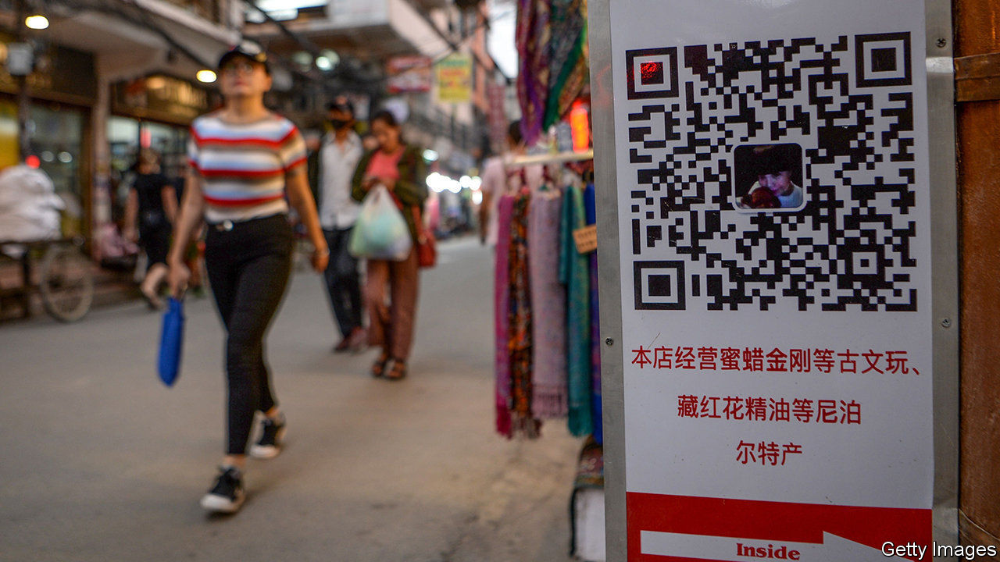
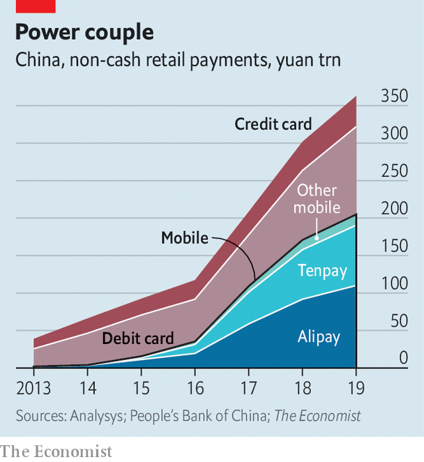

## A dynamic duopoly

# Do Alipay and Tenpay misuse their market power?

> Both dominate payments in China

> Aug 8th 2020SHANGHAI

“LET THE users decide who wins the game, not monopoly and power.” So said Jack Ma in 2014 when Alipay, the slick payment service he created, came under attack from China’s lumbering state-owned banks. Six years on, the users have decided, and Alipay and its rival, Tenpay, known mainly for WeChat Pay, have won. There is little question that they constitute a duopoly. Alipay has a 54% share and Tenpay 39% of the Chinese mobile-payments market by value, according to Analysys, a research firm. And mobile today accounts for more than half of all non-cash retail payments in China (see chart).

Not surprisingly, then, the former upstarts now face questions about their own power. According to Reuters, the central bank accuses them of misusing their dominance to limit competition. It reported on July 31st that the government’s antitrust committee is considering whether to investigate them, though has yet to make a final decision.

Alipay and Tenpay are sure to feel aggrieved about such scrutiny. In their view, their path to success was paved not with anti-competitive behaviour but with convenience and performance. Alipay began as a service for shoppers on Alibaba, China’s biggest e-commerce platform. WeChat Pay is an outgrowth of WeChat, the country’s main messaging app. They migrated offline by enabling people to pay in shops by scanning QR codes with their phones.

Seen as safe and reliable, they have earned the trust of merchants and shoppers. And as with much in the world of the internet, they have benefited from network effects: anyone who wants to make or take digital payments has little choice but to use Alipay or WeChat, or typically both, because just about everyone else does.

Given this dominance, there is potential for misuse. A rough parallel exists in rich countries, where Visa and Mastercard are the main platforms for processing card payments. These have faced antitrust lawsuits in America, Britain and Europe.

Alipay and Tenpay have acted in some ways that look anti-competitive, though typically by taking aim at each other. Within WeChat, for instance, it is impossible to open hyperlinks for products on Alibaba’s main shopping site. And on Alibaba you cannot make payments with Tenpay.

Yet for the financial system as a whole, Alipay and Tenpay have enhanced competition, not stifled it. As recently as a decade ago banking in China was a tortuous business, requiring heaps of paperwork and long queues. The digital duo dragged banks into the online era. They also offered users easy access to money-market products that allowed them to get better returns than available from banks.

More narrowly, they have improved the landscape for payments. Their underlying technology is simple, requiring just a smartphone. Even the humblest of fruit vendors can now accept non-cash payments. They have also lowered costs. They charge merchants fees of about 0.6% on transactions, down from the previous norm of roughly 1% on debit-card swipes.

Regulators have already put roadblocks in front of Alipay and Tenpay. The central bank limited the size of payments they can handle. It required that they hold customer funds in a zero-interest reserve account, denting their profitability. And it created a centralised clearing platform, NetsUnion, which Alipay and Tenpay must use, depriving them of exclusive transaction data.

Some in the payments industry see another possible explanation for an antitrust investigation. UnionPay, a state-owned firm, used to be the only show in town for handling card payments in China. As the market has evolved it has struggled to keep up with Alipay and Tenpay, and remains a bit player in mobile. Many in UnionPay’s upper ranks, including its departing chief executive, are former central-bank officials. This raises questions about the central bank’s impartiality when regulating UnionPay’s competitors.

The timing of the mooted investigation is also curious. The report came less than two weeks after Ant Group, which controls Alipay, announced plans for a long-awaited initial public offering, which could raise as much as $30bn, making it the world’s biggest-ever share sale. Perhaps someone wanted to spoil the party. If nothing else, a probe would serve as a reminder that China’s government keeps its tech champions on a short leash. ■

## URL

https://www.economist.com/finance-and-economics/2020/08/08/do-alipay-and-tenpay-misuse-their-market-power
