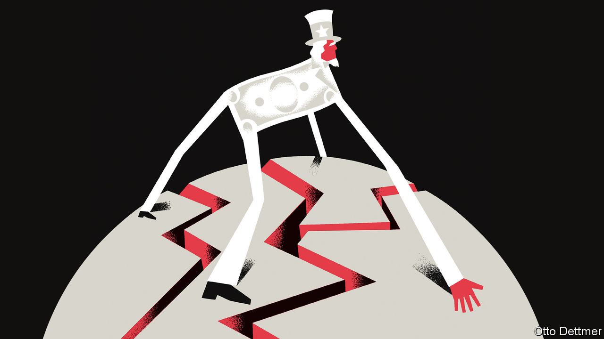

## Free exchange

# Dollar dominance is as secure as American global leadership

> The currency’s wobbles have fed fears that a reckoning looms for the world’s economic hegemon

> Aug 8th 2020

IT HAS BEEN an ugly summer for America and the dollar. The greenback fell by more than 4% against a basket of other major currencies in July, the largest monthly decline in a decade, as the value of euros, gold and even bitcoin soared. In a year packed with extreme market movements, the dollar’s wobbles might seem unimpressive. As they played out against a backdrop of American turmoil, though, they have fed fears that a reckoning looms for the world’s economic hegemon. An abysmal response to the pandemic, a stuttering economic recovery and soaring debt understandably contribute to concern about America’s economic wherewithal. But if there is reason to question the dollar’s dominance, it is not that America is becoming less economically mighty, but that the world order it built looks increasingly vulnerable.

Reserve-currency status is often cast as a matter of economic fundamentals. A reserve-currency issuer should play an outsize role in global trade, which encourages partners to draw up contracts in its currency. A historical role as a global creditor helps to expand use of the currency and encourage its accumulation in reserves. A history of monetary stability matters, too, as do deep and open financial markets. America exhibits these attributes less than it used to. Its share of global output and trade has fallen, and today China is the world’s leading exporter. America long ago ceased to be a net creditor to the rest of the world—its net international investment position is deeply negative. Soaring public debt and dysfunctional government sow doubt in corners of the financial world that the dollar is a smart long-run bet. And whispers, suggesting that the day of the dollar’s eclipse by the euro or the yuan looms, grow louder from time to time.

Debates about a changing of the guard are hampered by a dearth of historical comparisons. The replacement of one currency by another as the modern world’s monetary bulwark has occurred precisely once—when the dollar overtook sterling. That makes identifying its critical causal factors nearly impossible. Economists once thought that network effects made reserve-currency status a winner-take-all affair. It is more attractive to conduct trade or hold savings in a currency that is widely used by others, giving reserve currencies an edge over challengers. That America’s output overtook Britain’s as early as 1880, while the dollar did not clearly dominate until enshrined in the Bretton Woods economic institutions more than 60 years later, seemed to prove that dominant currencies are not easily dislodged. But accumulating evidence suggests a revision of these views may be warranted. In practice, leading currencies often share a reserve role with others. Sterling ruled the roost before the first world war, but still accounted for no more than two-thirds of global currency reserves at the end of the 19th century (German marks and French francs made up most of the rest). Furthermore, the dollar overtook sterling much earlier than once thought. By the early 1920s it already accounted for at least 50% of major economies’ foreign-currency reserves. Reserve-currency status may not be so unassailable after all.

Even so, challengers have for decades failed to knock the greenback from its perch. Part of the explanation is surely that America is not as weak relative to its rivals as often assumed. American politics are dysfunctional, but an often-fractious euro area and authoritarian China inspire still less confidence. The euro’s members and China are saddled with their own debt problems and potential crisis points. The euro has faced several existential crises in its short life, and China’s financial system is far more closed and opaque than the rich-world norm.

Dollar dominance also reflects factors that conventional economic analyses sometimes omit: geopolitics. Sterling ruled during a long period of increasing global integration to which Britain—as a financial, industrial and military powerhouse—was central. The first world war brought an end to that era, and sterling soon lost its position. It shared reserve-currency status with the dollar into the 1940s, but under very different circumstances than prevailed in pre-war times; global trade and cross-border investment did not return to the levels of 1913 until the final third of the 20th century. It was not just American economic superiority that put the dollar at the centre of the post-war order, but its unrivalled geopolitical might as well, which it used to reforge an integrated global economy. Work published by Barry Eichengreen of the University of California, Berkeley, and Arnaud Mehl and Livia Chitu of the European Central Bank highlights the role of power politics in currency choice. Analysing reserve holdings before the first world war, the authors find that military alliances influenced the composition of reserves. A pact, they reckon, boosted a currency’s share in an ally’s reserve holdings by 30 percentage points.

So the global role of the dollar does not depend on America’s export prowess and creditworthiness alone, but is bound up in the geopolitical order it has built. Its greatest threat is not the appeal of the euro or yuan, but America’s flagging commitment to the alliances and institutions that fostered peace and globalisation for more than 70 years. Though still unlikely, a collapse in this order looks ever less far-fetched. Even before the pandemic, President Donald Trump’s economic nationalism had undercut openness and alienated allies. Covid-19 has further strained global co-operation. The IMF thinks world trade could fall by 12% this year. Supply chains that sprawl across national borders may retreat amid concerns about economic conflict and national security. America and China seem to be sliding into a new cold war.

Though America’s economic role in the world has diminished a little, it is still exceptional. An American-led reconstruction of global trade could secure the dollar’s dominance for years to come. A more fractious and hostile world, instead, could spell the end of the dollar’s privileged position—and of much else besides. ■

## URL

https://www.economist.com/finance-and-economics/2020/08/08/dollar-dominance-is-as-secure-as-american-global-leadership
