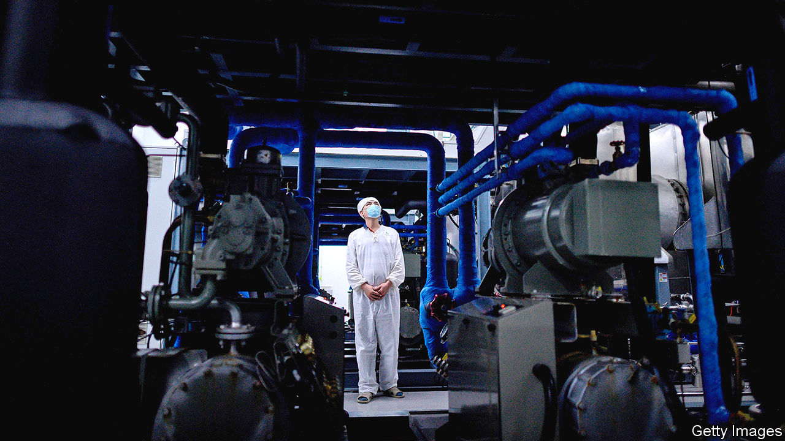
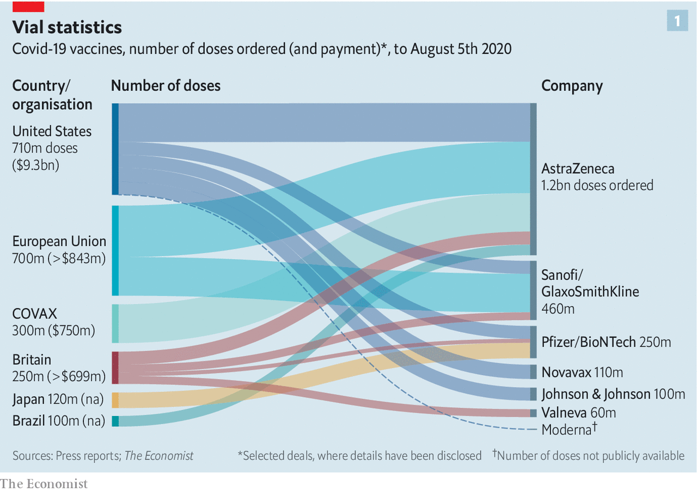
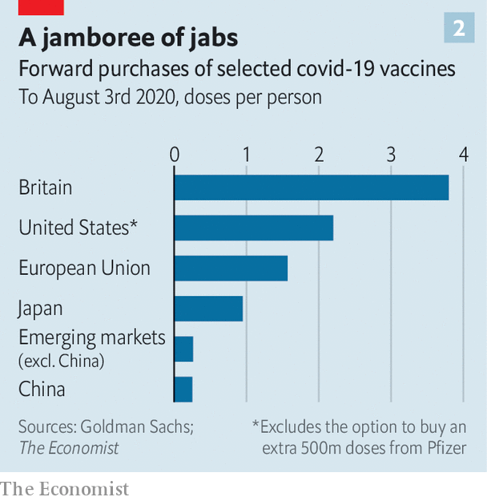

## Jab economics

# Hard questions as scientists and governments seek covid-19 vaccines

> They must work out how much to invest, and how best to distribute the goods

> Aug 8th 2020

Editor’s note: Some of our covid-19 coverage is free for readers of The Economist Today, our daily [newsletter](https://www.economist.com/https://my.economist.com/user#newsletter). For more stories and our pandemic tracker, see our [hub](https://www.economist.com//news/2020/03/11/the-economists-coverage-of-the-coronavirus)

SLOWLY BUT surely the economic costs of the covid-19 pandemic are becoming clear. On July 30th America’s statisticians revealed that the economy shrank by 9.5%, year on year, in the second quarter. Output in the euro zone fell even further. Even South Korea, which has managed the virus better than almost any other country, has not escaped a deep recession.

A vaccine would help end the economic chaos. Scientists and pharmaceutical companies have stepped up to the task. More than 150 vaccines are being developed worldwide, with six in final, large-scale clinical trials. It took the vaccination effort against hepatitis B—the disease for which the most candidate vaccines were developed—decades to make the progress that the attempts against covid-19 have made in months. The public-health and economic costs of the pandemic are such that, even as scientists beaver away, policymakers must grapple with two questions: how much to spend on vaccines, in order to ensure enough are made, and how to ensure they are distributed fairly.

Governments so far have invested more than $10bn in covid-19 vaccines, and made forward purchases of about 4bn doses (though data on deals are murky). As the vaccines may require a course of two doses, in theory this amount could inoculate the world’s most vulnerable people. In fact, effectiveness is far from assured, so a large share of purchases could turn out to be duds. A typical vaccine in final trials has a 20% chance of failure. Some of the candidate covid-19 vaccines involve novel technologies, so the risk of failure could be higher. That explains why rich countries are backing several efforts, with deals being signed every few days (see chart 1).

Despite the scramble in America and Europe to get to the front of the queue, countries elsewhere are likely to be under-supplied, and for some time. Japan has arranged to buy enough for just one dose per person, according to Goldman Sachs, a bank (see chart 2). On average, emerging markets have secured enough to cover less than a third of their citizens.

GAVI, an alliance that funds vaccines for poor countries, has set up COVAX, a purchasing pool for several late-stage vaccine candidates. It promises participants doses of an effective vaccine for up to 20% of their population by the end of 2021, with rich countries paying for their supplies and funding a kitty for poor ones. About 80 high- and middle-income countries have said they want to join. But it remains to be seen how many put money on the table: they must pay for the first 15% of their vaccines by the end of the month.

Even meeting the commitments they have already made will be a stretch for pharma companies, much less producing enough for the world. Existing manufacturing facilities can be repurposed for some types of jabs. For others, however, new ones must be built. These can cost about half a billion dollars apiece, and typically take three years to get up and running.

A company normally sets up production once a vaccine wins regulatory approval. But these are not normal times. To speed things up, some firms have started mass-producing vaccines that are still in clinical trials. Companies may have promised 4bn doses, but some of their vaccines may not pass trials and will have to be poured away. Many experts think supply will also be constrained by global shortages of things like vials and syringes. They put a more realistic estimate of global supply by the end of next year at nearer 2bn.

As that is nowhere near enough to cover the world, it is easy to imagine fights breaking out once effective vaccines become available. The experience of past pandemics is hardly encouraging on this front. During the H1N1 (swine flu) pandemic in 2009-10 rich countries cornered supplies of the vaccine to fight the disease. Only when they had more than they needed did they offer some of it to poor countries. By then, the disease had swept across the planet and the pandemic was over.

Early in the covid-19 pandemic, too, global co-operation quickly broke down. By late April, 80 jurisdictions had restricted exports, with governments especially keen to hoard supplies of disinfectants, personal protective equipment and thermometers. Some countries even seized shipments passing through their territory.

Fearful of a repeat of such marauding, the Coalition for Epidemic Preparedness Innovations, an alliance of charities and governments that has funded the early development of some of the most promising covid-19 vaccines, has organised manufacturing on several continents. So have some pharma companies.

The World Health Organisation (WHO) is also trying to avert vaccine politics. It has drawn up guidelines for how early supplies should be distributed in order to save the most lives, protect fragile health systems and hasten the end of the pandemic. The first doses would go to health and social-care workers, and the next batch to the 20% of people in each country who are most likely to die from covid-19 if infected. The rest would then go to places with the highest risk of outbreaks. COVAX has signed up to these principles, but there is no indication that countries would respect them in their bilateral deals with drug companies, rather than act in narrow self-interest.

There are slim hopes that America, China or Russia, among others, will allow exports of a vaccine made on their territory before enough is available for all of their citizens. But vaccine manufacturing and distribution involves a complicated global supply chain of raw ingredients, adjuvants (chemicals commonly used to boost potency), vials and so on. In the worst case, countries denied a share of the vaccines could ban exports of such inputs to the hoarding country. Everyone loses.

A global free-for-all, then, seems inevitable. One way to mitigate this would be to spend more. Some economists argue that governments could do more to hurry along vaccine manufacture and distribution. Separate groups of researchers reckon that the world needs to invest around $100bn in order to make several vaccines early and in sufficient quantities. That would be a ten-fold increase in what has been spent. But set against the output lost and the $7trn in stimulus injected into the global economy so far, it is peanuts. ■

## URL

https://www.economist.com/finance-and-economics/2020/08/08/hard-questions-as-scientists-and-governments-seek-covid-19-vaccines
