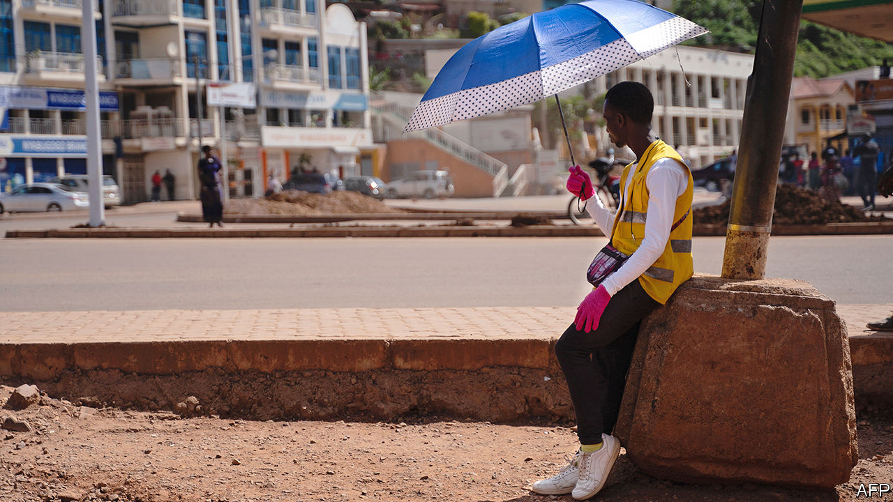
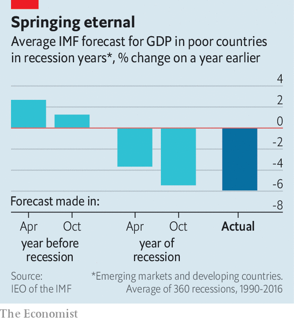

## Abandoning hope

# Official economic forecasts for poor countries are too rosy

> Over-optimism at the IMF and the World Bank can have serious consequences

> Aug 4th 2020

MOST PEOPLE, when presented with bad news, tend to play it down. Even professional economic forecasters are not immune to the temptations of hope. In February more than 500m people in China were experiencing some form of lockdown, and covid-19 had spread to Italy. Yet the IMF said that in its base-case forecast global GDP growth this year would be only 0.1 percentage points lower than previously expected. By April it had cut its forecast by 6.2 percentage points, to -3%. By June it had sawn off another 1.9 percentage points. Just a week later an informal poll of about 40 IMF staff found that two-thirds expected another downward revision in October.

By and large, economic forecasters are a sunny bunch. They rarely predict a downturn. Human nature, incentives and political pressure get in the way. Yet rosy forecasts by theIMF and the World Bank can have serious consequences. That is especially the case in poor countries today, where covid-19 is ravaging economies, and governments, international organisations and investors are using forecasts to guide their decisions.

IMF and World Bank projections can be very influential in some countries. They can affect governments’ spending and borrowing plans. Investors may lend more cheaply to countries expected to grow rapidly. And the forecasts determine whether the fund and the bank think a country’s debt is sustainable, which in turn determines whether it qualifies for a bail-out.

The fund tends to be optimistic. Its one-year-ahead growth forecasts for developing countries in 1990-2016 were, on average, 0.42 percentage points above subsequently published GDP figures. Most of the optimism comes from failing to predict downturns. Even once a recession has begun, forecasters are still slow to accept the news (see chart).

Such errors can drastically change debt dynamics. Take a country expected to have public debt of 50% of GDP in 20 years’ time. If annual economic growth is 0.5 percentage points less than predicted, and nothing else changes, then the debt ratio could instead be 90% of GDP. In a recent study Paul Beaudry of the University of British Columbia and Tim Willems of the IMF even link over-optimism to future fiscal crises. They find that overestimating average annual growth by a percentage point for the next three years, as the IMF does about 40% of the time, reduces growth three years later by a full percentage point. Governments and firms seem to celebrate good forecasts by racking up debt. Trouble sets in.

Predicting growth, and especially downturns, is fiendishly hard. Getting it right is not helped by forecasters having little incentive to spot clouds on the horizon. Analysts fear that gloom could become self-fulfilling. Standing out from the crowd and wrongly calling a recession damages a forecaster’s reputation more than failing to predict one along with everyone else. Then there is “pushback from governments”, says Maurice Obstfeld, who was the fund’s chief economist in 2015-18.

Internal pressure to nudge up forecasts in order to justify a lending package is also “definitely an issue ”, says Mr Obstfeld. A paper by Giang Ho and Paolo Mauro of the fund in 2014 found that forecasts were especially optimistic when countries were just about to enter a programme. The fund’s Independent Evaluation Office (IEO) acknowledges that forecasts tend to be rosy in high-profile bail-outs, but notes that these are usually corrected at the programme’s first review three months later. (By then, of course, the agreement has already been signed.)

Some economists at the fund are more optimistic than others, find Messrs Beaudry and Willems. In poor countries, less experienced economists tend to be less accurate. Although oil and mineral discoveries do not boost growth immediately, IMF forecasters consistently predict that they will, according to research in 2017 by James Cust of the World Bank and David Mihalyi of the Natural Resource Governance Institute, a think-tank.

The fund’s lack of consistency attracts criticism, too. Since the coronavirus pandemic began it has revised down growth in rich countries in 2020 by three percentage points more than that in developing ones. That is odd, argued Justin Sandefur of the Centre for Global Development, another think-tank, and Arvind Subramanian of Ashoka University, in June. Lockdowns and social distancing are at least as severe in poor countries as in rich ones. But fiscal responses have been much weaker, and, as the fund itself has argued, capital outflows and currency pressure are bigger threats. Perhaps, the authors speculate, the fund has been rosier about poorer countries this time in order to avoid having to provide support. TheIMF says that China’s success in containing the virus explains why its forecasts are more positive for developing countries and strongly denies lending influences its growth forecasts.

The other big official forecaster in poor countries is the World Bank. (Private firms, including The Economist’s sister organisation, the Economist Intelligence Unit, also publish forecasts.) Over the past decade, the bank has produced more accurate forecasts for Africa and the Middle East than the fund, but done a worse job for Latin America (though differences are small). Overall, a comparison of the forecasts published by both institutions every January by Prakash Loungani of the IEO suggests that the fund is still better than the bank at predicting downturns in poor countries.

Perhaps people should simply expect less of forecasts, says Mr Obstfeld. They may represent an expectation of the most likely outcome, but the chance of them being bang-on is slim. “You are getting something that is useful,” he argues, but “in general, you are not getting high accuracy.” ■

## URL

https://www.economist.com/finance-and-economics/2020/08/04/official-economic-forecasts-for-poor-countries-are-too-rosy
