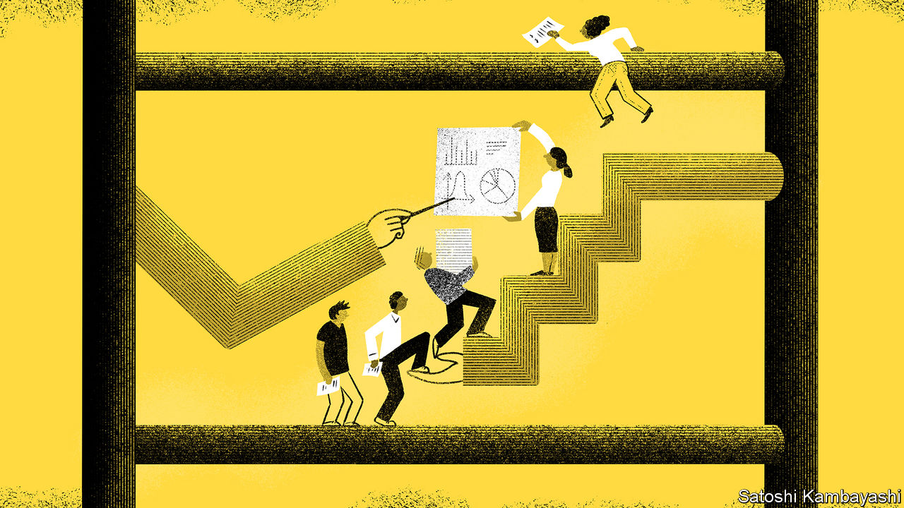

## Selection effects

# What it takes to become an academic economist is changing

> Pre-doctoral programmes are a new rung on the professional ladder

> Aug 8th 2020WASHINGTON, DC

NABBING A TOP academic job in America requires obtaining a PhD, preferably from a good university. That, in turn, requires stellar undergraduate marks, the right maths courses and a glowing letter of recommendation. Increasingly, pre-doctoral programmes, or pre-docs, are serving as a new rung on the professional ladder. These schemes, which typically involve two years of research at a university, are both the cause and consequence of changes in the profession.

Economists have long sought work experience before embarking on a PhD, whether in consultancy, the public sector or finance. But over the past decade or so the nature of the experience has changed. A study by Kevin Bryan of the University of Toronto examined the CVs of sought-after economists, and found that none of those applying for economics jobs in 2013-14 had been research assistants at academic institutions before they began their PhDs, but around a fifth of those graduating in 2017-18 had.

Formal pre-doc programmes have burgeoned, especially in elite universities such as Harvard, Stanford, the University of Chicago and Yale. Participants clean and analyse data, write papers and do administrative tasks. In exchange they may receive free or subsidised classes, a salary in the region of $50,000, potential co-authorship of the papers they work on, and, most prized of all, a letter of recommendation to a top PhD programme.

In part pre-docs show how economic research has changed. “Economics has become more like the sciences in terms of both the methods and the production process,” says Raj Chetty of Harvard, who directs the Opportunity Insights team, a group with a reputation for working its pre-docs hard. When analysing tax records that gave access only to a certain number of people, he switched away from using part-time research assistants to a lab-like team, inspired by his own family of scientists. As bigger data sets, new techniques and generous funding made such collaboration worthwhile, others followed.

Done well, pre-docs enrich both economists and economics. They help produce good research and open up the profession. Peter Henry of New York University started his programme in 2014 to increase the representation of minorities. Camille Gardner, one of his pre-docs, says the experience has persuaded her to pursue a PhD, and taught her skills important for graduate study, such as how to write a good paper. She thinks of Mr Henry as her mentor, “not just my boss”.

There are some concerns, though, that pre-docs leave junior researchers open to exploitation. Academic economists are neither rewarded for good management nor punished for being bullies. Michael Greenstone of the University of Chicago argues that “if you misbehave, it is going to be hard to get people to work for you”. But academic economists, as the profession’s gatekeepers, still hold plenty of power.

Programmes vary widely. Sometimes it is unclear whether pre-docs are students or employees. One pre-doc tells of tensions over the timing of holidays. Another says they were told they would be collaborating with professors, but were then given much less freedom than that implied. Another complains of not being given enough time to take classes.

Others tell of a hyper-competitive work environment, fuelled by some professors ranking pre-docs in their letters of recommendation. More than one tells of being asked to game a statistical test until it showed the results the professor wanted, and of struggling to push back.

Fortunately such experiences do not seem to be common enough to deter many pre-docs from doing PhDs. According to a new survey of around 200 pre-docs by Zong Huang and Pauline Liang of Stanford and Dominic Russel of New York University, only 12% say their current position has dulled their interest in further study.

It is less clear, though, that pre-docs are helping diversify the profession. The evidence on the question is mixed. Those at the top seven institutions who responded to the survey were roughly balanced in terms of gender, but just 2% were black. Compared with recent PhD graduates, they were less likely to have attended a top-ten university. But they were more likely to come from a top-ten liberal-arts college—not quite the diversity the profession may have been striving for.

Programme managers like Yale’s Rebecca Toseland are working to alert a diverse set of students to their schemes; some say they review all applications from minorities. Others are considering whether to make sure undergraduates know which maths courses to take. But a few, like Mr Henry, are more sceptical, worrying that pre-docs could come to represent another stage in the credentials arms race. Indeed, nearly a quarter of pre-docs at top institutions who were surveyed had been full-time research assistants before starting in their position. In other words, as pre-docs have gained prominence, so too have pre-pre-docs. ■

## URL

https://www.economist.com/finance-and-economics/2020/08/08/what-it-takes-to-become-an-academic-economist-is-changing
