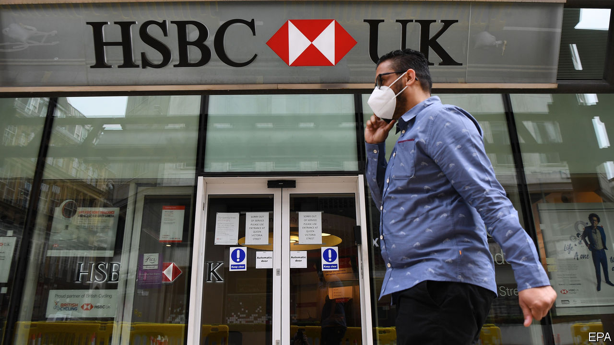
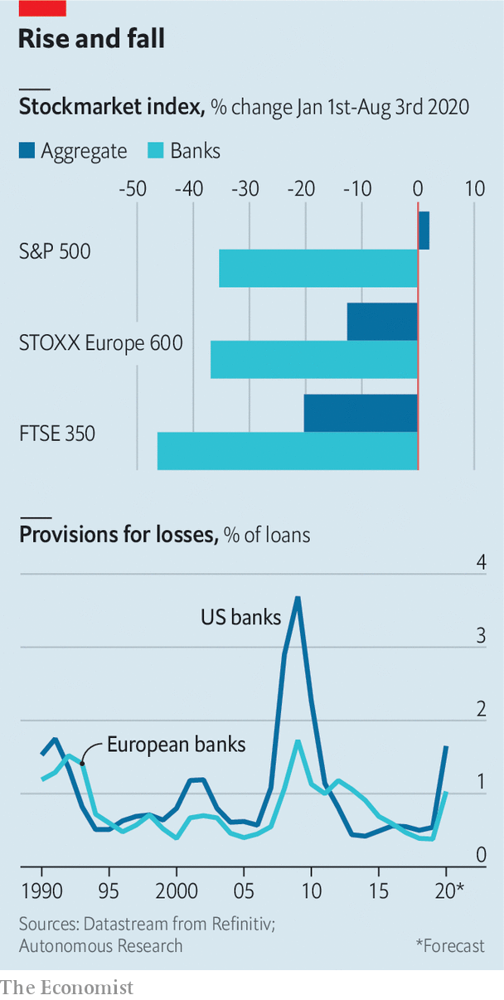

## Dud light

# Why European banks expect fewer bad loans than American rivals

> It may be a sign of weakness rather than optimism

> Aug 8th 2020

ANALYSTS HAD expected a blistering earnings season for European banks, which reported their second-quarter results in late July and early August. And painfully hot it was, with profits melting away as lenders made provisions for future loan losses. On August 3rd HSBC, Europe’s largest bank by assets, said that its post-tax profits had fallen by 88% on the year, to $617m. Loss-making lenders included Deutsche Bank in Germany, Santander in Spain and Société Générale in France.

Much like Wall Street titans, albeit on a smaller scale, European lenders with investment-banking arms saw losses tempered by a boost in trading revenue. As the coronavirus spread and markets turned volatile, investors rushed to reposition their portfolios. Many governments and companies took advantage of central-bank support and ultra-low interest rates to issue debt, allowing banks to pocket fat fees. BNP Paribas, France’s largest bank, saw trading revenue jump by 154%.

Such frenetic activity seems unsustainable. Indeed, says Stuart Graham of Autonomous, a research firm, debt issuance appears to have slowed in July. So the fate of banks will primarily be decided by the extent to which they are prepared for loan losses. Lenders on either side of the Atlantic have taken different approaches to the matter, with European banks booking smaller provisions, as a share of total loans. American banks have generally been more cautious in the past, only for European rivals to play catch-up (see chart). So who is right this time?

There is reason to think America’s banks may suffer more. Unemployment there has surged; Coface, a credit insurer, expects bankruptcies over the next year or so to rise by more than in Europe. A larger portion of American bank lending, including consumer and high-yield credit, is riskier and unsecured. European banks prefer to lend against collateral, for example through mortgages. That implies fewer and slower defaults, as well as higher recovery rates, when the cycle turns.

But the economic outlook is not the full explanation. America’s accounting rules require its lenders to make provisions against losses they expect on all loans over their lifetime. European rivals are required to account for lifetime losses only on loans that are closest to default (for performing assets they need to care only about the next 12 months). That makes them mechanically more myopic. In March the European Central Bank (ECB) encouraged more optimism by telling them to “avoid excessively pro-cyclical assumptions” when making provisions—in other words, to ensure that lending does not seize up in bad times.

Cultural differences compound prudential ones. American businesses, fans of transparency, tend to shoulder more pain upfront. European ones prefer to wait and see. Disclosure is not helped by the fact that fewer banks are listed. Only half of the 84 euro-zone lenders deemed “significant” by the ECB are publicly traded, says Nicolas Véron of Bruegel, a think-tank. By contrast, all America’s big banks are listed.

European banks’ smaller provisions could also be an admission of weakness. Most entered the crisis with a pre-existing condition: low profitability. Patrick Hunt of Oliver Wyman, a consultancy, says their return on tangible equity averaged 6% at the start of the year, half that of their American peers. That has left them with wafer-thin cushions with which to absorb provisions before they eat into core capital. The vast uncertainty about the economy translates into equally uncertain projections for defaults—and may have given banks the leeway to book provisions they can bear.

Investors are not fooled. European banks’ share prices have still fallen by as much as those in America, if not more. They have not been helped by the fact that the ECB, in an effort to preserve capital, has forbidden banks to distribute cash to shareholders until at least the end of the year. (In America regulators have banned share buybacks, but only capped dividends.) Investors usually covet European bank shares for their stable dividends, which they then funnel into high-growth technology or pharmaceutical stocks. The ban, says Ronit Ghose of Citigroup, a bank, is “another nail in the coffin”. ■

## URL

https://www.economist.com/finance-and-economics/2020/08/08/why-european-banks-expect-fewer-bad-loans-than-american-rivals
