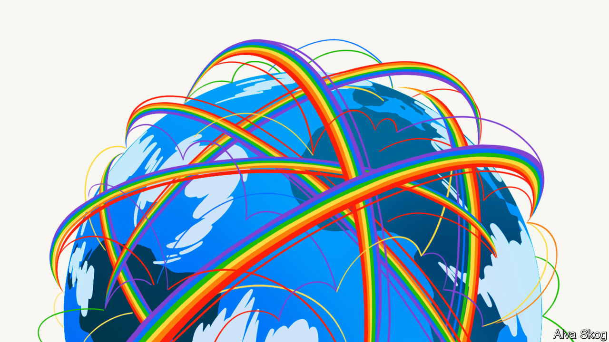
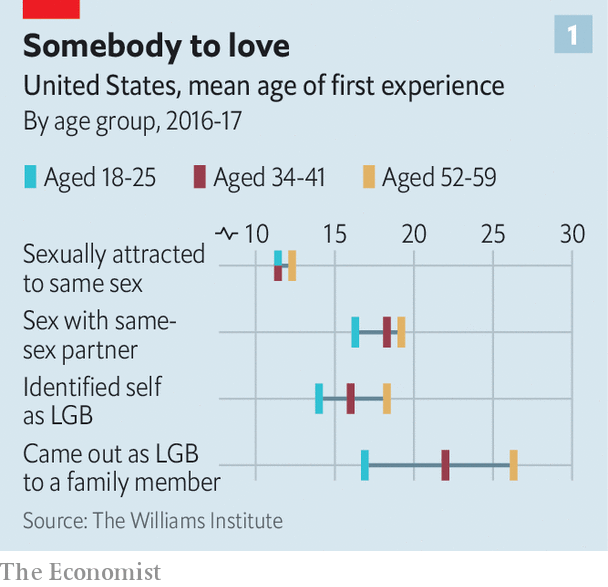
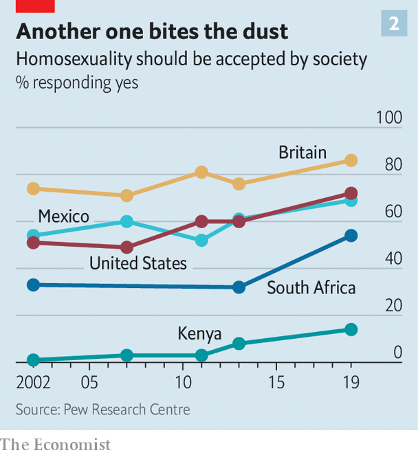
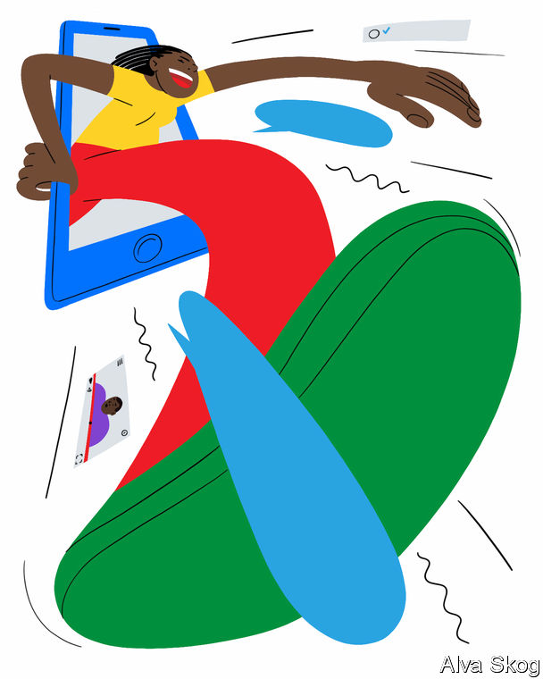

## Queer, there and everywhere

# How the internet is changing the experience of coming out

> Around the world, gay people are quicker to open up than before

> Aug 8th 2020BOGOTÁ, NAIROBI AND NEW YORK

PROPPED UP BY his Union flag pillows, Tom Daley was at last ready to unburden himself. As the camera wobbled about, the then 19-year-old British diver—who the year before had won a bronze medal at the Olympics in London—told his fans he was ready to talk about his private life, though his darting eyes seemed to belie that assertion. After two minutes of build-up, he got to the point. “Come spring this year my life changed—massively—when I met someone and it made me feel so happy, so safe,” he confided. “And everything just feels great, and well that someone”—long pause, looking everywhere but at the camera—“is a guy.”

He told that camera in his bedroom, and YouTube told everyone else. There were some nasty comments, but thousands of strangers chipped in to offer congratulations, support and, sometimes, slightly odd queries. “Is it just me or are all of the gay guys really handsome and attractive?” one viewer wondered. Six years on, the video has been viewed more than 12m times. Mr Daley is now married to that “guy”, Dustin Lance Black, a screenwriter. They have a two-year-old son, Robbie.

Some lesbian, gay, bisexual or transgender (LGBT) people never tell their friends and families about this aspect of their identities. A few don’t feel the need. In 2013 interviewers from the Pew Research Centre, a think-tank, spoke to a 54-year-old American woman about her bisexuality. “This is not a subject to discuss or tell anyone about,” she said. “It is an activity—like bowling, or gardening.”

But most want to open up. The same Pew study found that more than three-quarters of American gay men had confided in all or most of the important people in their lives. So universal is that first moment of disclosure that several languages use variations on the same phrase. Koreans, Japanese, French and Spanish people all talk of “coming out”. The Chinese and Russians also borrow the English metaphor of “the closet”, the dark and constraining place from which LGBT people are said to emerge. “Boys Like Us”, a compendium of coming-out experiences published in 1996, argued that this was “the central event of a gay man’s life”. For many, it still is. A sixth of calls to Switchboard, a British LGBT helpline, concern coming out. It is the single biggest category.

Yet though the metaphor remains constant, the process is changing rapidly, thanks to the internet. Two big shifts are under way. People are coming out earlier than ever before. And the closet door is opening in an increasingly broad range of countries. Stark disparities remain: in liberal countries, such declarations are accepted or even—as in Mr Daley’s case—celebrated. But gay sex remains illegal in 68 countries, and openly LGBT people often face stigma or violence even where it is not. Transgender people often experience even greater prejudice, and so need extra courage to tell others how they feel.

Nonetheless, the International Lesbian, Gay, Bisexual, Trans and Intersex Association (ILGA), a lobby group, has members in 164 countries (up from eight in 1978). “That means there are people in those countries who are coming out,” says André du Plessis, its executive director. “We are everywhere. It’s been a joyful and sometimes painful unmasking of who we are.”

That unmasking happens at different times. About four in ten American gay men first begin to question their sexuality before they leave elementary school, reports Pew. Others only realise later in life. A handful come out in their 70s. But on average Americans are coming out earlier than in previous generations, mostly in their teenage years. In 2018 the Williams Institute at the University of California, Los Angeles (UCLA), found that whereas interviewees in their 50s had tended to reveal their sexuality at about the age of 26, those currently in their late teens and early 20s had already done so before their 17th birthday (see chart 1). Stonewall, a British charity, found an even starker divide. According to a poll it commissioned in 2010, LGBT youngsters typically came out at 17, 20 years earlier than the oldest cohort.

This shift can partly be attributed to a dramatic softening of public attitudes towards same-sex relationships. In 1987, more than half of Americans thought gay sex should be illegal, according to Gallup; nearly three-quarters now approve that it is legal. Gay characters frequently pop up in movies and on television; same-sex weddings are growing ever more common. All of this helps teenagers work up the confidence to come out to parents or friends, since those they confide in are more likely than ever to support them.

But before teenagers begin to tell others about their sexuality, they have to come out to themselves. That is where the spread of the internet makes a big difference. Children who begin to wonder about their sexuality or gender can quickly educate themselves—and each other—on their smartphones. They can access this information at any time and anonymously (unlike, say, checking out a library book). YouTube hosts a vast archive of self-help videos made by others farther along the same path; social networks can connect teenagers to peers with similar feelings. This helps to explain that whereas it took the oldest cohort in the UCLA study six years after first feeling attracted to someone of the same sex to identify as gay, lesbian or bisexual, the youngest sample made the jump in less than half that time.

Consider the experience of a 14-year-old girl in Manhattan. When she began to wonder about her sexuality, she turned to the internet for answers. She spent a lot of time on Tumblr, a blogging platform, before figuring out that she is asexual (ie, she feels no sexual attraction to others). “Tumblr is where I found out about most of the stuff,” she says. “There’s a fricking ton of LGBT activism all over Tumblr.” Not long after having her suspicions confirmed, she decided to tell her mother. “I told her I’d looked it up and it all sounds like me.” A fellow student at her school, a 16-year-old transgender boy, saw his feelings echoed in videos posted by Jazz Jennings, a trans teenager who has 680,000 subscribers on YouTube. He told his parents a few years later, once he was sure.

Some teenagers use the internet to try out their newfound identities. A few, like Mr Daley, upload coming-out videos. Others share the news on social networks like Instagram. A study in 2014 by Stefanie Duguay, then of Queensland University of Technology, found that more than a third of a sample of 27 young LGBT Britons disclosed their interest in others of the same sex on their Facebook profiles. Three wrote posts that explicitly announced their sexual orientation.

The internet is particularly helpful in parts of the world that are less gay-friendly. A good example is Colombia. At first blush, it appears pretty tolerant. Gay sex was decriminalised in 1981, 22 years before America’s Supreme Court ordered states such as Texas to stop banning it. Gay Colombians can get married and adopt children. Claudia Lopez Hernandez, the mayor of its capital, Bogotá, is a lesbian.

But social attitudes have not kept pace with the law. Most Colombians are Catholic; many are socially conservative. Polls suggest they largely disapprove of gays adopting children, though they are coming around to same-sex marriage. A survey of about 5,000 LGBT Colombians, published earlier this year by UCLA, found that three-quarters were bullied as children. Several hundred report being attacked or sexually assaulted.

Unsurprisingly, then, Colombians are nervous about coming out. Roughly nine in ten lesbians and gay men have confided in at least some family members and friends. But most told nobody at high school despite typically realising they were attracted to someone of the same sex at about the age of 12, roughly the same time as their American counterparts. The internet gives such teenagers the chance to form digital support networks and online communities where they feel comfortable expressing their developing identities.

Take Emmanuel, a 19-year-old transgender man from Bogotá. After watching a documentary with his parents about transgender children, he told them he felt the same way. “I said ‘mum, dad—I’m trans’ and they got angry,” he says. “They told me ‘no, that’s wrong, you should not think that.’” He still lives with his parents. At college, he “tests the waters” with new friends by starting conversations about the 2018 winner of the Miss Universe Spain beauty pageant, a trans woman. “Depending on their reaction, it can be like ‘you get to know, you don’t get to know’.” He reckons he tells about one in five of them.

Online, it is a different story. He began confiding his feelings in strangers he met on Tumblr and Twitter, another social network, five years ago. He has messaged dozens of trans people and chats regularly to seven friends, who mainly live in America and Britain. “It is kind of a support group,” he says. Even though he largely shields his identity in public, he can be open online. “At least I know maybe I’ll come back home and turn on my computer and see my friends. They are the people who will call me by my name, who will give me tips on how to deal with situations. It helps a lot.”

Covid-19 makes the internet more crucial. It has been the only source of like-minded company for many LGBT people stuck in lockdown. Eleanor Tiernan, an Irish comedian, joked: “I came out just before lockdown. Suddenly I was free to be who I really was… but only as long as I stayed in my room.” Since the pandemic began to spread in Colombia, Emmanuel has been shut up in his parents’ small apartment most of the time. Because he has more time for domestic chores, his mother, who still treats him as a woman, tells him: “you’re getting like me, preparing to be a housewife.” His friends offer much-needed solace, chatting about the effects of the pandemic in their countries and playing online games.

Such networks are even more important in countries where gay sex is illegal, like Kenya. Last year the country’s High Court upheld a colonial-era law that threatens a maximum penalty of 14 years in jail for “carnal knowledge against the order of nature”. Ministers claim it is an effective way to curb the country’s HIV epidemic. Although arrests under this law are rare, gay Kenyans are often intimidated or harassed by cops. Films depicting gay characters are censored; lesbians are raped by gangs of men, supposedly to “correct” their sexuality. Repression is popular. In 2019 only 14% of Kenyans believed homosexuality is acceptable, compared with 72% of Americans and 86% of Britons (see chart 2).

The closet is sometimes the safest option. Becky Odhiambo Mududa, who helps to run Nyarwek, a gay-rights NGO in rural Kenya, reckons only 50-100 of its 1,500 members have come out to everyone they know. Another 300 or 400 are comfortable telling only fellow LGBT people, she estimates. Those who are open benefit from up-to-date information about homophobic violence and police crackdowns, which members share with each other via an online messaging service.

Since Kenyan teenagers are unlikely to encounter peers or role models who are open about their homosexuality, the internet plays a greater role in education. Rose Ambasa, 21, grew up in a slum in the capital, Nairobi. She did not understand her feelings for other girls until she borrowed her brother’s smartphone one day and googled “Who is a lesbian? What do they do?” “I came to accept myself,” she says. “It helped me so much that I came out of depression.”

Some wait years to discover they are not alone. Purity, now 24, grew up in a village with no internet access. When she felt attracted to a female classmate at 14, she had no way of knowing whether others had such feelings. “I was scared,” she says. “I was trying to get it out of me, just praying to God to figure out what it is. I just wanted to be a normal girl.” As soon as she got a smartphone, on her first night at college five years later, she searched whether it was possible to fall in love with another girl. “I then discovered it’s normal.” The next day she confided in a classmate, who was sympathetic. Soon afterwards, she began dating another student.

The internet can also provide hope, even to those in the bleakest situations. Delphine, 21, was raped by local men when they found out she is a lesbian. When she fell pregnant, her mother forced her out of the family home. Three years on, she is in a long-term relationship with another woman. They are raising her son together. She finds inspiration for the future on YouTube, which she scours for videos of gay wedding ceremonies in other countries. “People applaud it,” she says, incredulously. She probably watches two weddings a day, and shares the couples’ joy. “We hope some day when our country allows it, we’ll get married,” she says. “We talk of growing old together.”

The internet’s increasingly pivotal role has its downsides. Natasha Jones, who runs a youth engagement programme at the Gay Centre in Manhattan, has seen good and bad. Plenty of teenagers only find out about her programme online, then come to ask questions and meet other teenagers before coming out to their parents. But, she says, the internet can be a source of misinformation during this formative time. The centre’s sexual-health classes often need to counter misconceptions young people have picked up online, such as that lesbians cannot get sexually transmitted infections or that losing your virginity is meant to be painful. “We have young people coming here with the wildest ideas,” she says. “YouTube has taught them and that’s fact.”

It also gives a space for homophobes and trolls to direct abuse at youngsters who raise their heads above the parapet. Worse, it provides a forum for involuntary “outings”. In Kenya, rumours about someone’s sexuality spread rapidly on social media. Several of the people supported by Nyarwek were “thrown out of the closet” in this way, by former partners or friends with grievances.

But bigots and dodgy information existed long before the internet. That it makes such things more visible does not negate the largely positive role it plays in gay people’s lives. Studies frequently find that gay people suffer higher rates of depression and anxiety than heterosexuals. “Trying to hold conflicting identities or lying to yourself causes incredible mental strain,” says Mr du Plessis. Enabling more people to be honest with themselves and others at an early age ought to reduce this strain. Greater openness will improve sexual health, too, enabling better targeting of preventive measures and treatment for HIV and other sexually transmitted infections.

The shift towards transparency will also raise awareness. In some countries, populist politicians caricature homosexuality as a western import. J.M. Kariuki, a Kenyan nationalist, was fond of calling it “that vice for which we Africans have no name”. Others deny its existence. Ramzan Kadyrov, the head of the Chechen Republic, has reportedly presided over the routine abduction, torture and killing of gay men. He denies that, instead claiming: “we don’t have any gays. If there are any, take them to Canada.” By shining a spotlight on domestic gay populations, the internet will make such claims even more risible. “In our advocacy work, one question that comes up is ‘where are these queer people, do these queer people exist?’” says Caroline Mwochi, also of Nyarwek. “Coming out actually puts a face on it.”

And being visible is the surest way to change social attitudes. The rapid rise in support for gay rights in America between 1980 and 2000 followed a steep increase in the number of Americans who said they knew a gay family member, friend or colleague. In 1985 only a little more than a fifth did; now 87% do. “We’ve seen over the decades that this is how change can take place in the hearts and minds of people,” says Mr du Plessis. “People often have a knee-jerk reaction. But when you take it down to a personal level, it becomes real: this is your daughter, your aunt, your minister, your colleague.” As coming out spreads around the world, tolerance probably will, too.

Purity, for one, isn’t going to wait. Now that she has come out, she regularly messages friends online to arrange to meet at a gay-friendly bar in central Nairobi. At an outing before the pandemic took hold, a flashing neon sign marked the entrance, on a bustling street packed with battered minibuses belching foul-smelling fumes. Inside, two young women moved closer together on the dance floor, just as one of the buses honked its horn. Another woman flicked a rainbow braid in her cornrows. Purity and her friends shared beer and gossip. She has no regrets about coming out. Though she has faced discrimination looking for a job, her mother surprised her by being “quite cool with it”. She is certain that one day she will meet another woman and they will marry. In the meantime, she says, “I feel good being who I am.” ■

## URL

https://www.economist.com/international/2020/08/08/how-the-internet-is-changing-the-experience-of-coming-out
