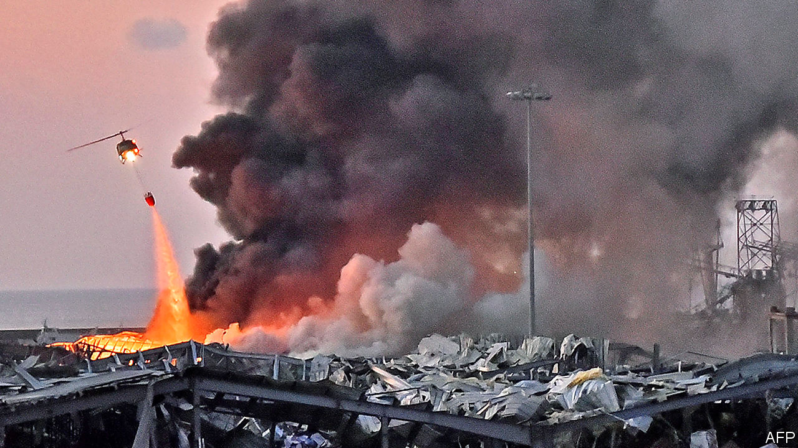

## No way to run a country

# A big blast should lead to big change in Lebanon

> It is past time to reform the broken state

> Aug 8th 2020

SO POWERFUL WAS the explosion that rocked Beirut on August 4th that people in Cyprus, 240km (150 miles) away, thought they had suffered an earthquake. Scores of people died and thousands were injured in the blast, which left the port in ruins. The Lebanese government says it was caused by 2,750 tonnes of ammonium nitrate, which can be used as fertiliser or as an explosive (see [article](https://www.economist.com//middle-east-and-africa/2020/08/05/beirut-after-the-blast-the-crunch-of-glass-acrid-smoke-and-stairs-slick-with-blood)). This appears to have been confiscated years ago from an abandoned Russian-owned cargo ship heading to Mozambique. Customs officials proposed exporting the stuff, giving it to the army or selling it to an explosives company—but they needed the judiciary’s approval. Their repeated requests were met with silence. So the material sat in a warehouse at the port.

What kind of government leaves a mountain of explosive chemicals lying around unsafely for the better part of a decade? The same kind that cannot agree on a budget for 11 years and that let its central bank run a Ponzi scheme to defend its unrealistic currency peg. The kind which is so deluded that it relies on aid, loans and remittances, spending far more than it collects in taxes. The kind that is controlled by an out-of-touch elite who fiddle and extort while the economy burns. In short, it is the government of Lebanon—and it is in desperate need of reform.

That much was clear even before the explosion showered Beirut with broken glass and pieces of rubble. For months Lebanon has been mired in a debilitating economic crisis, because of a rotten banking sector and a collapsing currency. The Lebanese pound has lost about 80% of its value on the black market against the dollar. Because Lebanon imports so much, inflation has spiked. The government defaulted on its debts months ago. The economy was weak before covid-19 forced politicians to lock down the country for two months earlier this year. Now it is in a coma. The poverty rate is expected to rise from 45% in 2019 to more than 75% by the end of this year. Many businesses have gone bust. Those that reopened had to close again recently because of a new surge of infections.

Without answers, the government asked the IMF for help. The fund wants a modest show of good faith, such as a new law on capital controls or a reform of the loss-making electricity industry. But Lebanese officials cannot even agree on the severity of the crisis. They have spent weeks bickering over how to estimate the losses racked up by the central bank. IMF officials have looked on with dismay. Even some in the government have had enough. On August 3rd the foreign minister quit, saying that Lebanon risks becoming a failed state. “I participated in this government on the basis that I have one employer named Lebanon,” Nassif Hitti wrote in his resignation letter, “and I found in my country many employers and conflicting interests.”

It is a new way of describing an old problem. For decades Lebanon has carved up political power among its religions and sects as a device for keeping the peace between them. Though designed to ensure that all Lebanese have a say in government, the system has been captured by an entrenched elite. This elite hands out government jobs based on sect. With power guaranteed, it can plunder ministries. The waste associated with its patronage schemes costs Lebanon 9% of GDP each year, says the World Bank. Corruption is rife. Residents of Beirut note that the explosion occurred in the city’s port, known locally as the “cave of Ali Baba and the 40 thieves”, owing to allegations of theft, bribery and embezzlement at the government-owned facility.

Most Lebanese want to ditch the power-sharing system. Ever fewer feel defined by their religion. (A growing number are not devout at all.) Big protests in October forced out the previous government, which was also incompetent. The current one entered office promising change, but has accomplished little.

That is, in part, because interests stand in the way. The warlords who wrecked Lebanon in the civil war are now the politicians who steal from it. Groups such as Hizbullah, a Shia militia-cum-political party, face few constraints. Foreign powers, such as Iran, which backs Hizbullah, and Saudi Arabia, which backs the Sunni elite, would surely try to scuttle reforms that diminished their clients or benefited their rivals.

They all play on fears of a sectarian power-struggle that might leave some groups worse off—or sink the country back into violence. The magnitude of the explosion at the port called to mind the massive car-bomb that killed the prime minister, Rafik Hariri, a Sunni, in 2005. A UN-backed court is due to deliver a verdict later this month in the case of four Hizbullah members accused of his assassination.

There was a time when such fears seemed like a good reason to move slowly in unpicking the power-sharing system. But those in power are using the crisis to hook more of their followers on the handouts they provide. And the cost of moving slowly is increasingly clear. It was not fighting or foreign occupation that led to the destruction of a large part of Beirut. It was incompetence by a corrupt and broken state. Only bold action will fix it. The government should do away with the power-sharing system sooner rather than later, and replace it with something more democratic and meritocratic. ■

## URL

https://www.economist.com/leaders/2020/08/08/a-big-blast-should-lead-to-big-change-in-lebanon
