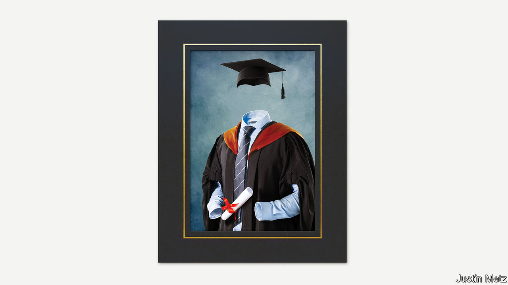

## The absent student

# Covid-19 will be painful for universities, but also bring change

> They need to rethink how and what they teach

> Aug 8th 2020

Editor’s note: Some of our covid-19 coverage is free for readers of The Economist Today, our daily [newsletter](https://www.economist.com/https://my.economist.com/user#newsletter). For more stories and our pandemic tracker, see our [hub](https://www.economist.com//news/2020/03/11/the-economists-coverage-of-the-coronavirus)

IN THE NORMAL run of things, late summer sees airports in the emerging world fill with nervous 18-year-olds, jetting off to begin a new life in the rich world’s universities. The annual trek of more than 5m students is a triumph of globalisation. Students see the world; universities get a fresh batch of high-paying customers. Yet with flights grounded and borders closed, this migration is about to become the pandemic’s latest victim.

For students, covid-19 is making life difficult. Many must choose between inconveniently timed seminars streamed into their parents’ living rooms and inconveniently deferring their studies until life is more normal. For universities, it is disastrous. They will not only lose huge chunks of revenue from foreign students but, because campus life spreads infection, they will have to transform the way they operate (see [Briefing](https://www.economist.com//briefing/2020/08/08/covid-19-could-push-some-universities-over-the-brink)).

Yet the disaster may have an upside. For many years government subsidies and booming demand have allowed universities to resist changes that could benefit both students and society. They may not be able to do so for much longer.

Higher education has been thriving. Since 1995, as the notion spread from the rich world to the emerging one that a degree from a good institution was essential, the number of young people enrolling in higher education rose from 16% of the relevant age group to 38%. The results have been visible on swanky campuses throughout the Anglosphere, whose better universities have been the principal beneficiaries of the emerging world’s aspirations.

Yet troubles are piling up. China has been a source of high-paying foreign students for Western universities, but relations between the West and China are souring. Students with ties to the army are to be banned from America.

Governments have been turning against universities, too. In an age when politics divides along educational lines, universities struggle to persuade some politicians of their merit. President Donald Trump attacks them for “Radical Left Indoctrination, not Education”. Some 59% of Republican voters have a negative view of colleges; just 18% of Democrats do. In Britain universities’ noisy opposition to Brexit has not helped. Given that the state pays for between a quarter and a half of tertiary education in America, Australia and Britain, through student loans and grants, the government’s enthusiasm matters.

Scepticism among politicians is not born only of spite. Governments invest in higher education to boost productivity by increasing human capital. But even as universities have boomed, productivity growth in the rich-country economies has fallen. Many politicians suspect that universities are not teaching the right subjects, and are producing more graduates than labour markets need. Small wonder that the state is beginning to pull back. In America government spending on universities has been flat in recent years; in Australia, even as the price of humanities degrees doubles, so it will fall for subjects the government deems good for growth.

There are questions about the benefits to students, too. The graduate premium is healthy enough, on average, for a degree to be financially worthwhile, but not for everybody. In Britain the Institute for Fiscal Studies (IFS) has calculated that a fifth of graduates would be better off if they had never gone to university. In America four in ten students still do not graduate six years after starting their degree—and, for those who do, the wage premium is shrinking. Across the world as a whole, student enrolment continues to grow, but in America it declined by 8% in 2010-18.

Then came covid-19. Although recessions tend to boost demand for higher education, as poor job prospects spur people to seek qualifications, revenues may nevertheless fall. Government rules will combine with student nerves to keep numbers down. Last month the Trump administration said new foreign students would not be allowed to enter the country if their classes had moved online. Sydney, Melbourne, UNSW and Monash, four of Australia’s leading universities, rely on foreign students for a third of their income. The IFS expects losses at English universities to amount to over a quarter of one year’s revenues.

The damage from covid-19 means that, in the short term at least, universities will be more dependent on governments than ever. The IFS reckons that 13 universities in Britain risk going bust. Governments ought to help colleges, but should favour institutions that provide good teaching and research or benefit their community. Those that satisfy none of those criteria should be allowed to go to the wall.

Those that survive must learn from the pandemic. Until now most of them, especially the ones at the top of the market, have resisted putting undergraduate courses online. That is not because remote teaching is necessarily bad—a third of graduate students were studying fully online last year—but because a three- or four-year degree on campus was universities’ and students’ idea of what an undergraduate education should look like. Demand for the services of universities was so intense that they had no need to change.

Now change is being forced upon them. The College Crisis Initiative at Davidson College says that less than a quarter of American universities are likely to teach mostly or wholly in person next term. If that persists, it will reduce the demand. Many students buy the university experience not just to boost their earning capacity, but also to get away from their parents, make friends and find partners. But it should also cut costs, by giving students the option of living at home while studying.

Covid-19 is catalysing innovation, too. The Big Ten Academic Alliance, a group of midwestern universities, is offering many of its 600,000 students the opportunity to take online courses at other universities in the group. There is huge scope for using digital technology to improve education. Poor in-person lectures could be replaced by online ones from the best in the world, freeing up time for the small-group teaching which students value most.

Universities are rightly proud of their centuries-old traditions, but their ancient pedigrees have too often been used as an excuse for resisting change. If covid-19 shakes them out of their complacency, some good may yet come from this disaster. ■

## URL

https://www.economist.com/leaders/2020/08/08/covid-19-will-be-painful-for-universities-but-also-bring-change
