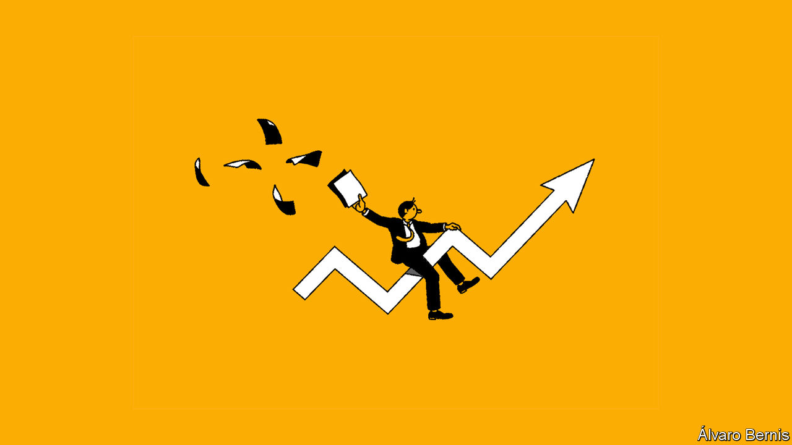

## When the facts change

# Economics sometimes changes its mind

> The science may be dismal but it is flexible, too

> Aug 8th 2020

ECONOMICS IS A “disgrace”, according to Claudia Sahm, a former Federal Reserve researcher, who has chosen to “no longer identify” as an economist. Among several flaws, the profession fails to nurture the young, she argues, or listen to outsiders. A survey by the American Economic Association (AEA) found that only 31% of economists under the age of 44 felt valued within the discipline.

All this must be off-putting to youngsters beginning the long (and lengthening) journey into the profession (see [article](https://www.economist.com//node/21790460)). They may wonder if there is room for their ideas in a discipline that can seem hidebound, hierarchical and homogenous. Will they invigorate economics or will it indoctrinate them?

Budding economists can draw comfort from our series of six economics briefs that begins this week. Each looks at an issue (competition policy, minimum wages, inflation, the dollar, culture and public debt) that has prompted economists to revisit their field’s presumptions. Over the past decade or two, the profession has become more relaxed about minimum wages, inflation and public debt; less relaxed about monopoly power; less enamoured of flexible exchange rates; and more open to deep, institutional explanations of wealth and poverty.

What does it take to change economists’ minds? New ideas are not enough. The theory of monopsony, which explains why a minimum wage may help employment, not hurt it, had been around for at least 60 years before mainstream economics accepted its use in many low-wage labour markets. Recent nonchalance about high levels of public debt may seem new and mould-breaking. But the fresh thinking rests on theories set out in the 1950s and 1960s.

New facts are more compelling. The persistence of low interest rates despite high public debt has left an impression, as has the pre-pandemic combination of low inflation and low unemployment. The dollar’s rally in the global financial crisis showcased its peculiar role in the international financial system, as have various emerging-market tantrums since. Fresh evidence also matters in microeconomics. New Jersey’s decision to raise its wage floor in 1992 by more than neighbouring states (despite tipping into a recession) provided the natural experiment required to change economists’ minds about minimum wages.

New facts, then, are more persuasive than new ideas. But although an alternative theory is not a sufficient condition for a change of heart, it is often necessary. It takes a model to beat a model, as economists like to say. They sometimes cling to propositions in defiance of the facts simply because they have nothing better to replace them with.

That raises a third condition for persuasiveness. To convert economists to your cause, it is not enough to give them something new to believe. You must also offer them something fruitful to do. Appeal to their hands as well as their heads. Economists will jump on a revolution that gives them new toys or techniques to play with. This may explain why they have become more enthusiastic about institutional explanations of the wealth and poverty of nations. They cannot rerun history or sprinkle institutions randomly across countries to test their long-term effects. But they have found ingenious proxies for this kind of random variation. Economists, like many others, relish the chance to display their cleverness.

New facts and clever techniques help shift economic opinion. Does this also require new economists? Not necessarily. Some big names have changed their minds, or at least their tone. Olivier Blanchard is less fiscally cautious today than he was ten years ago as IMF chief economist, and Narayana Kocherlakota is much more doveish about monetary policy than when he was first appointed to head a Federal Reserve bank. The heretical tribes on the fringes of economics yearn to sack Rome. But it is more efficient to convert the emperor.

It is nonetheless striking that, in several of the areas covered by our series, vital work was done by economists who were in their 30s at the time (although all of them were already at elite institutions). According to the AEA’s survey, only 5% of economists aged under 44 feel they have a great deal of power within the discipline. But the young may have one power denied to their elders: the freedom to imagine a future economics, unencumbered by too heavy an intellectual stake in its past. ■

## URL

https://www.economist.com/leaders/2020/08/08/economics-sometimes-changes-its-mind
