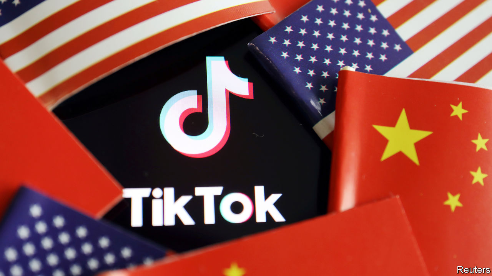
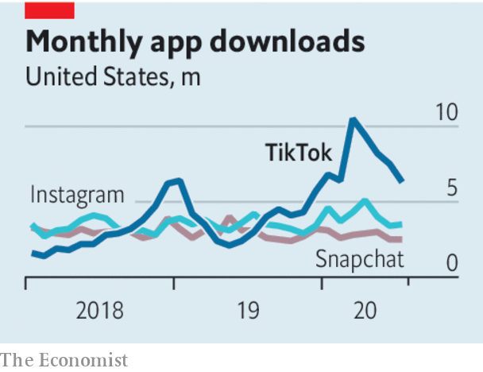

## Trumpian TikTok

# Forced sales are the wrong way to deal with Chinese tech

> America needs to sort out its own data-privacy regime

> Aug 5th 2020

IN DECEMBER 2017 a Chinese technology firm called ByteDance bought Musical.ly, an app which let its young users dance and lip-sync to music videos. This did not, at the time, look like a recipe for geopolitical strife. ByteDance merged Musical.ly with a similar app called TikTok, which started growing at a blistering pace. Today TikTok has 100m users in America, and competes with Facebook and Snap. With growing popularity has come growing scrutiny, as Sino-American tensions spread from trade to tech, and a barrage of invective from President Donald Trump. This looks set to culminate in a forced sale of TikTok’s American business to a domestic buyer. Touted as vital to protect Americans’ data, the crackdown is in fact a depressing example of jingoistic opportunism, more likely to chill investment in America and stoke Chinese nationalism.

The legal basis for TikTok’s divestment comes from the Committee on Foreign Investment in the United States (CFIUS), which this week ruled that the Musical.ly deal was against America’s national-security interests. Having flirted with banning TikTok altogether, Mr Trump now seems willing to accept a fire-sale. Microsoft, an American software giant, is in talks to buy TikTok’s American operations, as well as those in New Zealand, Australia and Canada (see [article](https://www.economist.com//business/2020/08/08/microsoft-wants-a-slice-of-tiktok)). 

ByteDance is the latest in a series of Chinese firms, among them Huawei, a telecoms-equipment provider, to be targeted by the Trump administration amid fears of cyber-spying and propaganda-peddling. It claims—without providing evidence—that the firms are, or could be, used to pass Americans’ personal data to the Chinese government. ByteDance will not be the last in the crosshairs. Lenovo, a partly state-owned Chinese firm, sells lots of computers in America. Tencent, a social-media giant, owns large stakes in video-game studios with millions of American users. On August 2nd Mike Pompeo, the secretary of state, suggested that America may take action against not only TikTok but also Tencent’s WeChat app and “countless more” Chinese firms “feeding data directly to...their national security apparatus”.

The data threat from China is real. But nationalist whack-a-mole, backed up with knee-jerk threats of expropriation, is no way to respond. The apparent detachment from any rules or procedure undermines investor confidence in America and heaps political pressure on technocratic bodies like CFIUS, which ought to consider cases based on their merits.

America would do better to strengthen the process of vetting foreign tech investments, and to get its own data privacy in order. CFIUS probes need to conclude more promptly; taking two years to start investigating the Musical.ly deal practically guaranteed a chaotic unwinding. And the committee’s political independence also needs bolstering. Mr Trump is watching over TikTok’s talks with Microsoft as if he were a feudal lord. He has even suggested that the Treasury should get a cut for making the deal possible, a demand with no precedent.

The Trump administration should tighten privacy law. America has until recently been relaxed about protecting its citizens’ data, and hostile to cyber-security concepts like encryption. A new federal data-privacy and cyber-security law would create transparent standards for handling Americans’ data and stymie foreign hackers. The government must also find a way to assure the quality of digital products containing opaque algorithms, which should apply to all firms, wherever they are based. Bills that do so have long been languishing in Congress. The Trump White House has made little effort to revive them.

The tension between maintaining global trade and rightful mistrust of the Chinese government is inevitable. Digital technologies, whose connected nature opens up all kinds of hypothetical meddling, are particularly tricky. But rushed asset sales at the barrel of a gun are not the answer. America needs a response that is less arbitrary and counter-productive.■

## URL

https://www.economist.com/leaders/2020/08/05/forced-sales-are-the-wrong-way-to-deal-with-chinese-tech
