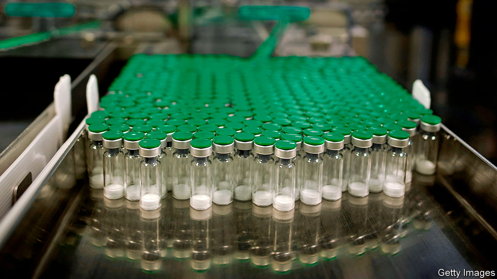

## A bigger dose

# The world is spending nowhere near enough on a coronavirus vaccine

> Far better to spend far too much

> Aug 8th 2020

Editor’s note: Some of our covid-19 coverage is free for readers of The Economist Today, our daily [newsletter](https://www.economist.com/https://my.economist.com/user#newsletter). For more stories and our pandemic tracker, see our [hub](https://www.economist.com//news/2020/03/11/the-economists-coverage-of-the-coronavirus)

CONSIDER THE following thought experiment. If you fail to eat a pizza within an hour, you will die from hunger. What do you do? Most people would immediately order a pizza—and not just one Margherita, but lots of them, from several different parlours. In order to maximise the chances that at least one pizzeria got you what you needed in time, you would not care that some of the pizza would be sure to go to waste. 

The world is hungry for a vaccine against covid-19. So far about 700,000 deaths have been recorded from the disease, and the total is increasing at a rate of roughly 40,000 a week. If you also include unrecorded deaths, the actual numbers are much higher. Meanwhile, the global economy is experiencing its sharpest contraction since the Great Depression, of perhaps 8% of GDP in the first half of 2020.

In the face of this catastrophe, scientists look likely to produce a vaccine much faster than almost anyone could have predicted at the start of the pandemic. Yet global efforts to manufacture and distribute vaccines do not measure up. A mere $10bn or so has been devoted to the cause—the equivalent of ordering one pizza, rather than the several that are needed. 

The figures are murky, but on a rough estimate the world has bought about 4bn doses of covid-19 vaccines for delivery by the end of next year, which is in theory enough to give half the planet one dose. In practice, however, far fewer people will secure protection from the disease. Some of the vaccines in production will fail to get regulatory approval, and a potential candidate that reaches a large-scale clinical trial—as several have—still has a 20% chance of failure. Others will be approved but may not provide full protection. They may not be suited to the elderly, for instance, or they may stop people dying from covid-19 but not from passing it to others. Other vaccines will require more than one dose in order to be effective. Because of these contingencies, even those countries, such as Britain and America, that have bought more than two doses for each of their citizens have still not bought enough. 

Instead of seeing unproven vaccines as an extravagance, the world needs to think of them as an insurance policy. Research suggests that if ten or more vaccines are in development, there is a 90% chance of finding one which works. Once one of these candidates proves to be effective, billions of doses will need to be distributed quickly. But it is impossible to know in advance which candidate will succeed. Governments should therefore help pharmaceutical firms produce vast quantities of a range of different vaccines—ideally, numbering tens of billions of doses in all—long before regulatory approval is or is not granted. The winning vaccine could thus start to get to people quickly, even as doses of failed vaccines might be thrown away unused. 

That may seem deliberately and needlessly lavish. Yet even boosting vaccine funding tenfold to $100bn or more, in line with the most ambitious proposals, pales in comparison with the $7trn which governments across the world have spent or pledged since the pandemic began in order to preserve incomes and jobs. The real extravagance would be to wait until a successful vaccine candidate emerges before rushing to boost production. In terms of the economic output that is saved, to say nothing of lives, it would make sense for the world to spend as much as $200bn on bringing forward an effective covid-19 vaccine by just one week. 

For some, the prospect of such a heavy investment raises fears of “vaccine nationalism”, in which rich countries outspend poor ones in an attempt to corner the market for their citizens. The world as a whole can wring the most benefit out of limited supplies of vaccine by pooling resources and allocating doses on the basis of need—health-care workers first, vulnerable people next, and so forth. Around 80 countries are interested in such a deal. Unfortunately, however, politicians in some countries with manufacturing capacity are likely to put their own people first. One way to minimise the international scramble over who gets vaccines and when is to maximise supplies up front and to spread manufacturing capacity. Vaccines for the poorest countries would need to be subsidised, perhaps through GAVI, the alliance that already pays for other vaccines there. 

The idea of deliberately overproducing something does not sit easily with politicians, especially in a world where there are so many claims on public funds. Faced with a large manufacturing capacity that turns out to be useless, politicians risk being accused of having wasted money—as the British government was when the emergency hospitals it had built early in the pandemic were not needed. Yet politicians must be rational. You buy insurance before you know what will happen, not after. ■

## URL

https://www.economist.com/leaders/2020/08/08/the-world-is-spending-nowhere-near-enough-on-a-coronavirus-vaccine
