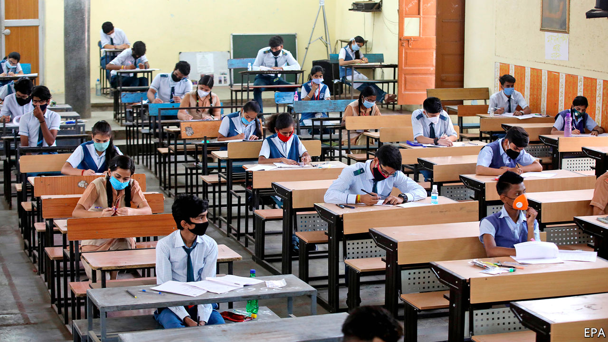

## On reopening schools, oil, French accents, Amazon, sports teams

# Letters to the editor

> A selection of correspondence

> Aug 8th 2020

Your leader calling for schools to reopen presented a straw-man argument when it described teachers as “obstructive” (“Let them learn”, [July 18th](https://www.economist.com//leaders/2020/07/18/the-risks-of-keeping-schools-closed-far-outweigh-the-benefits)). I am a high-school teacher just north of New York City. All my colleagues desperately want to be in school full-time come September. But the federal government has offered not one scintilla of advice or assistance on how to go about opening schools safely.

You also made an insulting insinuation about teachers being paid whether they work or not. That is silly. There is nothing I would want more professionally than to be in school. Teaching online is difficult, time-consuming and largely unrewarding, compared with teaching children in person. I don’t know anyone who prefers the former.

However, we simply do not want to rush back at the risk of our own health as well as the public’s. The evidence about young people and covid-19 is by no means clear. It seems that young adults have a much lower chance of getting seriously ill if they catch the virus. It is not at all certain that they cannot spread the disease, particularly high-school-aged students. Younger people contracted the virus at higher levels during the recent spike in America than earlier in the outbreak. Put hundreds of these young adults in closed classrooms with older teachers who then go home to their families and you may have a recipe for disaster.

LARRY FATANew York

I was intrigued by your leader about the future of Arab petrostates, and how they will soon no longer be able to “afford to buy loyalty with do-nothing public-sector jobs and free services” as the price of oil presumably falls and demand fails to recover (“There will be pain”, [July 18th](https://www.economist.com//leaders/2020/07/18/with-oil-cheap-arab-states-cannot-balance-their-books)).

Might I remind you of a similar prediction you made two decades ago, which anticipated that new advances in technology such as hydrogen fuel cells and bioethanol would help wean the world off oil (“The end of the Oil Age”, [October 25th 2003](https://www.economist.com//leaders/2003/10/23/the-end-of-the-oil-age)). Seventeen years later, bioethanol is long forgotten and hydrogen fuel cells can only be found in some cities’ buses.

If I were an Arab leader sitting in my $300m yacht looking at my da Vinci painting, you would forgive me if I took your conjectures with a grain of salt and did not put my precious painting up for sale just yet. I would however not stop reading The Economist. Your prognosis regarding the decreasing clout of OPEC has certainly come true.

YASIN MANDLondon

Parisians might overcome their snobbery against regional accents following the appointment of Jean Castex as prime minister, you say (“Accent grave”, [July 18th](https://www.economist.com//europe/2020/07/18/parisian-snobbery-towards-regional-french-accents-persists)). That is overly optimistic. Paris has form when it comes to the marginalisation of speakers whose French is far removed from an idealised standard norm.

In 1635 the founding members of the Académie Française, France’s central language authority, declared that its principle function was to impose the language of the royal court on the rest of France. Today, examples abound of public figures still validating this bias. Look no further than footage of Jean-Luc Mélenchon mocking a southern French-speaking journalist rather than answer her awkward questions, or television presenters deriding Marie-Arlette Carlotti, a former minister, for shifting between southerly accented speech for her local audience, and a more standard accented speech for a national one.

In each case, there is adherence to the reproduction of a standard-language ideology. Pierre Bourdieu, who, like Mr Castex, was also from an Occitan-speaking family in the Gascon region, argued that the French elite is raised with the social capital necessary to exert power, and that language is central to this endeavour. French speakers who do not have such linguistic capital are reminded of their position in the social hierarchy whenever they turn on the television.

You suggested that a popular backlash against globalising elites might mean a bright future for non-Parisian types. Regrettably this isn’t supported by the evidence.

JONATHAN KASSTANLecturer in French and linguisticsUniversity of WestminsterLondon

An important underlying assumption in your briefing on Amazon is that it is doing well in Europe (“And on the second day ...”, [June 20th](https://www.economist.com//briefing/2020/06/18/can-amazon-keep-growing-like-a-youthful-startup)). Where is the evidence? Amazon, as far as I am aware, has never included any profit or sales figures for its European retail operations in its statutory filings in America. It merely aggregates all revenue, including Amazon Web Services, from Europe.

Audited profit data is openly filed in London for Amazon EU SARL, based in Luxembourg, which appears to be more or less retail only, and is published only about eight months after Amazon’s annual accounts in the United States are filed. The latest numbers are for 2018 and show a loss of €259m ($300m), admittedly a significant improvement on the €876m it lost in 2017.

This is crucial. The claim that “No firm bestrides the physical and digital worlds in the way Amazon does” is difficult to make if it turns out, as I believe is the case, that after 25 years, Amazon has never managed to make money from retailing outside its home country. And possibly Canada.

MIKE FLANAGANCharlbury, Oxfordshire

Where the Industrial Revolution saw people leaving the manual looms in their cottages to operate power looms in factories, the Distributional Revolution is causing workers who would have been employed in local stores to move to warehouses to pick orders. In both cases, the economic advantages are not without their social ramifications.

STEVE CULLENMedfield, Massachusetts

I would not describe the logo on Amazon’s brown packages left at our homes as “smiling”. I would suggest “smirking”.

MARGARET CATINGLondonderry, Vermont

Johnson’s musings about the media’s reluctance to mention unmentionable words ([July 11th](https://www.economist.com//books-and-arts/2020/07/09/papers-should-print-offensive-language-if-it-is-crucial-to-a-story)) reminded me of a recent radio news item from CBC, Canada’s national broadcaster, on the pressure put on football teams in Washington and Edmonton to change their names. The report never mentioned the offensive names in question, the Redskins and Eskimos, leaving listeners wondering what the names were, and marvelling at a news piece that managed not to broach the core of its subject.

BOB MARTINHalifax, Canada

Regarding the name of Cleveland’s baseball team (“Skin in the name”, [July 18th](https://www.economist.com//united-states/2020/07/18/renaming-the-washington-redskins)), the term “Indians” was proposed in 1915 to honour Louis Sockalexis, a Native American of the Penobscot nation, who was a star player for the Cleveland Spiders in the late 19th century. The interim team name “Naps” honoured Napoleon Lajoie, a star player a few years later. It had nothing to do with sleep, though the team’s performance during the ensuing century has unfortunately often been a cause of somnolence.

JOHN JAYVenice, Florida

## URL

https://www.economist.com/letters/2020/08/08/letters-to-the-editor
