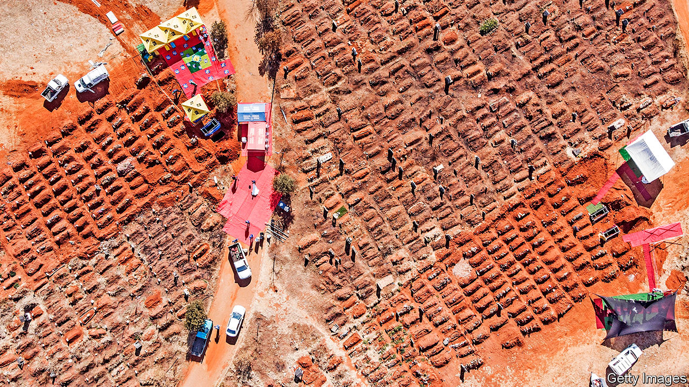

## A million and not counting

# Africa closes in on 1m reported cases of covid-19

> The true number will be much higher

> Aug 8th 2020JOHANNESBURG

“IT’S BEEN hectic,” says Thabo Nko, an undertaker in Soweto, a township on the outskirts of Johannesburg. Before the pandemic he would do two or three burials in a week. These days he is doing about 20. The nearest public cemeteries are full, so he has to bury some corpses 50km away.

Surprisingly, all the death is not good for business. Overwhelmed authorities are behind on issuing the death certificates families need to claim on their funeral insurance policies. For the first time since opening in 2007, Mr Nko is laying people to rest before he is paid. “I had to drop that rule,” he says. “There is too much to do.”

South Africa has the world’s fifth-highest number of reported cases. It accounts for 53% of the confirmed cases and 43% of deaths from covid-19 in Africa. But that does not mean the rest of the continent is being spared. Instead it reflects a lack of data in most other countries—and how their peaks may be yet to come.

As of August 5th the Africa Centres for Disease Control and Prevention, a public-health body, had recorded 992,710 cases in Africa. It took about five months for the continent to reach 500,000 cases and another month to reach close to 1m. The compound daily growth rate of new cases over the past two weeks was higher in sub-Saharan Africa than in other regions. In reality the millionth African contracted covid-19 many weeks ago.

The full extent of the undercount is unknown. The share of tests that come up positive is below 5% in only a few countries, suggesting widespread underreporting elsewhere. Low test-positivity-rates are found in states with relatively efficient governments, such as Botswana; countries with feared security forces, like Uganda; and those that have both, such as Rwanda.

Elsewhere the shares are much higher. In most of the countries where the International Rescue Committee works the rates are in double digits—for instance Somalia (17%, as of July 30th), Congo (20%), South Sudan (19%), Ivory Coast (16%) and the Central African Republic (16%). Relative to its population, Britain has done 600 times more tests than have the African countries where the IRC works.

Another hint of underreporting is found in the number of cases among Africa’s elites, who are more likely to get tests. At least three of South Sudan’s five vice-presidents have had covid-19. Burundi’s former president, Pierre Nkurunziza, probably died of it. So too did Perrance Shiri, Zimbabwe’s agriculture minister (who was better known for organising mass killings in Matabeleland in the 1980s). Unlike most of the country’s doctors, his pallbearers had protective gear.

Patchy data make it hard to assess many African countries’ responses. Mauritius, an island that quickly closed its borders, has largely suppressed the virus. Rwanda’s track-and-trace system, which includes random testing, has slowed transmission.

Cases seem to be growing quickly in most countries as they loosen lockdowns to try to revive their economies. States that appeared to have the virus under control, such as Ethiopia, Kenya and Zambia, are all experiencing daily growth rates above the regional average. Ghana’s widely praised testing strategy, involving a “pooled method” in which multiple samples are tested at once, is becoming less effective as cases rise. In Nigeria, home to nearly one-sixth of Africans, testing is held back by shortages of reagents and kits. It is using less than half of its testing capacity, according to a survey by the Tony Blair Institute.

Two supposed advantages for African countries are geography and demography. The relative isolation of rural areas was meant to slow transmission. It still might. But, notes Matshidiso Moeti, the head of the WHO Africa region, “the virus has spilled out of major cities and spread into distant hinterlands.”

The continent’s youthfulness is more of an obvious boon. Most Africans were born in the 21st century. Africa has a lower share of people over the age of 65 than any other continent. A recent paper published by the American Journal of Tropical Medicine and Hygiene argued that Uganda’s age structure will keep death rates lower than in other parts of the world. (Other pan-African models suggest that such advantages are outweighed by poor health systems.)

About 2% of Africans diagnosed with covid-19 have died. That is only half the global average. But such numbers should be treated with great caution. There is a delay between diagnosis and death, so the rate can be misleading when infections are rising rapidly. Also, only a few African countries keep good cause-of-death records. The WHO says it is trying to improve this, but the work is not happening fast enough. And politicians may not see it as in their interest to reveal how many people have died on their watch.

Even in South Africa, which has reliable records, the toll is probably far higher than the official tally of 9,298. On August 5th the country’s Medical Research Council noted that from May 6th to July 28th there were 28,329 more deaths from natural causes than forecast by historical trends. The vast bulk of these will probably have been related to covid-19.

Such data chime with Mr Nko’s experience. South Africa has an older population than other African states. But many covid-watchers fear that what is happening at the southern tip of the continent may be repeated elsewhere. Whether it will be recorded is another question. ■

Editor’s note: Some of our covid-19 coverage is free for readers of The Economist Today, our daily [newsletter](https://www.economist.com/https://my.economist.com/user#newsletter). For more stories and our pandemic tracker, see our [hub](https://www.economist.com//news/2020/03/11/the-economists-coverage-of-the-coronavirus)

## URL

https://www.economist.com/middle-east-and-africa/2020/08/08/africa-closes-in-on-1m-reported-cases-of-covid-19
