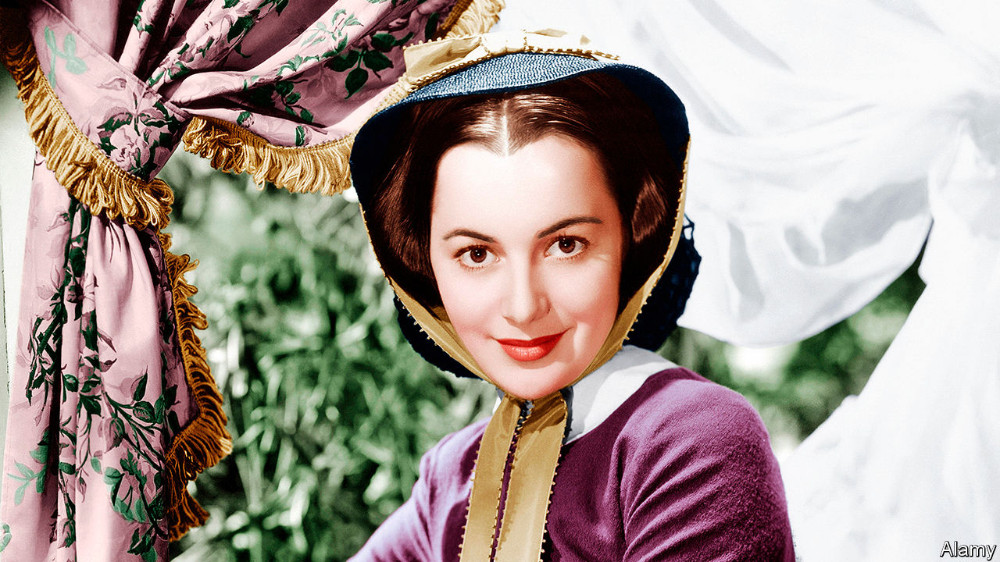

## The ingénue who roared

# Olivia de Havilland died on July 26th

> The last grande dame of Hollywood’s Golden Age was 104

> Aug 8th 2020

ON THE FIRST day of rehearsals for “Captain Blood”, in 1935, Olivia de Havilland and Errol Flynn returned their lunch trays together to the canteen. Already she had thought “Oh!” at the sight of him; but, being sensible, she had eaten alone at a distant table. Now they sat together on the stage ramp, by the huge doors that opened onto the street, and his first words were: “What do you want out of all this?” She answered, in her clear young English tones: “I would like respect for difficult work well done.”

That sounded more modest than his aim, which was simply “success”. But it meant hard fights on several fronts. When she reviewed her proudest achievements later, they were not just her major role in “Gone With the Wind” in 1939 and her two Academy Awards for Best Actress, in 1947 for “To Each His Own” and in 1950 for “The Heiress”—still less her 49 feature films altogether. She had also broken the hold of Hollywood studios over their actors, leaving them freer to choose the roles they were best suited for.

To some extent no one was free at Warner Bros in the Golden Age. She worked six-day weeks there, dressed, up on her lines and on the set by 6.30am, shooting until 6pm and until midnight on Saturdays. She once got a cameraman to blacken her eyes to show Jack Warner she was tired. That was hardly the worst of it, though. Because she was small and flawlessly beautiful she was inevitably an ingénue: the lovely and mindless girl, her pleading eyes harking back to silent-cinema days, who would lead the hero windingly but inevitably to the marriage bed. Warner Bros had one great dramatic actress, Bette Davis, and two ingénues, one blonde and one brunette. She was the brunette. And with a burst of menthol in her eyes, she could weep real tears.

From the start, this rankled with her. She wanted to play women who were complex and thoughtful, when the best she could hope for was spirited, wimpled Maid Marian in “The Adventures of Robin Hood” (1938). In “Gone With the Wind” (made for MGM, not Warner, after she pleaded with Warner’s wife) she went for Melanie Hamilton, dignified, loving and forgiving, rather than the flighty Scarlett O’Hara. There were deeply feminine qualities in her she wanted to explore. She did so largely by herself, after a good read of Stanislavsky’s “An Actor’s Work”; in costume as Melanie, she would keep going back to commune with her in the dressing-room mirror. One day, still struggling, she asked Jimmy Cagney for advice. “Whatever you say, mean it,” he snapped. She made sure she did.

And she always had. To act had been her dream from the age of five, when she found her actress-mother’s make-up box and smeared her cheeks with rouge that would not come off. It grew steadily through the childhood elocution lessons, the Shakespeare-reading sessions and a local production of “Alice in Wonderland” in which she seemed to move in an enchanted world. (Her younger sister Joan, treading annoyingly on her heels, wanted just the same career and, as Joan Fontaine, got much of it, until their mutual snubbing became legendary.) Yet even after her big break, playing Hermia in Max Reinhardt’s “A Midsummer-Night’s Dream” at the Hollywood Bowl in 1934, to sign at once with a studio was terrifying. She was 18, and felt she was jumping off an Olympic diving board with no idea how to dive. That was before she found that pretty little women were hardly required to act.

Almost as fast as Warner Bros kept offering her brainless work, she declined it. After all, her favourite pursuit was to do cryptic crosswords. But the studio had a hold on her. Each time she turned down a role her contract was suspended, and the days not worked were added as time owed. Infuriated, she took the studio to court in 1943 and won, as she was pretty sure she would. Henceforth, under the De Havilland Law of 1945, actors were employed for proper calendar terms and the studio stranglehold was ended.

It was no coincidence that she did her best work after that. In “To Each His Own”, she played a mother trying over decades to retrieve the child she had given up, carefully changing her perfume to fix the character as she aged. In “The Heiress” she portrayed a woman who was shy and plain; scorned by her father and betrayed by her fortune-seeking lover, she took a calm, cold revenge on both of them. For “The Snake Pit” (1948) she became a wife sent by her husband to a mental asylum, striving to keep her dignity while assailed by inner demons. To research the role she consulted psychiatrists and visited a mental hospital to watch electric-shock treatment, with the horror of the body rising and forcibly held down. She knew just a little of constraint like that.

She was alert to other curbs on her freedom, too. She avoided marrying her leading men, preferring to carry on discreetly with several, including Errol (unconsummated, she insisted, despite eight films together), Jimmy Stewart and John Huston. Instead she married writers, promptly divorcing them when mutual interest faded. In the mid-1940s, though ardently liberal, she resigned from the liberal Citizens’ Committee to protest against the leadership’s pro-Soviet line, and even informed the FBI secretly about them. No other voice or group should dare to speak for her, or use her.

Her strongest bid for independence came in mid-life, when she left Hollywood behind. In 1955, having married a Frenchman, she went to live in Paris for the next 60 years. In her 19th-century mansion she would float about magnificently in Chinese silk and pearls, with a glass of Veuve Clicquot in her hand. Her screen work became rarer; she did not keep company with actors and directors, but with Voltaire and Monet. Real as she had made her characters, what she most loved now was actual authenticity: houses and churches made of stone, not canvas, and real princes to meet. On a visit to Beverly Hills in 1957 she bumped into Errol again, at a charity ball, and was surprised by the deadness of his eyes.

California stayed in her mind, however. She mused to Vanity Fair that if she could not come back to Earth as herself, a role she found perfectly satisfactory, she would like to be a redwood tree. Strong, deep-rooted, benevolent, tall— and reaching in unimpeded splendour for the sun, the moon and the stars.■

## URL

https://www.economist.com/obituary/2020/08/08/olivia-de-havilland-died-on-july-26th
