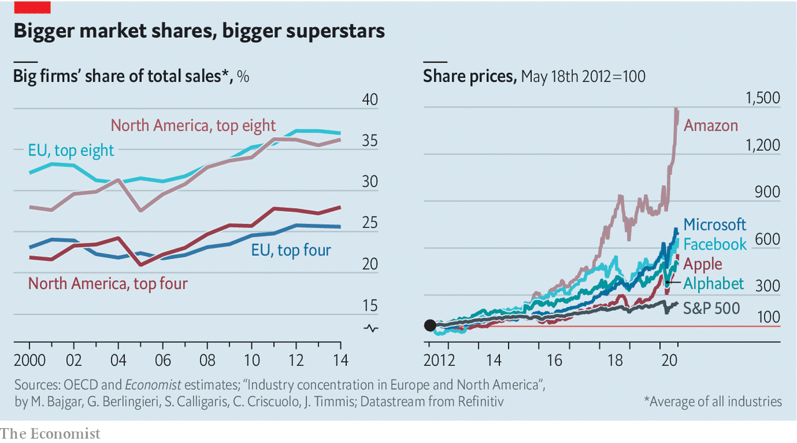

## When big isn’t beautiful

# What more should antitrust be doing?

> The first of a series on areas where economists are rethinking the basics

> Aug 8th 2020

DONALD TURNER, America’s top trustbuster in the mid-1960s, saw antitrust law as benefiting from an “inhospitable” tradition: on many matters its default response was to say no. Government lawyers routinely blocked mergers merely on the grounds that the resulting company would be too big. The companies’ counterargument that being bigger would make them better was rarely entertained by the courts.

In the 1970s the “Chicago school” of antitrust law successfully harnessed economics to argue for a much more hospitable approach. Over the following decades America’s regulators became so welcoming that critics painted them as doormats. In many industries the largest firms have consistently gained market share without any official concern; the most successful technology companies have grown into veritable titans. Many economists studying the subject now worry that a lack of competition is an economic drag, especially online. Some scholars go further, arguing that the Chicago school’s sense of what is good for consumers is not serving their broader interests.

The Chicago school, built on the work of Aaron Director, an economist from the mid-20th century, reached its zenith in the writing of the legal scholars Robert Bork and Richard Posner. Its proponents argued that many activities which were assumed to be anti-competitive were entirely reasonable strategies for improving corporate efficiency. They also claimed that in some cases even things which couldn’t be justified that way could safely be left to the market to sort out without recourse to law.

Take “predatory pricing”. Regulators thought that selling goods below cost so as to bankrupt competitors was malfeasance that had to be stopped. The Chicago school argued that it was a poor business strategy which would fail. Even if the predator crushed its competition, it would not remain a monopoly long enough to recoup its earlier losses. Instead, its high profits would attract new competitors.

Perhaps because, in the 1970s, American business had started to look more in need of help than hindrance, such arguments found favour with the American courts. And though the Chicago school’s influence was more limited elsewhere, many jurisdictions, including the European Union, adopted one of Bork’s central ideas: that the sole purpose of competition law should be to protect consumers. It is a view which forbids regulators from considerations of the broad public interest, limiting them to the busting of cartels and the prevention of mergers that create monopolies. Under this “consumer-welfare standard”, competition cases turn on forensic analysis of “upward pricing pressure”—ie, of the degree to which a merger or strategy will leave consumers out of pocket.

But has this approach led regulators to miss the wood for the trees? In 2016 The Economist pointed to America’s high corporate profits and the rising market shares enjoyed by big firms as evidence that competition across the economy had waned. Later that year economists at the White House released a report making similar observations. A version of the trend can also be found in Europe. Research by the OECD, a club of mostly rich countries, finds that between 2000 and 2014 the share of sales accounted for by the top eight firms in a given industry rose by four percentage points in Europe and eight percentage points in North America (see chart).

Many antitrust experts are unconcerned: industrial concentration, they argue, does not tell you how competitive the market for a particular good is. But some economists have blamed falling levels of competition for far-reaching economic ills, such as stagnant labour markets and growing inequality. In a paper published in 2019 the late Emmanuel Farhi of Harvard and François Gourio of the Federal Reserve Bank of Chicago argued that the rising market power of big companies was linked to low interest rates and weak investment, factors shaping the whole economy.

As in the days of the Chicago school, other economists see these critiques as ignoring the role of efficiency. A recently published paper by David Autor and John Van Reenen of MIT, David Dorn of the University of Zurich, Lawrence Katz of Harvard and Christina Patterson of the University of Chicago argues that globalisation and technological advances have concentrated economic activity in a small number of “superstar firms”. Because these firms are more productive, the industries which have seen the most of this concentration have also seen the fastest productivity growth.

It is when they are applied to technology giants that these arguments get most heated. In America the Department of Justice, the Federal Trade Commission, Congress and many states are investigating whether Amazon’s dominant position in online shopping, Apple’s immense profitability or the duopoly that Facebook and Google enjoy in online advertising can be seen as involving the abuse of the giants’ market power. Google has been the subject of three separate competition investigations by the EU and fined €8.2bn ($9.7bn).

Businesses built on “platforms”, as Amazon, Facebook and Google are, raise particular issues when it comes to competition because they have two separate sets of customers. Amazon deals with both retailers and consumers, Facebook and Google with both users and advertisers. In the 2000s Jean Tirole and Jean-Charles Rochet, two French economists, laid out an economic framework for looking at such platform businesses which showed that their optimal strategy will often be to provide cheap access to one side of the platform and charge steeply on the other. Consumers enjoy free Google searching and Facebook socialising; advertisers pay through the nose to reach them as they do so.

Platforms existed before big technology firms: television, newspapers and credit cards are all platforms of sorts. But the internet has provided vast scale and reach. Adding users is cheap, and it is often the case that the more users a platform has the more attractive it becomes to those yet to sign up. A firm that attains critical mass becomes overwhelmingly dominant: winner takes all.

Does it matter if the winning platforms dominate the digital economy? In terms of consumer welfare it seems, on the face of it, a sweet deal: users get stuff which is of real value to them at a price—zero—to which no one can object. But on the other side of the platforms things look more worrying. A recent investigation by Britain’s Competition and Markets Authority found that the cost of digital advertising for firms was worth £500 ($650) per household per year. Were the market less concentrated, those costs might fall—and some of the savings would be passed on to consumers in the form of lower prices.

Another potential worry is that there are conflicts of interest in many big-tech business models, such as when Apple sells through its app-store software which competes with its own, or when Amazon collects data about the sales of third-party products with which it competes.

Perhaps concentration would be tolerable if the big firms lived in fear of usurpation by a hot new entrant. But startup platforms face growing barriers to entry. One is amassing the reams of data which enable firms to tailor their services to individual users. Another is that in the digital economy it is relatively easy for an incumbent to see what it is that users like about what a startup offers, provide something similar and push it out to millions (if not billions) of existing users. That reduces the incentive to innovate in the first place. A final worry is that wealthy incumbents can close off the possibility of competition by buying new entrants before they pose a real threat, as when Facebook bought Instagram in 2012 and WhatsApp in 2014. In the decade to 2019 the five largest technology firms made over 400 acquisitions with scant intervention by competition authorities.

There are, broadly speaking, two sets of ideas for reforming competition economics and antitrust enforcement in response to these worries. Adherents of the more radical call themselves “neo-Brandeisians” after Louis Brandeis, an early-20th-century American Supreme Court justice who thought the overarching purpose of government antitrust action should be to prevent any one firm from exerting too much power over the economy. Neo-Brandeisians such as Lina Khan of Columbia Law School and Matt Stoller of the American Economic Liberties Project, a think-tank, want to broaden the purpose of antitrust investigations beyond promoting consumer welfare. Governments, they argue, should not fear breaking up the tech giants; they should fear leaving them be. In this view the companies’ size and power are a threat not just to consumers and workers but to democracy itself.

To its Chicago-school critics, Neo-Brandeisianism is “hipster antitrust”, replacing a transparent and rigorous methodology with an ill-defined set of social goals. It might disempower technology firms, but it would empower regulators. If concentrations of market power should be viewed with suspicion, so should concentrations of regulatory power: they bring the risk of arbitrary and unaccountable decision-making. In America, its home territory, this debate is predictably partisan: neo-Brandeisians are listened to only by Democrats.

The second set of ideas for reform is more incremental. It seeks not to abolish the consumer-welfare standard but to reinterpret it. Carl Shapiro of the University of California, Berkeley, has suggested calling it the “protecting competition standard” to make clear that it takes into account all the harm that anti-competitive practices might do to consumer welfare, including that which is indirect or diffuse.

Applying this interpretation of the consumer-welfare standard to digital platforms means accepting that in some situations firms will naturally grow large, meaning that at any point in time there will be little “competition in the market”. But there can still be “competition for the market” if a new, better product has a chance to disrupt the status quo. That might mean blocking more of the sort of early acquisitions which snuff out potential competitors, or reversing the burden of proof in such cases, so that the merging companies have to show that their plans will benefit consumers. It also might mean forcing incumbents to share some of their data, or at least making it easier for users to switch easily between platforms.

This agenda might not do much to satisfy neo-Brandeisian complaints about the political power of tech titans today. But it could succeed at making life at the top slightly more precarious. ■

## URL

https://www.economist.com/schools-brief/2020/08/08/what-more-should-antitrust-be-doing
