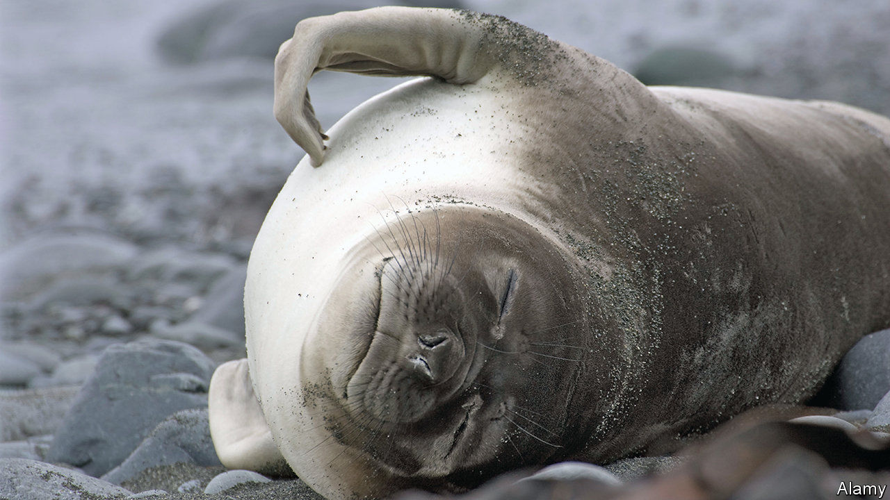

## Parasites under pressure

# An exception to the rule that there are no marine insects

> Lice that latch onto seals survive deep-sea rides

> Aug 8th 2020

INSECTS DOMINATE dry land. About 1m species have been described, more than twice as many as all other multicellular animal species, terrestrial and marine, put together. Several times that number are reckoned to await discovery. The oceans, though, are mostly insect-free. A few skate over the surface, but none dive willingly below the waves.

At least, that was the consensus until recently. But Soledad Leonardi at CONICET-CENPAT in Argentina and Claudio Lazzari at the University of Tours, in France, have found an exception: the 13 species of lice that latch onto seals. That seals have lice is not news. But Dr Leonardi and Dr Lazzari have shown that, contrary to previous belief, these passengers do not abandon ship, as it were, and remain on dry land when the seals go swimming. Instead, they cling on and brave not only the hostile, saline chemistry of seawater, but also the tremendous pressures imposed when their hosts dive to depths of several hundred metres in search of prey.

Dr Leonardi and Dr Lazzari disposed of the salinity question in 2014 by the simple procedure of dunking seal lice in seawater for prolonged periods, and discovering that they did not die. Now, as they report in the Journal of Experimental Biology, they have dealt with the question of pressure.

To do so, they collected representatives of the louse species that dwells upon the deepest-diving pinniped of them all, the South Atlantic elephant seal, which can dive as far as 2,000 metres. Using tweezers, they prised 75 lice from the flippers of 15 weaned seal pups that were sitting by themselves on the beach. They then put their trophies into a bronze compression chamber, filled with salt water, and exposed the insects to pressures ranging from a mild 30kg/cm2 (much like swimming 300 metres below the surface) to 200kg/cm2 (the full two kilometres).

That 69 of the lice survived this treatment suggests that, far from abandoning their hosts when they go for a swim (which always sounded a slightly desperate approach, given that it meant surviving on the beach until another host came along), the lice almost certainly stay on board for the ride. Indeed, an accidental extension of the experiment caused by an equipment malfunction suggests 200kg/cm2 is peanuts for an elephant-seal louse. The malfunction caused one louse to suffer a whopping 450kg/cm2 for several minutes before the system could be shut down. The bug survived the ordeal intact.

Assuming lice are typical of the wider class of insects, it seems that neither chemistry nor pressure prevent insect colonisation of the oceans. As parasites, lice of all sorts lead fairly pampered lives compared with their free-living insect cousins. Perhaps that is the difference. Or maybe respiration is the obstacle—for insects, like seals, are air-breathing creatures, and would need, as seals do, to come to the surface to breathe until they evolved gills. But some freshwater insects (dragonfly nymphs, for example) have gills, so that does not seem an unimaginable step. Possibly, the explanation is that all the oceanic niches which insects might inhabit are already taken by their close relatives the crustaceans. But some crustaceans (woodlice and coconut crabs, for example) have managed the journey in the opposite direction, in the face of insect competition. So what is actually keeping free-living insects out of the sea remains a mystery.■

## URL

https://www.economist.com/science-and-technology/2020/08/08/an-exception-to-the-rule-that-there-are-no-marine-insects
