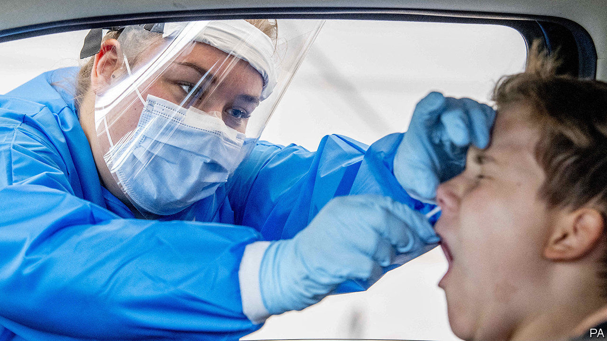

## Dive in

# Covid-19 testing labs are being overwhelmed

> Pool-sampling may offer a solution

> Aug 8th 2020

SINCE THE beginning of the coronavirus pandemic, many places have struggled with overwhelmed laboratories and a shortage of testing kits. In March, Germany was carrying out half the tests it needed. In Britain testing was limited until May to health-care workers, hospital patients and key workers. In America shortages of various components required for testing have been a cause of constant frustration. Now, as countries emerge from their lockdowns and case numbers begin to rise, the strain is being felt once more.

America carries out roughly 800,000 tests a day. A study published by Harvard University, however, reckons that the country would need to carry out 5m a day in order to reopen safely. Quest Diagnostics and LabCorp, two of the largest test-makers in America, have reported that overwhelmed laboratories mean that results are taking a week, sometimes two, to come through, instead of a couple of days.

A technique developed in the 1940s by Robert Dorfman, an American economist, may help resolve the problem. Dorfman proposed it as a way of testing soldiers en masse for syphilis. It is, in fact, quite obvious: pool together samples taken from several individuals and test the pool. If it is clear, none of its members is infected, and only one test has been used. Only if the pool comes up positive is individual testing required.

Pool-sampling has been used in America, Germany and Israel and has been introduced into China, India, Pakistan and Singapore. Sandra Ciesek at the University Hospital, Frankfurt, in Germany, says that if it were to do only individual testing, her hospital could process about 2,000 people a week. Now it can test ten times that number, which means tests can be given to every patient that is admitted, for any reason.

Testing pooled samples has its difficulties. For now, samples must be labelled by hand, which is slow. There are also concerns about loss of sensitivity that may result from dilution if too many samples are mixed. A group of researchers from Technion, Israel’s oldest university, and Rambam Health Care Campus, in Haifa, have said that up to 64 samples could be mixed, but they acknowledge that a pool this large would be difficult to manage and could have a higher risk of a false-negative result.

Peter Iwen, director of Nebraska’s Public Health Laboratory, is using tests with high sensitivity, and in pools of no more than five samples. “No test is 100%,” he says. “We feel very confident we can pick up at least 97% or better.” His was one of the first laboratories in America to use pool-sampling, after getting permission from Nebraska’s governor in March. On July 18th America’s Food and Drug Administration issued its first emergency authorisation for the whole country to follow suit.

Besides requiring high sensitivity, pool-sampling works best when the incidence rate is low. The more likely a positive result, the less efficient it is—since positive batches then have to be tested individually. It is best used, therefore, on the asymptomatic, since those with symptoms are more likely to test positive. But at the beginnings and ends of outbreaks, when most candidates for testing are, indeed, people without symptoms, it looks like a valuable time- and money-saving tool that might become standard procedure. ■

Editor’s note: Some of our covid-19 coverage is free for readers of The Economist Today, our daily [newsletter](https://www.economist.com/https://my.economist.com/user#newsletter). For more stories and our pandemic tracker, see our [hub](https://www.economist.com//news/2020/03/11/the-economists-coverage-of-the-coronavirus)

## URL

https://www.economist.com/science-and-technology/2020/08/08/covid-19-testing-labs-are-being-overwhelmed
