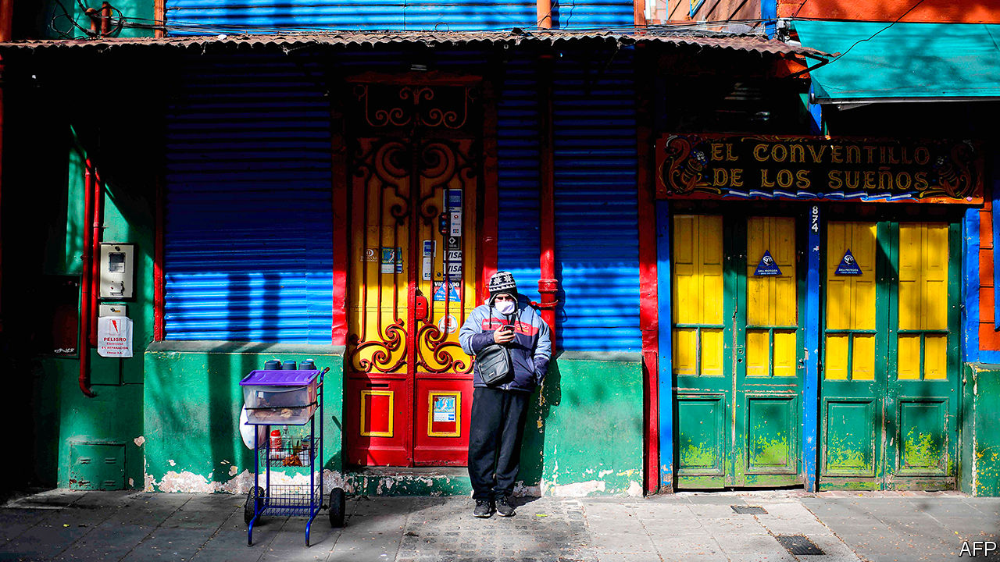
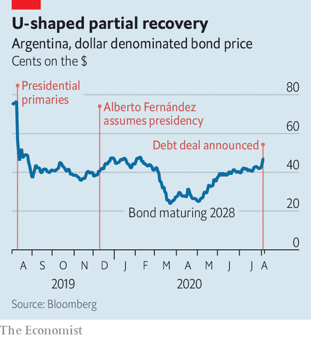

## Fighting on fewer fronts

# Argentina reaches a deal with its foreign creditors

> That is good news. It will take much more to overcome the economic and health crises

> Aug 5th 2020BUENOS AIRES

AT ALBERTO FERNÁNDEZ’S official residence in a suburb of Buenos Aires, the mood mixed relief and caution. “We’ve dodged a bullet,” said an adviser to Argentina’s president after the government had reached a deal with creditors on August 4th. The news came just as the country recorded 166 covid-19 deaths, a daily record. “The challenge is a path out of pandemic and deep recession,” said the adviser.

The summing-up is accurate. Mr Fernández, a Peronist who became president in December, had appeared to be on a collision course with holders of $65bn-worth of foreign-law bonds. That is about 40% of the government’s foreign debt and equivalent to 16% of this year’s GDP. The economy minister, Martín Guzmán, initially demanded big cuts in interest payments and a delay until 2023 in resuming them. Argentina, now on its ninth debt default, looked set for yet another legal battle with creditors, which would have weakened the peso, quickened inflation and prolonged its exile from international credit markets.

The government’s agreement with the main holders of the debt has probably averted that danger. It is offering new bonds worth almost 55% of the face value of the ones they own, up from an original proposal of 38%. It will start to pay a bit earlier than it had first proposed (interest due every March and September will instead be paid every January and July). It has also agreed to make collective-action clauses, which allow a supermajority of creditors to force others to agree to a debt restructuring, more favourable to investors by making it harder for Argentina to make a separate peace with a subset of creditors, then turn on the rest. Argentina will now have to renegotiate its $44bn debt to the IMF.

The agreement with creditors is “great news”, says Federico Sturzenegger, a former head of the Central Bank who has been a critic of Mr Fernández. Most Argentines are less enthusiastic. “I can’t pay my taxes, so how can I celebrate us paying debts?” asks Ricardo as he opens his small grocery store in downtown Buenos Aires. His first client, Marta, a cleaner, scoffs: “People are starving. We need the money, not the foreign banks.” Mr Fernández’s approval rating has recently dropped, from 61% to 51%.

What comes next “is the hard part”, says an IMF official: the intertwined tasks of suppressing the pandemic and restoring growth. That is what will improve the mood of people like Ricardo and Marta.

The Fernández government acted early in response to covid-19. It imposed a nationwide lockdown in mid-March and has maintained it in the most densely populated areas. That has kept Argentina out of the ranks of the worst affected countries. Despite the lockdown, though, the number of cases and deaths has jumped in the capital and the surrounding province of Buenos Aires, home to 45% of Argentines.

The cost has been high. The IMF expects the economy to contract by 10% this year, worsening a crisis that began under Mr Fernández’s predecessor, Mauricio Macri, in 2018. Annual inflation is nearly 43%. The official poverty rate, 35% at the end of last year, now probably exceeds 40%.

Although the government will now be spending less to service its debt than originally planned, it has little cash to fight recession and poverty. The budget deficit this year is projected to be 8% of GDP. It is being financed directly by the Central Bank, one reason inflation is so high. If the government is to restore growth, attract investment, curb inflation and pay creditors as promised it will need another plan.

One precondition is reducing the budget deficit. That will require a cut in public spending as soon as the pandemic allows. The government should de-index the pension system, use tax incentives to boost exports and liberalise labour laws to encourage investment, especially in agri-business and energy, argues Aldo Abram, director of Libertad y Progreso, a conservative think-tank. “Do we know what we have to do, economically, to get out of this hole?” Mr Abrams asks. “Yes. Do I see a president ready to confront these issues? No.”

One reason may be the influence of the vice-president, Cristina Fernández de Kirchner. A populist, she was president herself from 2007 to 2015 and chose Mr Fernández to be the Peronist movement’s presidential candidate.

Ms Fernández (no relation to the president) has used her clout most in non-economic areas. Her supporters lead the ministries of interior, security and defence. Under indictment for corruption (and with her two children being investigated), she is pushing for sweeping changes to the judiciary, including an expansion of the Supreme Court. Her critics say that is to make room for judges loyal to her.

She has a say on economic matters, too. She lobbied the president to issue a decree expropriating Vicentin, a big cereal producer. President Fernández eventually withdrew it, saying the courts would not co-operate. Though she fought foreign bankers during her presidency, she favoured this month’s settlement, and made sure she got some of the credit. During the frantic negotiations on August 3rd, Mr Guzmán visited her at home to explain his strategy. Her influence, though in favour of a sensible policy in this case, “is not a good narrative to sell investors”, says a longtime adviser to the president.

With the debt deal, Mr Fernández has made his impossible-seeming job a bit easier. Now he must overcome a recession, tame a disruptive vice-president and, above all, contain the pandemic, which is ravaging poor villas around Buenos Aires. He has handled Argentina’s creditors with finesse. Covid-19 is more implacable.■

## URL

https://www.economist.com/the-americas/2020/08/05/argentina-reaches-a-deal-with-its-foreign-creditors
