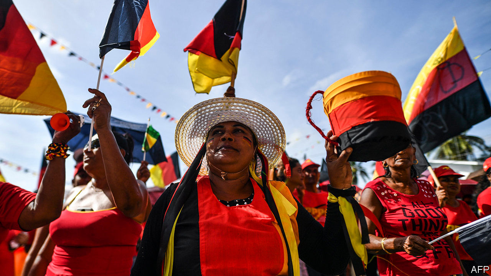
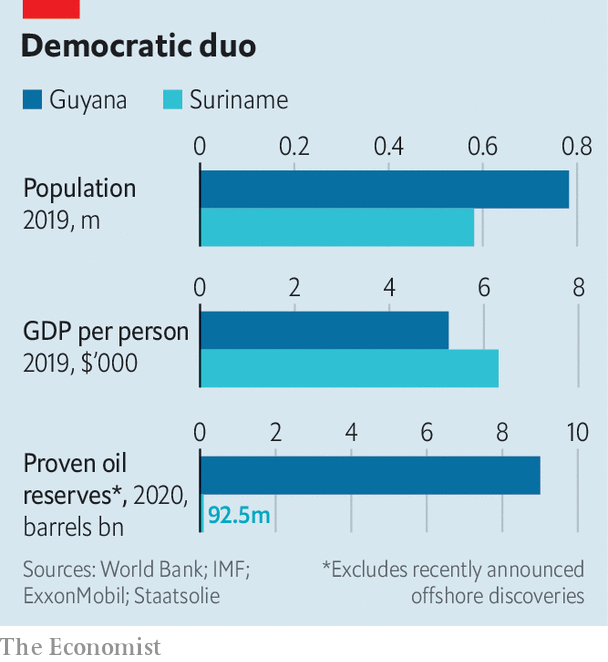

## Oil futures

# Democracy wins in Guyana and Suriname

> The neighbours’ new presidents have contrasting challenges

> Aug 8th 2020

FOR FIVE months Guyana has waited to see if the stand-off between its president, David Granger, and the opposition would end in violence, a coup or a peaceful transfer of power. On August 2nd peace prevailed. The Elections Commission declared that Irfaan Ali, the opposition’s candidate, had won the election held on March 2nd. He took office the same day.

Mr Ali had a minuscule lead on election day, but a disputed tally by the chief elections officer gave victory to Mr Granger. A drawn-out recount and legal battles followed. It looked as if Mr Granger, a former army brigadier, was determined to remain in office. He relented under pressure from other countries such as the United States and Britain, the former colonial power, plus regional organisations such as the Caribbean Community. Independent media and Guyana’s private sector lobbied for Mr Granger to go. His supporters plan a court fight, but have little prospect of success.

The transfer of power comes just as Guyana begins to cash in on massive offshore oil deposits (see chart). Thanks to them, the IMF expects the economy to grow by 53% this year. In a few years, South America’s third-poorest country, which has one of the world’s highest rates of emigration, will probably be one of its richest. The chance to control the bonanza raised the stakes in the bitter rivalry between Mr Granger’s mainly Afro-Guyanese coalition and Mr Ali’s mainly Indo-Guyanese People’s Progressive Party (PPP), which began before independence in 1966. The winner could hope to stay in power for decades.

It is hard to trust that the new government will spend the oil money wisely. The PPP’s 22 years in power before 2015 are remembered for corruption (as are the 28 years of rule before that by the People’s National Congress, now Mr Granger’s party). Bharrat Jagdeo, the president from 1999 to 2011, still calls the shots in the PPP and is the new vice-president. He chose Mr Ali, a former housing and water minister, as the party’s candidate because he could not run. Guyana’s Special Organised Crime Unit has charged Mr Ali with conspiracy and fraud. He denies the allegations, and promises honest management of the oil money.

The PPP has said it will dissolve the Natural Resource Fund, set up by Mr Granger’s government to receive oil revenue. It is supposed to release the money into the economy at a rate that does not drive the value of the currency to levels that would make other enterprises uncompetitive or overwhelm the capacity of Guyana’s weak institutions to spend it well. But it is not clear what the new government will replace it with, or when.

More than $90m, about 2% of last year’s GDP, is sitting in a bank account at the New York Federal Reserve. An early test of Mr Ali will be whether he bows to pressure to spend much of that money to bail out GuySuCo, the state-owned sugar producer, which is having trouble paying its wage bill. Mr Granger’s government had sought to reduce the firm’s losses by shutting down some money-losing estates, which contributed to his election loss. Mr Ali may be tempted to preserve unproductive jobs, mostly held by Indo-Guyanese workers. There are wiser ways to spend the money: on boosting infrastructure and education and on measures to protect the country from covid-19, which is spreading alarmingly, and from climate change. That might win over the half of Guyanese who did not vote for him.

Suriname’s new president, Chan Santokhi, also wondered whether he would take office after winning an election. His period of suspense was shorter. The vote took place on May 25th, and he was sworn in on July 16th. The doubt was whether President Desi Bouterse, who has dominated Suriname’s politics for more than 40 years and was convicted last year by a military court of murdering 15 political opponents in 1982, would yield power.

He did, but has left Mr Santokhi with a mess. Before leaving office Mr Bouterse gave public servants a 50% pay rise, which the government cannot afford. The budget deficit last year exceeded 10% of GDP. Mr Santokhi persuaded public-sector unions to wait for the pay rise. He has begged banks for cash, raised income-tax rates and deferred payment of a loan taken out last year to buy a hydroelectric dam.

Suriname, like Guyana, is an emerging petro-power. Apache, an American oil company, and its French partner, Total, announced this year three big oil finds offshore. Others are about to drill. Surinamese may share Guyanese worries over how well the windfall will be managed. Mr Santokhi is a former police commissioner and justice minister but the new vice-president, Ronnie Brunswijk, seems less strait-laced. He began his career as Mr Bouterse’s bodyguard, fought a guerrilla war against his former boss in the 1980s, and has been convicted by a Dutch court for cocaine smuggling. He owns a football club and a gold-mining business.

The oil will not flow for perhaps five years, which means that Mr Santokhi, whose term ends in 2025, may reap as little political benefit from it as the unlucky Mr Granger. The economy will shrink by 5% this year, reckons the IMF. Gold may help before the oil money arrives. It accounted for more than three-quarters of exports last year. Investors’ mistrust of the dollar has pushed its global price to a record high.

Dutch-speaking Suriname’s largest ethnic groups, like Guyana’s, are of African and Indian origin. But its political divide reflects attitudes to Mr Bouterse rather than ethnic identity. He has now left the scene. The fight over how to spend Suriname’s new riches, when they come, may be less bitter than Guyana’s. That, perhaps, is Suriname’s real gold.■

## URL

https://www.economist.com/the-americas/2020/08/08/democracy-wins-in-guyana-and-suriname
