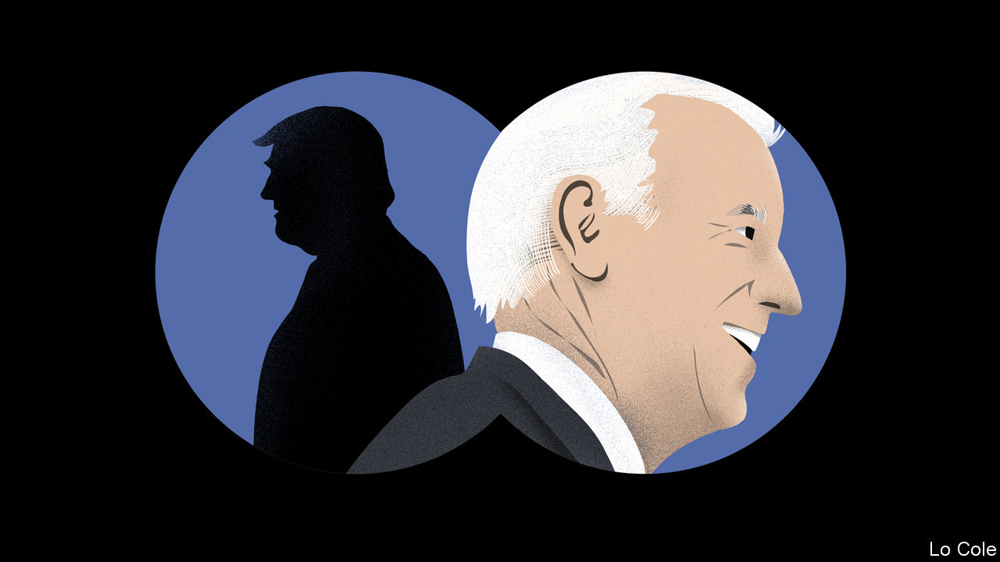

## Bello

# How Joe Biden might change policy towards Latin America

> Less confrontation, more co-operation

> Aug 8th 2020

“FOR THE first time in history, you can truly envision a western hemisphere that is secure, democratic and middle-class, from northern Canada to southern Chile, and everywhere in between.” So said Joe Biden in a speech at Harvard University in 2014. Much has changed since then, not least the destruction of lives and livelihoods wrought by the pandemic. Even so, were Mr Biden to be elected president of the United States in November, for many Latin Americans he would offer a vision that is reassuring and familiar compared with the unpredictable sound and fury of Donald Trump.

Mr Trump won in 2016 in part because he promised to build a wall to keep out Latin American immigrants, declaring that Mexico was “not our friend”. Nevertheless, he has developed relatively good relations with the most important governments in the region. Jair Bolsonaro, Brazil’s president, used Mr Trump’s success as a template for his own campaign in 2018. He has closely aligned Brazil’s foreign policy, normally independent, with the Trump administration’s views. Andrés Manuel López Obrador, on his only foreign trip in 21 months as Mexico’s leader, last month went to Washington and praised Mr Trump’s “kindness and respect”. To keep the border open for trade, Mexico’s government has collaborated in shutting it to asylum-seekers.

Wary of Mr Trump’s threats of tariffs and sanctions, many governments have fallen into line “out of necessity and especially out of fear”, says a Latin American official. Ordinary Latin Americans are not impressed: the percentage who express a favourable view of the United States fell from the high 60s in 2015 to around 45 in 2017, according to the Pew Research Centre.

Mr Trump’s Latin American policy has centred on a (so far) failed bid to overthrow what John Bolton, his former national security adviser, called “the troika of tyranny”—the leftist dictatorships in Venezuela, Cuba and Nicaragua. In his recent memoir Mr Bolton blamed the failure to oust Nicolás Maduro in Venezuela, despite swingeing sanctions, on Mr Trump’s lack of constancy and foot-dragging inside the administration. As important, the administration underestimated the difficulty of prising the army away from Mr Maduro. Its critics say its Latin American policies are based on the president’s need to win Florida, home to large Cuban and Venezuelan diasporas, in November. “Domestic politics always figures in policy towards Latin America, but never before to this degree,” says Michael Shifter of Inter-American Dialogue, a think-tank in Washington.

Were Mr Biden to win, his priorities would be the American economy and dealing with China. But Latin America might not be at the bottom of his to-do list. He knows the region far better than recent presidents. In Barack Obama’s second term Vice-President Biden took on responsibility for the Americas. “He dedicated time to it, set out to learn about it and talked to a lot of people in the region,” says the Latin American official.

Juan Gonzalez, who advised Mr Biden on Latin America back then, stresses that the region and the world are not as they were in 2016. “The challenges are much greater,” he says. But he thinks there are opportunities for the United States in the region, not just threats to be managed. American firms that bring supply chains back from China could benefit Mexico and Central America. Mr Biden has long supported immigration reform. As president, he would be likely to resume his previous policy in Central America, with an aid programme aimed at fighting corruption and deterring migration through economic development.

On Venezuela, Mr Gonzalez says that sanctions should be part of a broader policy that would include seeking negotiations for free elections. A Biden presidency would revert to Mr Obama’s Cuba policy, which saw engagement as more likely to weaken the communist regime than Mr Trump’s intensification of sanctions. It would press Mr Bolsonaro on his failure to protect the Amazon.

An immediate issue concerns leadership of the Inter-American Development Bank. Breaking with a 60-year understanding that its president is a Latin American, the Trump administration wants the job for Mauricio Claver-Carone, an official at the National Security Council and an architect of its Venezuela policy. He may get it at a meeting of the bank’s governors next month. A Biden administration would probably force him out in favour of a less polarising figure. To do that, Mr Biden must win.

Dig deeper:Sign up and listen to Checks and Balance, our [weekly newsletter](https://www.economist.com//checksandbalance/) and [podcast](https://www.economist.com//podcasts/2020/07/31/checks-and-balance-our-weekly-podcast-on-american-politics) on American politics, and explore our [presidential election forecast](https://www.economist.com/https://projects.economist.com/us-2020-forecast/president)

## URL

https://www.economist.com/the-americas/2020/08/08/how-joe-biden-might-change-policy-towards-latin-america
