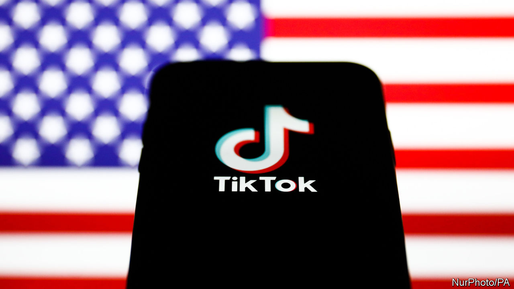
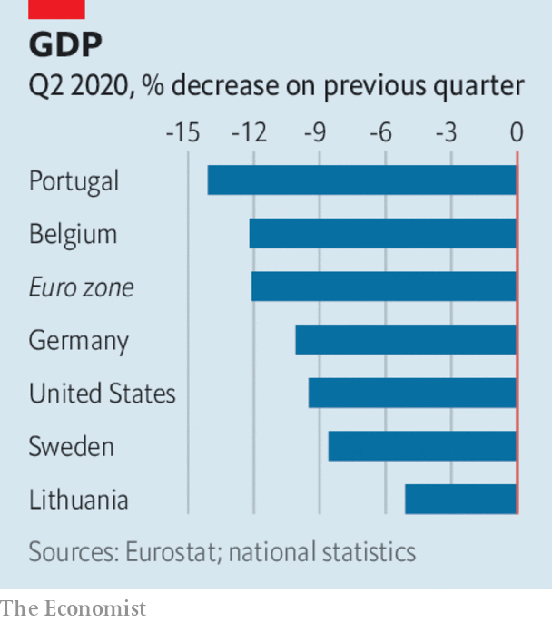

# Business this week

> Aug 8th 2020

In an extraordinary turn of events, Donald Trump said he would now give his blessing to Microsoft’s recent proposal to acquire the American operations of TikTok, after the software giant said it had addressed the president’s concerns. Mr Trump had threatened to shut down the video app in the United States because of worries that its Chinese owner might collect user data for the Chinese government. Warning that he might intervene further, Mr Trump suggested that the US Treasury should get a cut from any deal. [See article](https://www.economist.com//leaders/2020/08/05/forced-sales-are-the-wrong-way-to-deal-with-chinese-tech).

BP said it aimed to reduce production in oil and gas by 40% before 2030 and hugely increase investment in renewable energy as part of its project to achieve net zero carbon-dioxide emissions by 2050. It is the most ambitious plan put forward by an oil company yet in the switch to green energy. BP reported a headline loss of $6.7bn for the second quarter, mostly because it wrote down assets in light of lower oil prices. It also reduced the size of its shareholder dividend for the first time in a decade.

BP was not alone among the oil giants in revealing a painful quarter. Chevron reported a loss of $8.3bn and ExxonMobil $1.1bn. Shell recently wrote down its assets by $16.8bn.

Bolstering its balance-sheet, Marathon Petroleum, an oil-refining company, agreed to sell its Speedway petrol stations to Seven & i Holdings, the Japanese owner of 7-Eleven convenience stores, for $21bn.

Anthony Levandowski, who helped found Google’s driverless-car project, was sentenced to 18 months in prison for stealing the company’s technology before going to work on a rival scheme for Uber. Mr Levandowski, once one of Silicon Valley’s brightest stars, will not go to jail yet because of covid-19. He was also ordered to pay $756,000 in restitution.

Elizabeth Warren, an American senator, wrote to the Securities and Exchange Commission asking it to investigate “potential incidents of insider trading” before the announcement that Kodak was to receive a government loan to make generic drugs. Kodak’s share price soared by over 2,000% following the announcement, but has fallen by more than half since then.

A raft of data for the second quarter revealed the extent of the damage that the pandemic is doing to economies. The euro zone’s economy was 12.1% smaller than in the previous three months. Spain’s GDP contracted by 18.5%, France’s by 13.8% and Italy’s by 12.4%. Earlier figures showed America’s economy shrinking by 9.5% in the quarter. Sweden, which controversially avoided a lockdown to keep its economy running, saw GDP shrink by 8.6%.

Two big takeovers involving health-tech companies were announced. Siemens Healthineers, a group listed separately to Siemens, its parent company, said it would buy Varian Medical Systems, best known for its use of artificial intelligence and machine learning in cancer treatments, for $16.4bn. And Teladoc Health, which operates a telemedicine platform, struck a deal to acquire Livongo, a rival, for $18.5bn.

Ford announced that Jim Hackett is to step down as chief executive. Jim Farley, the chief operating officer, will take over in October. Mr Hackett has held the position for three years, a time of lacklustre profits that drove many investors to despair. Ford did report a second-quarter net profit of $1.1bn, but that was mostly down to gains from an investment; without the gains it slipped to a loss. General Motors and Fiat Chrysler reported losses, but they were smaller than expected.

EasyJet operated just 709 flights for the three months ending June, in contrast with 165,656 in the same quarter last year. However, the European airline says demand is now “healthy” and it has increased its planned passenger capacity this quarter to 40%. Faced with a cash crunch, IAG, the owner of British Airways, said it would issue new shares to raise up to €2.75bn ($3.3bn).

James Murdoch resigned from the board of News Corporation, because of “certain editorial content”. He is Rupert Murdoch’s youngest son and was once seen as an heir to his father’s media empire, but he has drifted away from the business to take up liberal causes. That empire is much smaller now anyway, after the sale of film and television assets to Disney in 2019.

With cinemas under restrictions on social distancing and facing the prospect of more lockdowns, Disney decided to release “Mulan”, the live version of its animated hit, on Disney+ in September. Its streaming service has attracted over 60m subscribers since launching late last year, though it has yet to cover its costs. Overall, Disney reported a net loss of $4.7bn from April to June, its first since 2001, mostly because it had to close its theme parks at the start of the pandemic.

## URL

https://www.economist.com/the-world-this-week/2020/08/08/business-this-week
