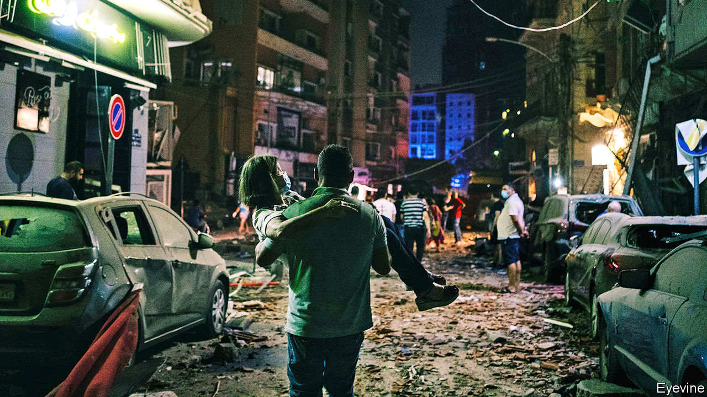
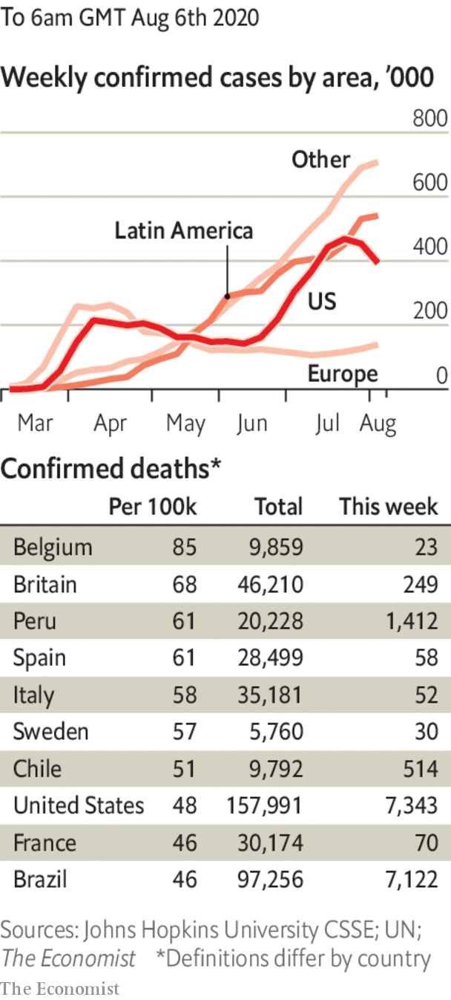

# Politics this week

> Aug 8th 2020

A state of emergency was declared in Lebanon, after a huge explosion at Beirut’s port. The blast was felt in Cyprus, 240km away. It killed at least 135 people, injured 5,000 and left 300,000 homeless. The cause was a fire in a warehouse holding 2,750 tonnes of ammonium nitrate, a chemical used in fertiliser and bombs. This highly explosive stockpile had lain neglected for six years. Lebanon’s prime minister, Hassan Diab, vowed that those responsible would “pay the price”. Lebanon was in an economic and political crisis even before the blast. See [article](https://www.economist.com//leaders/2020/08/08/a-big-blast-should-lead-to-big-change-in-lebanon).

Israeli aircraft struck military targets in southern Syria, in retaliation for an alleged attempt by militants to plant explosives near the Israeli-occupied Golan Heights area, which is also claimed by Syria.

The United Arab Emirates began operating the Arab world’s first nuclear power plant. The oil-rich UAE hopes it will meet a quarter of its electricity needs once it is fully operational. Qatar, a rival, has described the plant as a “flagrant threat to regional peace and environment”.

A report by the BBC Persian service accused Iran of covering up deaths from covid-19. Leaked official data showed the number of Iranians who have died with covid-19 symptoms to be nearly three times higher than the government admits. Known infections were almost double the public figures.

Armed men thought to belong to Boko Haram, a Nigerian jihadist group, attacked a refugee camp in Cameroon, killing 17 people.

Colombia’s Supreme Court ordered that Álvaro Uribe, a conservative former president, be placed under house arrest. It is examining whether Mr Uribe had tried to tamper with witnesses in an investigation that he instigated against a left-wing senator. Mr Uribe, the mentor of Colombia’s current president, Iván Duque, is the first sitting or former president since the 1950s to be detained.

Five months after the vote, a final result was declared in Guyana’s presidential election, allowing Irfaan Ali, of the mainly Indo-Guyanese People’s Progressive Party, to be sworn into office. The new president will be able to decide how to spend the country’s new-found oil income, which began flowing in February. See [article](https://www.economist.com//the-americas/2020/08/08/democracy-wins-in-guyana-and-suriname).

Sri Lankans voted in parliamentary elections. Early returns suggest the Sri Lanka People’s Front of President Gotabaya Rajapaksa will win a clear majority.

Jihadists loyal to Islamic State attacked a prison in the city of Jalalabad in eastern Afghanistan. Some 29 people were killed during a day-long gun battle, including guards, assailants and inmates. Several hundred prisoners escaped, including fighters from IS and the Taliban.

Narendra Modi, India’s prime minister, laid the foundation stone of a temple to the Hindu god Ram in the city of Ayodhya. The temple is being built on the site of a mosque that was torn down by an organised Hindu mob in 1992, sparking riots in which 2,000 people died. Its construction has been a goal of Mr Modi’s Bharatiya Janata Party since the 1980s. See [article](https://www.economist.com//asia/2020/08/04/indias-ruling-party-replaces-a-mosque-with-a-hindu-temple).

The children’s commissioner for England said that schools should be opened ahead of pubs, restaurants and shops, and only shut when essential: “first to open, last to close”. She listed various ways in which missing out on education harms children, especially the poorest ones.

By contrast, Chicago joined a growing list of American cities that will keep schools closed in September and continue with remote learning.

Black Lives Matter activists scored their biggest upset in the Democratic primaries so far when Cori Bush defeated William Lacy Clay, the incumbent congressman in St Louis. Mr Clay, who is black, has served the district since 2001; his father held the seat before that for 32 years.

The former king of Spain, Juan Carlos, went into voluntary exile, two months after Spain’s supreme court opened an investigation into his alleged involvement in a high-speed rail contract in Saudi Arabia. He said he would assist prosecutors as required.

Hong Kong’s leader, Carrie Lam, postponed elections to the legislature that had been due in September. They will be held a year later, she said, because of covid-19. Pro-democracy candidates had been expected to do well.

America imposed sanctions on the Xinjiang Production and Construction Corps, and two Communist Party officials linked to it, for their alleged role in human-rights abuses. Xinjiang is a vast Chinese region where many ethnic-Uighurs have been locked up for their devotion to Islam and their Turkic culture.

China’s leader, Xi Jinping, declared the official completion of the country’s BeiDou satellite-navigation system, intended as a rival to America’s Global Positioning System, or GPS. A Chinese general said it marked an “important milestone” on China’s path towards becoming a “space power”.

The SpaceX capsule that transported two astronauts to the International Space Station came safely back to Earth, touching down in the sea near Florida’s Gulf coast. This was NASA’s first spacecraft splashdown since 1975.

Manila was put back into lockdown. The 13m people in the Philippine capital will endure fewer restrictions than under an earlier lockdown, but mass transit is shut.

The Australian state of Victoria declared an emergency and imposed a night-time curfew in Melbourne, its capital. The city’s residents can only shop and exercise within 5km of their home. See [article](https://www.economist.com//asia/2020/08/08/australias-internal-travel-restrictions-are-tested-in-court).

The Democratic convention in Milwaukee will now be entirely virtual. Some party officials will still go to the city, but Joe Biden is to broadcast his big speech from Delaware.

Deborah Birx, who heads the White House’s task force on covid-19, warned that the disease is more widespread in America now than in April. That earned her a rebuke from Donald Trump, who tweeted that she was “Pathetic!” for repeating what he said was a Democratic argument.

## URL

https://www.economist.com/the-world-this-week/2020/08/08/politics-this-week
