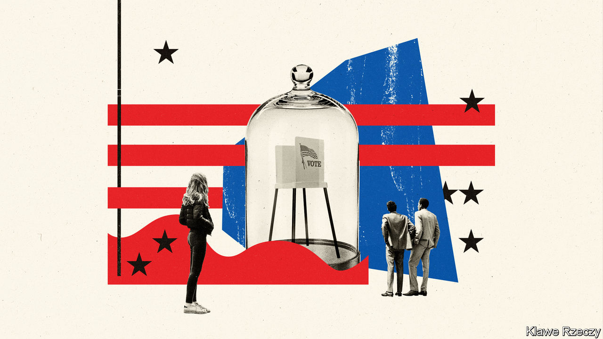
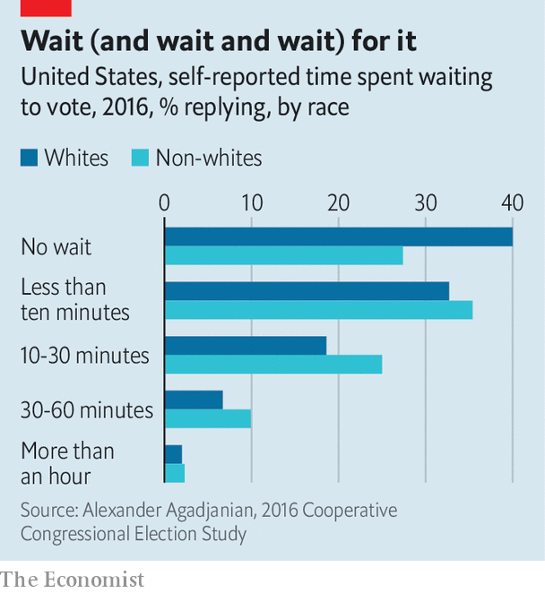

## Electing a president

# Americans should worry less about foreigners and voter fraud

> And worry more about long lines at polling booths and problems with vote counting

> Aug 8th 2020

WITH LESS than three months to go until polling day, a president talking up the threat of fraud and a virus keeping people at home, Americans are understandably worried about this year’s presidential election. Even in more normal times, America’s system of casting and counting ballots is more complicated and inconvenient than it should be. In Georgia’s primary elections in mid-July some voters queued for five hours to make their voices heard. In New York, tens of thousands of mail-in ballots have been disqualified or are being disputed six weeks after the primary election there.

To simplify a bit, at election time Americans now worry about three groups of bad actors. The first is foreigners, who might meddle with the results. “Russian election interference” conjures-up images of hackers ensconced in St Petersburg breaking into vote-counting machines, or corrupting lists of eligible voters. But this is not what happened in 2016. The Russian interference that became such a big post-election story was an influence campaign rather than a technologically sophisticated plot to mess with voting returns.

The second group is fraudulent voters. These have long preoccupied Republican politicians. Donald Trump’s insistence that “2020 will be the most INACCURATE and FRAUDULENT Election in history” is different in style and motivation, but not in substance, from past claims. There is almost no evidence for this either. Mr Trump’s own commission on election integrity, which was seemingly set up to explain how the greatest candidate in history could possibly have lost the popular vote in 2016 (and which was run by Kris Kobach, an enthusiastic peddler of the myth), disbanded without finding evidence of voting fraud. Still, polls last time around suggested that about half of voters believe that electoral fraud is a real problem.

The third group of “bad actors” are Republicans. Democrats maintain that, by manipulating laws on what identification is acceptable at a polling station and where those stations are sited, and by purging inactive voters from the state lists of eligible voters, Republicans engage in a systematic kind of cheating, or voter suppression. There is evidence that this goes on. Republican operatives will sometimes admit to it in unguarded moments. But there is little evidence that voter suppression is decisive, perhaps because the main effect may be to disenfranchise people who would not have voted anyway (even in presidential elections, about 45% of eligible voters do not bother to cast a ballot).

After the 2016 election, activists aligned with the Democrats claimed that laws requiring voters to present photo ID before they could vote cost Hillary Clinton the state of Wisconsin and maybe the entire election. But academics have poured a lot of cold water on these theories; there is no compelling evidence that voter-ID laws changed the result of the 2016 election. Likewise, in 2018 the Democratic candidate for governor of Georgia alleged that her opponent, now-governor Brian Kemp, used his power as the secretary of state (a position that is responsible for administering elections) to disenfranchise voters and deny her the election. One investigation into the contest found that a programme designed to verify the information voters submit with their applications for registration could have disenfranchised up to 50,000 Georgians. Yet Mr Kemp’s margin was 55,000 votes—even if every single voter who was disenfranchised voted for his opponent, he would still have won.

If worries about these three groups of bad actors can be overblown, Americans are far too relaxed about less exotic kinds of trouble on election day—the kind caused by incompetent administration, weird laws, lack of funding and too few volunteers at polling places.

America’s constitution, unlike those of other Western democracies, does not guarantee all its eligible citizens the right to vote. Instead, it leaves election administration up to the states. Polling-place closures and long queues caused by a lack of volunteers, as well as failures of new electronic machines (which happened in Georgia this year) are routine. The whole system is a bit creaky: an analysis by researchers at the Brennan Centre for Justice, a law and voting-rights group, found that the vast majority of states are using voting machines that are no longer manufactured.

Though a visit to a polling place lasts minutes in many other Western democracies, it can take hours from start to finish in America. Big cities often have too few polling places with too few workers and cumbersome voting machines. All this waiting can dissuade people from voting, an effect seen disproportionately among non-white Americans. One poll taken after the 2016 election revealed that 73% of non-whites said they had to wait in line to cast their votes, compared with 60% of whites. The longer someone has to wait, the more the disparity grows; non-whites were 40% likelier than whites to report waiting longer than half an hour to vote (see chart).

The failure of the New York Board of Elections to prepare for an influx of mail-in ballots this year has raised renewed concerns about the capacity of postal voting systems (see [article](https://www.economist.com//united-states/2020/08/08/the-postal-service-has-become-a-key-part-of-americas-election-infrastructure)). Covid-19 means more voters than ever will attempt to cast their votes by post in November. The US Election Assistance Commission, an agency charged with helping election administrators, reckons that in 2016 41% of ballots were cast before election day. If that share increased it would lessen waiting times at polling stations. But the postal service and ballot-counters would be inundated with envelopes sent by voters who are new to the process and may have their ballot discarded because of some minor technical glitch. More postal voting could also make counting much slower on election night, creating doubt about who has really won that could last for days or even, in the case of a tighter election, months.■

Dig deeper:Sign up and listen to Checks and Balance, our [weekly newsletter](https://www.economist.com//checksandbalance/) and [podcast](https://www.economist.com//podcasts/2020/07/31/checks-and-balance-our-weekly-podcast-on-american-politics) on American politics, and explore our [presidential election forecast](https://www.economist.com/https://projects.economist.com/us-2020-forecast/president)

## URL

https://www.economist.com/united-states/2020/08/08/americans-should-worry-less-about-foreigners-and-voter-fraud
