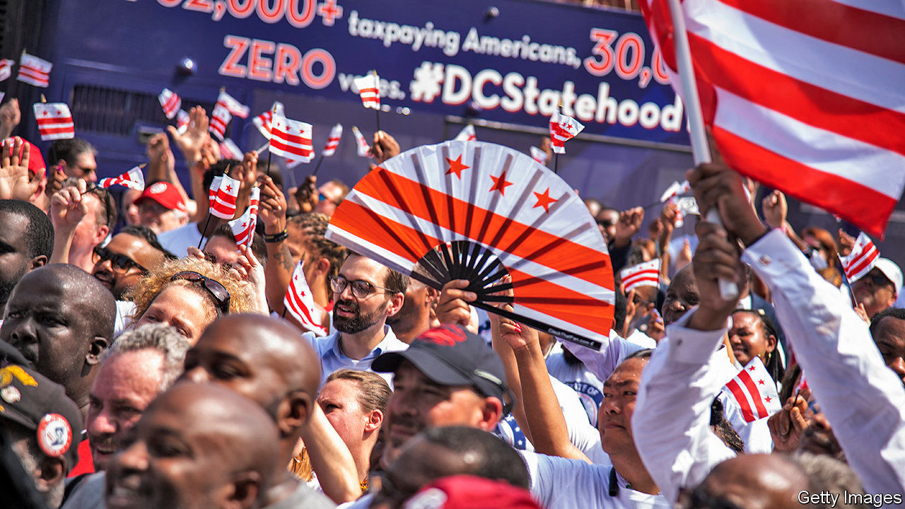
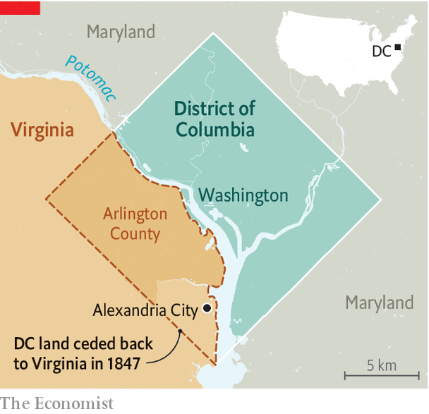

## Without representation

# Residents of Washington, DC could once vote for Congress

> Might they soon be able to again?

> Aug 8th 2020

WASHINGTON, DC was not always a funky trapezoid shape. It took on that form in 1847, when residents of Alexandria City (now in Virginia) spearheaded an effort to leave the capital and be reincorporated into Old Dominion state. Years of neglect from Congress and Washington’s various governing committees had left its infrastructure crumbling. Many slaveholding residents also believed that the capital would soon outlaw slavery, and cast an eye to friendlier territory next door. Following votes in favour from Alexandria residents and Congress in 1846, the Virginia state legislature met the next year to approve the retrocession of all District lands south of the Potomac river. That history is becoming newly relevant as the campaign for DC statehood has gained momentum.

Before the retrocession, the District was ten square miles of land that included both present-day Alexandria City and Arlington County, Virginia, in addition to its current territory north of the Potomac. This was its original design as set out in 1790, when northern political leaders met their southern opponents to establish a capital on the Potomac in exchange for a powerful national bank and an expanded role for the federal Treasury. The story of this “dinner-table bargain” has now been popularised by a song in the musical “Hamilton”.

The original capital district was not just geographically different from the one that exists today. Its residents also enjoyed different rights. Between 1790 and 1801, people living in the newly converted district could vote for both the House of Representatives and the state legislatures of Virginia and Maryland, depending on which side of the Potomac they lived. That is because the District of Columbia was not officially incorporated until the turn of the century; until then, de facto residents still enjoyed all the de jure rights of a citizen living in the surrounding state. In 1801 Congress passed the Organic Act, a law officially establishing Washington as a district separate from its adjacent states. Residents were to be governed by Congress, and were no longer counted as residents of Maryland or Virginia. Their right to vote was stripped away.

This history is little-known outside the capital city. Although its lack of voting rights is a live issue among the 700,000 people who live there, most other Americans pay it little attention. Polling suggests that those who have are split; statehood for Puerto Rico has greater support than statehood for the Swamp.

Democratic activists are an exception. They have embraced the issue not only for the sake of residents’ voting rights, but also for the two additional Democratic senators the District, which is almost half black, would undoubtedly send to Capitol Hill if it became a state. In “It’s Time to Fight Dirty: How Democrats Can Build a Lasting Majority in American Politics”, David Faris, a political scientist, cites statehood for DC as one of several “dirty” tricks Democrats could pull to tilt the electoral system—which confers advantages to Republicans who represent sparsely populated, rural states—back towards equality. In June a majority of members of the Democrat-controlled House of Representatives voted to admit DC into the union as the 51st state. Of the 25 candidates who ran for the Democratic presidential nomination this year, 18 supported statehood.

The political implications of granting statehood to DC have caused an uproar on the right. Just before the House vote, Tom Cotton, a Republican senator from Arkansas, told the Senate that granting statehood to the district and conferring voting rights on its citizens constituted a “power-grab” by Democratic politicians to “rig the rules of our democracy and try to give [them] permanent power”. That, of course, is part of the appeal for some of the idea’s supporters. How could it happen?

Stasha Rhodes, campaign manager of an advocacy group called “51 for 51,” says that “bypassing the filibuster and getting 51 votes is the most straightforward path to statehood.” If Democrats did manage to win control of the Senate and White House in November, admitting DC as a state could be on their agenda. Though some legal experts argue that Congress has the power to restore the voting rights they rescinded from District residents in 1801, others believe that the Constitution grants congressional representation only to residents of states. If that is so, advocates would need to turn to a constitutional amendment to get proper representation in Congress.

51 for 51 maintains that the fight for statehood is about rights. America’s founders believed that proper representation in government was key to a modern social contract. Accordingly, many adopted “no taxation without representation” as a rallying cry during the war of independence. The same demand for voting rights is now the District’s unofficial slogan. Proponents point out that, thanks to laws about voting overseas, there is nowhere—apart from prison—an American citizen can move to and be deprived of their right to vote for congressional representation. Nowhere, except the District of Columbia.■

Dig deeper:Sign up and listen to Checks and Balance, our [weekly newsletter](https://www.economist.com//checksandbalance/) and [podcast](https://www.economist.com//podcasts/2020/07/31/checks-and-balance-our-weekly-podcast-on-american-politics) on American politics, and explore our [presidential election forecast](https://www.economist.com/https://projects.economist.com/us-2020-forecast/president)

## URL

https://www.economist.com/united-states/2020/08/08/residents-of-washington-dc-could-once-vote-for-congress
