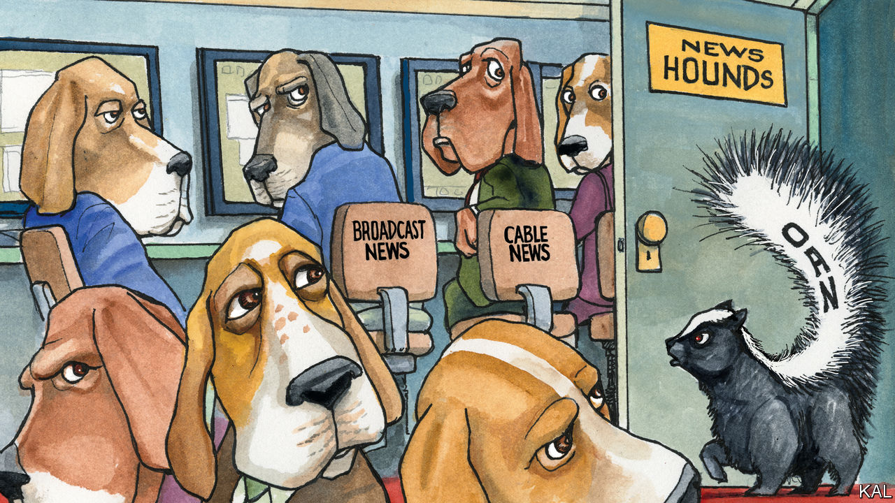

## Lexington

# The meaning of One America News Network

> The president’s new favourite network reveals more about America than it intends

> Aug 8th 2020

SHORTLY AFTER touching down in Texas on July 29th, Donald Trump gave a review of the in-flight entertainment on board Air Force One. “It is AMAZING watching @FoxNews how different they are from four years ago. Not even watchable. They totally forgot who got them where they are!” he tweeted. The president’s relationship with his once-favourite cable-news network has publicly soured. With its “phony polls, done by the same group of haters that got it even more wrong in 2016”, Fox is “doing nothing to help Republicans, and me, get re-elected on November 3rd”, Mr Trump has complained. “Watching @FoxNews on weekend afternoons is a total waste of time,” he tweeted in April. Fortunately, however, “We now have some great alternatives, like @OANN.”

Great or not, the One America News Network is certainly alternative. Launched on Independence Day in 2013 by Robert Herring, a circuit-board millionaire who decided to cash in his chips and spend them on running a television network, the cable channel serves up news from another dimension. Its reports suggest that the coronavirus, whose seriousness it considers exaggerated, may have been developed in a North Carolina laboratory. Hydroxychloroquine is a miracle drug—not that you are likely to hear about it, because of a massive disinformation campaign orchestrated by Big Tech and the Chinese-controlled World Health Organisation. Another thing you won’t know is that Martin Gugino, the 75-year-old who fractured his skull when he was pushed to the ground by two police officers in Buffalo in June, was using an antifa-inspired police-tracking device on his phone when he was tackled.

This is the regular-strength, daytime stuff. OANN’s evening talk-shows are still more eye-opening. Graham Ledger usually kicks off his hour-long slot by announcing: “The doors to the newsroom are locked, and the PC police are not getting in!” Mr Ledger, who considers wearing a face mask to be an act of submission, recently filmed himself going out for a clandestine haircut, in breach of California’s lockdown rules. “This is not unlike, of course, what they had to live through during Hitler’s time,” he observed, from behind dark glasses, on his way to the salon. Mr Ledger’s show is followed by “Tipping Point”, presented by Liz Wheeler, who denounces the “trained Marxists” of Black Lives Matter with a glare that could turn liberals to stone.

Thrillingly angry talk-shows are not new to the American airwaves. They became a fixture on radio after the abolition in 1987 of the Fairness Doctrine, which had required broadcasters to give equal treatment to competing points of view. As America was criss-crossed with cable and audiences got access to hundreds of channels, television networks found that they, too, could get higher ratings by zeroing in on one group—conservatives, say—than by trying to cater to everyone. As a bonus, it turned out that opining was cheaper than reporting. Advertisers preferred the more opinionated channels too, within reason, as they were able to tailor their ads to more specific audiences. Commercials on OANN fit the content perfectly: after watching an apocalyptic report about protests in Portland, viewers might be shown a commercial for a dynamo-powered emergency radio (“Your life may depend on it!”). After bulletins that question the validity of mainstream science, they see ads for alternative supplements, such as crystals that promise to unlock the power of beetroot.

This has helped cable news remain profitable—and influential—even as other forms of journalism have withered. While American newspapers have shed about half their newsroom staff in the past ten years, as readers and advertisers have fled online, the cable-news industry employs about as many people as it did a decade ago, according to the Pew Research Centre. Ratings have held steady, helped in recent years by a White House that generates extraordinary amounts of news.

OANN is only a small fish in a big swamp. It is not carried by some of the large cable and satellite companies (despite a campaign that has included a billboard ad encouraging people to call the mobile-phone number of an executive at Dish, a satellite firm). It claims to make money, though it declines to say how much. The network appears to be run on a shoestring, making free use of library footage, suffering from occasionally dodgy sound and misspelled captions, and employing just 50 journalists, who are mostly confined to studios or stationed outside the White House.

Still, it would be foolish to switch off to the dangers represented by OANN. It is the fourth-rated cable-news network, after Fox, CNN and MSNBC (and ahead of the likes of BBC America, CNBC, Fox Business and Bloomberg). Mr Trump, who well knows that a joke can turn into something serious, promotes its stories to his 85m Twitter followers with a relentlessness that makes some wonder if he is planning a career at the channel after his presidency. For those who swallow OANN’s stories, whether by tuning in directly or hearing them second-hand, it is an unhealthy addition to their news diet. The pandemic has shown how misinformation can kill.

The bigger reason to worry about OANN, however, is that TV is a lagging indicator of opinion. Talk-shows are less about persuasion than about affirmation: of views formed online, on social media and in forwarded emails and WhatsApp messages. Viewers don’t tune in to Ms Wheeler to learn about the world, but to experience an expression and celebration of the opinions and the identity they have already been introduced to on the fringes of the internet.

“There are tens of millions of Americans who have developed a taste for these sorts of conspiracy theories, and for whom Fox may be too tame,” believes Charlie Sykes, a former conservative talk-radio host who quit his show in 2016 after opposing Mr Trump. Even if Mr Trump loses in November, fake news will thrive. Like OANN, he amplifies harmful nonsense. But the act only works because so many cannot distinguish politics from entertainment. ■

Dig deeper:Sign up and listen to Checks and Balance, our [weekly newsletter](https://www.economist.com//checksandbalance/) and [podcast](https://www.economist.com//podcasts/2020/07/31/checks-and-balance-our-weekly-podcast-on-american-politics) on American politics, and explore our [presidential election forecast](https://www.economist.com/https://projects.economist.com/us-2020-forecast/president)

## URL

https://www.economist.com/united-states/2020/08/08/the-meaning-of-one-america-news-network
