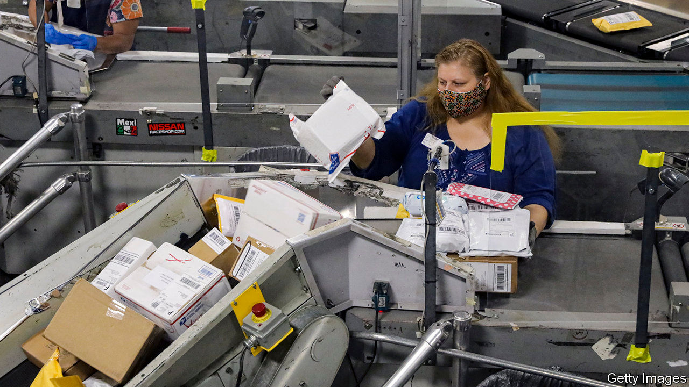

## Law of the letter

# The postal service has become vital to America’s elections

> Unfortunately it is also in a mess

> Aug 8th 2020

“THE POSTAL service”, said Donald Trump, as he signed covid-19 relief legislation in the spring, “is a joke.” He contended that the United States Postal Service (USPS) is losing money by “handing out packages for Amazon and other internet companies”, and needed to quadruple its package rates. Far from being a joke, the USPS is the nation’s favourite government agency, viewed favourably by 91% of Americans. But it is losing money: $4.5bn from January to March, more than double its losses for the same period last year. Neither the reasons nor the solution are quite so simple—and many see ulterior motives behind Mr Trump’s contempt.

The USPS’s financial woes have three main causes, one acute and two chronic. The acute one is covid-19. At least 2,400 postal workers have caught the virus and 60 have died. More than 17,000 of its 630,000 employees have been quarantined. Although package volume and revenue has grown along with online shopping, the volume of first-class and marketing mail have both declined.

Chronic problem number one is the decline in first-class mail, the postal service’s most profitable offering. In a digital age people send fewer letters and postcards. Chronic problem two is the Postal Accountability and Enhancement Act (PAEA), a law passed with bipartisan support in 2006 that requires USPS to prepay a large share of future retirees’ health benefits—a burden imposed on no other federal agency.

On current trends, the postal service estimates that it could run out of money sometime between April and October 2021, unless there is relief or reform. House Democrats included money for the postal service in their version of the CARES Act enacted in March, but after Steven Mnuchin, the Treasury secretary, said Mr Trump would veto any legislation that included funding for the postal service, it was cut. The only relief the USPS has so far been offered is a $10bn line of credit from the Treasury that lets Mr Mnuchin see the terms of its ten biggest contracts, which includes the one with Amazon (the USPS does a lot of “last mile” delivery for Amazon).

To put the service on firmer financial footing—or, some believe, to undermine it—Louis DeJoy, who became Postmaster General in May, implemented operational changes last month. Instead of setting as a paramount goal delivering to customers all mail received by a post office on a given morning, the new rules forbid carriers from leaving late or making extra trips back to the station, as often happens if more mail arrives than a single truck can hold.

Many question why Mr DeJoy opted to implement those changes just before a presidential election that will be unusually reliant on mailed ballots. Mr DeJoy, unlike the previous four postmasters general, has never worked for USPS; he ran a logistics company and has been a generous donor to Republicans. Gerry Connolly, a Democratic congressman who chairs the subcommittee that oversees USPS, calls Mr DeJoy’s rationale “a smokescreen...Under the guise of ‘We can’t afford it and we’re making efficiencies’, it’s directly affecting the delivery of mail on the eve of an election.”

Others posit different motives. Two years ago the Office of Management and Budget released a report mulling the sale and privatisation of the USPS, a position long advocated by some market-friendly wonks. Mr Trump has a long-standing grudge against Jeff Bezos, who owns both Amazon and the Washington Post. Some believe the president sees raising package rates as a way to exact revenge. The latest stimulus bill passed by the House contains $25bn for USPS, and removes any conditionality—such as letting Treasury see contractual terms—from its $10bn line of credit. This may not survive negotiations, or the threat of Mr Trump’s veto.

Mr Connolly is defiant. “We have a pandemic spreading; it’s more virulent than ever, the unemployment numbers are going up, GDP shrank by the largest number ever recorded, and you want to veto a bill over the fact you have your nose in a snit about Jeff Bezos and Amazon? Good luck on selling that.” The postal service too will be on the ballot in November—if the ballot papers can be delivered by USPS.■

Dig deeper:Sign up and listen to Checks and Balance, our [weekly newsletter](https://www.economist.com//checksandbalance/) and [podcast](https://www.economist.com//podcasts/2020/07/31/checks-and-balance-our-weekly-podcast-on-american-politics) on American politics, and explore our [presidential election forecast](https://www.economist.com/https://projects.economist.com/us-2020-forecast/president)

## URL

https://www.economist.com/united-states/2020/08/08/the-postal-service-has-become-vital-to-americas-elections
