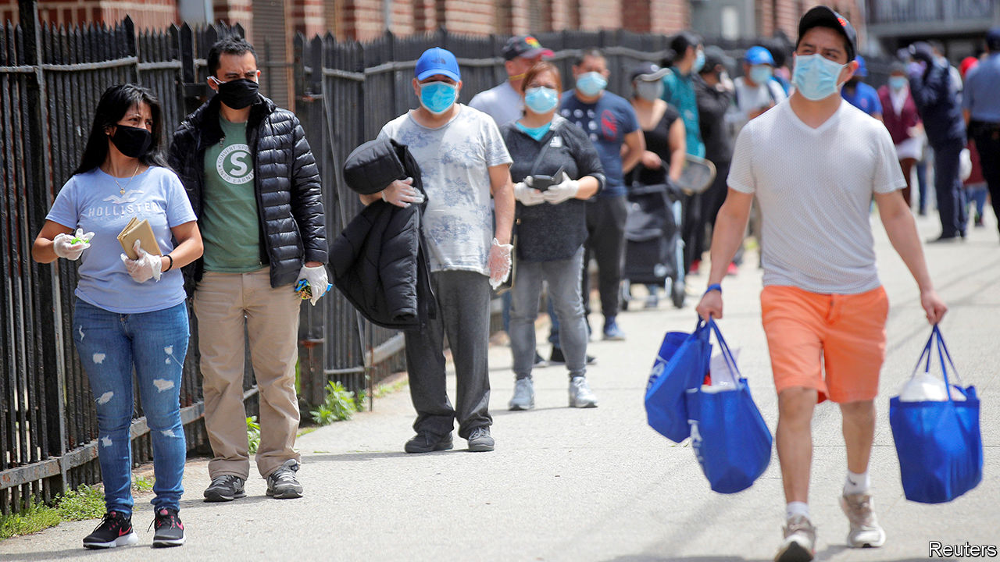

## From unthinkable to universal

# Universal basic income gains momentum in America

> Paying for it remains another matter

> Aug 8th 2020NEW YORK

COLETTE SMITH and her husband are both out of work. They had exhausted their savings, when she received a one-time $1,000 cash infusion as part of a scheme run by Neighbourhood Trust, a financial coaching non-profit, and Humanity Forward, an organisation devoted to building support for universal basic income (UBI) founded by Andrew Yang. UBI was the centrepiece of Mr Yang’s run for the Democratic presidential nomination, in which he advocated a guaranteed income of $1,000 a month, a “Freedom Dividend”, as he called it, for every American adult, regardless of their financial circumstances.

There are two big hurdles to introducing UBI in America. One is building support for something that sounds, to many, alarmingly socialist. The other is working out how to pay for it. Mr Yang’s campaign for the Democratic nomination may have failed. But on one of these points he has been wildly successful. A recent Stanford study showed that people are warming to the UBI idea. In April 88% of liberals backed it, while support among conservatives rose from 28% before covid-19 to 45%. Universal benefits can be easier for politicians to sell, because they are less vulnerable to the racial politics that have undermined support for welfare spending in the past.

Dreams of a UBI have a peculiar history in America. In 1967 a coalition of welfare recipients, led by African-American women, demanded “decent income as a right”. Martin Luther King wrote about it in his final book. At the other end of the political spectrum, Donald Rumsfeld and Dick Cheney drew up a guaranteed minimum-income proposal for President Richard Nixon. Milton Friedman and Friedrich Hayek, beloved of libertarians, were enthusiasts too.

More recently, UBI has been taken up by technologists who believe that software will leave a large number of Americans jobless, leading to social unrest. It has also been promoted by some of the organisations which make up the Black Lives Matter movement, who see it as a way to mend racial disparities in wealth.

Mr Yang points out that the approval rating for UBI was only about 25% when he began his presidential run, but by the time he ended it, in February, it was 66%. “The energy around universal basic income has skyrocketed, and it’s going to remain elevated until a bill passes,” says Mr Yang, who believes the job losses caused by covid-19 will not quickly be reversed. In June Jack Dorsey, Twitter’s boss, gave Mr Yang’s organisation $5m to build the case for UBI.

Funding a generous UBI has always seemed impossible. But many seemingly impossible economic policies have been enacted recently, opening the door to wackier ideas. Under America’s economic-stimulus plan to deal with the fallout from the pandemic, for example, Congress sent $1,200 to every adult. The scheme was so generous that, combined with extended unemployment benefits, aggregate household income is forecast to rise this year.

In May more than dozen cities, including Atlanta, Los Angeles, Newark and St Paul, along with the Economic Security Project, launched Mayors for a Guaranteed Income, a network of mayors experimenting with UBI-like schemes. Mr Dorsey has also given money to this group. In February 2019 Stockton, California, began an 18-month experiment to give $500 to 125 randomly selected people. This is being extended for another six months to help participants weather the slump.

In Jackson, Mississippi, the Magnolia Mother’s Trust provides poor African-American mothers with $1,000 in cash monthly, no strings attached, for a year. It recently began a larger experiment with 110 participants. Hudson, a small city in upstate New York, recently announced a five-year scheme to give a monthly $500 payment to 20 people. In Newark, New Jersey, Ras Baraka, the mayor, is hoping to get a pilot programme up and running. A third of Newark’s residents live in poverty and have to make tough decisions, Mr Baraka says, like “heat or eat.” Nearly 60% of Newark households carry delinquent debt. But to introduce a proper UBI in Newark, he says, would require federal funding.

For all the enthusiasm about UBI experiments, they remain problematic. It is hard to fully evaluate their effect because they are not universal (in the sense of received by everyone). Most take the form of occasional cash payments to poorer Americans. Nor are they generous enough to live on, which is what true UBI believers advocate. Finally, because they tend to be funded by philanthropy, the experiments do not factor in the substantial tax rises that would be needed to pay for them.

The proposal Mr Yang ran on would have cost $2.8trn annually, which is about what the federal government spends each year on Social Security (pensions), Medicare (health care for the elderly) and Medicaid (health care for the poor) combined. Even then it would provide adults with no more than $12,000 a year—not enough to lift a workless family with two adults and two children above the federal poverty line.

A more targeted effort that did not aim to be universal could do much more on that score. Ms Smith, along with 1,000 other residents of the Bronx, received a one-off $1,000 grant from Mr Yang’s outfit. This allowed her to buy food and to restore the internet, which her 14-year-old son needed for remote learning. This helped a great deal. But UBI advocates still have to explain why it would not be better to give families such as hers larger sums rather than a smaller payment that also goes to those who do not need it.■

Correction (August 7th 2020): A previous version of this article misstated the number of participants in the Magnolia Mother’s Trust scheme. Sorry.

Dig deeper:Sign up and listen to Checks and Balance, our [weekly newsletter](https://www.economist.com//checksandbalance/) and [podcast](https://www.economist.com//podcasts/2020/08/01/checks-and-balance-our-weekly-podcast-on-american-politics) on American politics, and explore our [presidential election forecast](https://www.economist.com/https://projects.economist.com/us-2020-forecast/president)

## URL

https://www.economist.com/united-states/2020/08/08/universal-basic-income-gains-momentum-in-america
