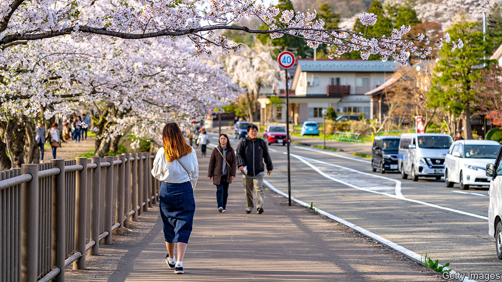

## Anti-anti-missile systems

# NIMBYs and pacifists thwart Japan’s military plans

> No one wants a base next door

> Aug 15th 2020AKITA

DURING A VISIT to Tokyo in 2017, Donald Trump called on Japan to buy “massive” amounts of American weaponry. At the time, North Korea was testing new rockets regularly. For the Japanese government, buying Aegis Ashore, a pricey American missile shield, allayed both concerns.

Not all Japanese, however, were happy with the purchase, especially in Araya, a quiet residential neighbourhood of low-slung homes next to the sea in Akita city—and the site of a proposed Aegis base. Jittery locals fretted about electromagnetic waves from the system’s radar and debris from its rockets. They worried about becoming a target in a conflict, as the city’s oil refineries were during the second world war.

“Why, why here?” asks Sasaki Masashi, a retired railway worker and head of a neighbourhood council. “It says: ‘Please attack us’,” complains Sakurada Yuko, another anti-Aegis campaigner. They have collected signatures, harangued officials and voted against the ruling Liberal Democratic Party (LDP), which unexpectedly lost a seat in Akita in elections to the upper house of parliament last year.

In June Akita received unexpected but welcome news: the government declared it was scrapping the $4.2bn purchase of Aegis Ashore. Kono Taro, the defence minister, cited the ballooning cost of ensuring that boosters did not fall on civilian property. Some view the cancellation as an underhanded way to initiate debate about pre-emptive strikes on missile bases that threaten Japan—a big step for a country committed by its constitution to pacifism. Others think Mr Kono may be trying to make a splash to enhance his chances of succeeding Abe Shinzo, the current prime minister, who is due to retire next year. Japanese officials may believe Mr Trump is on his way out, and so are less eager to placate him. In addition to all that, however, “There was no consensus locally,” says Terata Shizuka, the independent MP who won the upper-house seat from the LDP.

Akita is a conservative region, but more than 60% of residents opposed Aegis Ashore. The Self-Defence Forces (SDF, Japan’s armed forces in all but name) field seven destroyers equipped with ship-based Aegis systems (an eighth is under construction). A land-based system, the argument went, would provide more consistent coverage. “But wherever there’s flat land there are people, and so it becomes necessary to consider local emotions and feelings and circumstances,” says Suzuki Kenta, an LDP MP from Akita.

It is not just military installations that suffer from NIMBYism. An expansion of Tokyo’s main airport and a new high-speed railway line have been held up by local objections. But the public is especially prickly about military matters, and the government, in turn, treads carefully. After officials in southern Japan objected to the local deployment of Osprey aircraft intended in part to defend the Senkaku Islands, even farther to the south, the government sent the new planes to a far more distant base, notes Michael Bosack of the Yokosuka Council on Asia-Pacific Studies. Although Japanese law allows the government to make forced purchases of land, in practice it almost never does. The defence ministry tends to lease, rather than buy, since the prospect of steady rent payments can win over obstreperous locals.

The LDP had tried to smooth the way for Aegis Ashore. It was to be deployed in the home regions of Mr Abe and Suga Yoshihide, the powerful cabinet secretary. Local politicians had backed the plans. “The mood was that it was inevitable,” says Ogasawara Naoki, who headed the local paper, Akita Sakigake Shimpo, at the time.

But people from across the political spectrum opposed the deployment. There were those who welcomed stronger missile defences, but just not nearby. Others worried that Mr Abe was chipping away at Japan’s pacifism. As the government continues to press to beef up the SDF, whether by spending more on defence or building new bases, it could meet resistance anywhere. “If we don’t want it,” Ms Sakurada says, “our neighbours won’t want it either.” ■

## URL

https://www.economist.com/asia/2020/08/15/nimbys-and-pacifists-thwart-japans-military-plans
