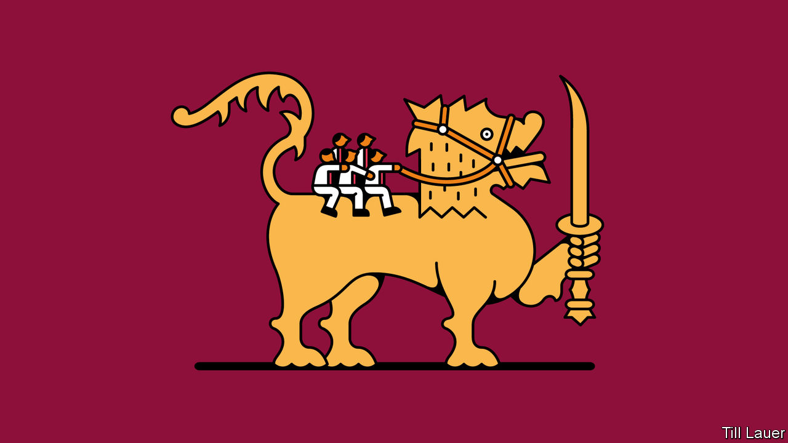

## Banyan

# Sri Lanka is becoming a one-family state

> The Rajapaksas’ landslide election win may see them hold power for a long time

> Aug 15th 2020

USUALLY, WHEN people speak of an electoral landslide, they exaggerate. But the word aptly describes what happened in Sri Lanka on August 5th. The island nation’s voters all but buried the grand old party that had led an outgoing coalition, the United National Party, reducing its 106 members in the 225-seat parliament to a humiliating total of exactly one. They instead awarded a commanding 145 seats to a relative upstart, the Sri Lanka Podujana Peramuna, or People’s Party (SLPP), a vehicle for the powerful Rajapaksa family. With smaller parties now flocking to their support, the Rajapaksas have grasped the two-thirds majority they need to rewrite the constitution to their liking, something they have said they intend to do. One of Asia’s oldest and most durable democracies has in practice entered a period of one-party, one-family rule.

Alas, none of this comes as a surprise. The Rajapaksas are not new to politics. The father and uncle of the current head of the family, Mahinda Rajapaksa, were prominent leaders decades ago. Mahinda, a genial populist who is now prime minister, himself served two terms as a strongman president, from 2005 to 2015, appointing one brother to run the army and helping to install another as speaker of parliament. Gotabaya Rajapaksa, who as defence chief brought the 26-year civil war to a bloody end in 2009, was elected president in November. Another brother, Basil, heads the SLPP and is credited as the brains behind the family’s spectacular comeback. A clutch of younger Rajapaksas, as well as intimates such as the family lawyer, now serve as MPs and ministers.

The surprise, in fact, was the five-year hiatus during which the Rajapaksas were out of power. It was an unlikely combination that kept Mahinda from winning a third term as president in 2015, including defections from his own camp and unprecedented unity among the normally squabbling opposition forces, which were worried that dictatorship loomed. The challengers vowed to punish the Rajapaksas for varied alleged abuses, ranging from human-rights violations to corruption. In office, they did amend the constitution to trim the president’s powers, but soon fell back to squabbling, went limp on prosecutions and were disgraced by a series of terror attacks on Easter Day last year that left 269 people dead. As elections approached, the party leading the coalition broke in two. Its old guard, clinging to the elephant symbol they had proudly waved as the governing party for more than half the years since Sri Lanka won independence in 1948, failed to prevent a stampede to the exits when frustrated younger leaders formed their own breakaway party.

The Rajapaksas, meanwhile, had worked relentlessly to construct a disciplined new political machine. They assiduously cultivated business interests, the press and security forces, many of whose officers were alarmed by UN-backed plans to investigate wartime abuses. The family also surreptitiously played the sectarian card, giving a quiet nod to chauvinist groups that have stoked passions among the Sinhala-speaking Buddhist majority, who are around 70% of the population, against Tamil-speaking Hindus and Muslims. As if on cue, last year’s terror attacks—which largely targeted another minority, Christians—gave substance to the majority’s insecurities and strengthened calls for a firm, “patriotic” government.

Given the success of these tactics and the abject failings of their opponents, the Rajapaksas’ return was perhaps inevitable. Yet the fact that so many Sri Lankans—59% of the electorate as a whole and perhaps 80% of Sinhalese Buddhists—have willingly entrusted the government to a single ambitious family, is nonetheless disturbing. Mahinda’s presidency was marked by harassment of critics and an utter disregard for civilian casualties in the civil war. Gotabaya has presided over creeping militarisation, with the army and police granted sweeping new oversight in civilian matters. Some fear that the Rajapaksas, having returned to power, intend to capture the state for keeps.

If these anxieties prove warranted, the Rajapaksas would be typical of a gathering trend in global politics, whereby strongmen such as Turkey’s Recep Tayyip Erdogan or Russia’s Vladimir Putin subvert democracy to personal ends. Alarmingly, this looks like the direction in which the rest of the Indian subcontinent—despite its much-heralded legacy of lofty constitutions and boisterous Westminster-style parliaments—is also heading.

## URL

https://www.economist.com/asia/2020/08/15/sri-lanka-is-becoming-a-one-family-state
