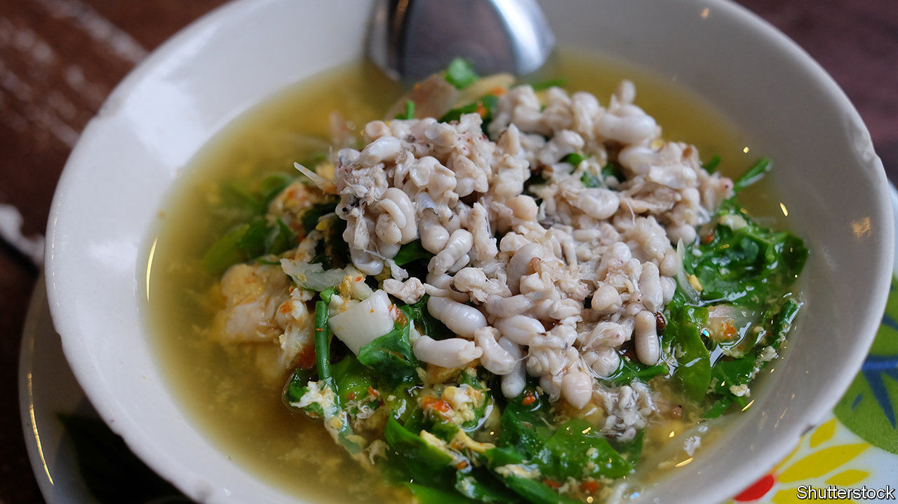

## Jungle caviar

# Urban Laotians pay handsomely for ant-egg soup

> But will young people retain a taste for this nutritious tradition?

> Aug 15th 2020VIENTIANE

“YOU WOULDN’T serve this to the king,” says Dalaphone Pholsena, a restaurateur in Vientiane. Before her are two small bowls of ant-egg soup, a favourite dish of the late summer in Laos. In it are chunks of white fish, meaty mushrooms and dozens of splayed and lifeless ants. Bobbing at the surface is the pièce de résistance: clusters of ivory-white eggs that look like tiny white beans. They burst in the mouth like fish roe, but with a more acidic tang.

Ms Dalaphone considers herself a defender of the dishes traditionally eaten by Laos’s subsistence farmers—of which there are still many. Ant-egg soup is a classic: both an important source of protein and an emblem of rural life. The eggs are laid by red weaver ants, which nest in mango trees and coconut palms in April and May. A brave forager—the ants’ bites are like the prick of a needle—uses a stick to tear open the nest, catching the eggs (and lots of livid ants) in a bucket. Wearing as few clothes as possible, the better to brush marauding ants from the skin, and hopping from foot to foot to evade the incensed insects, the harvester then shakes the eggs from the leaves. Rural folk tend to mix this hard-won prize into omelettes, salads or soups, adding a distinctive, sour pop.

Nowadays, however, many pack up the eggs and ship them to markets in the city instead. Laos is urbanising fast. In 2000 about a fifth of its population lived in cities; today over a third does. New urbanites often express nostalgia for the countryside. On weekends many middle-class Laotians drive to the family village to help tend the rice paddies. Failing that, a steaming bowl of ant-egg soup can be almost as transporting. “It’s something that reminds them of life before,” says Gie, a 30-something professional. “You think of 50 or 20 years ago, when you were in the village, with your mum.”

A kilo of eggs can fetch as much as 150,000 kip ($16) in Vientiane, the capital. That is a handsome sum for a poor rural forager. But even as the price of eggs climbs, people like Ms Dalaphone worry about the dish’s future. Urban youth grow up eating pizza and wontons and are often squeamish about gulping down bugs. Asked about ant-egg soup, Gie’s 12-year-old son replies, “It looks awful, not a tasty meal.” He prefers fried rice and noodles, easily ordered by phone or whipped up in an instant from packets imported from China or Thailand.

Chefs say traditional Lao cuisine, including ant-egg soup, needs a charm offensive to survive. A reprieve may come from the covid-19 pandemic, which is likely to hobble the economy and prompt some of those on falling incomes to revert to cheaper folk dishes or even to foraging to save money. But in the long run, in all likelihood, fewer and fewer Laotians will be willing to brave a sting for their supper. ■

## URL

https://www.economist.com/asia/2020/08/15/urban-laotians-pay-handsomely-for-ant-egg-soup
