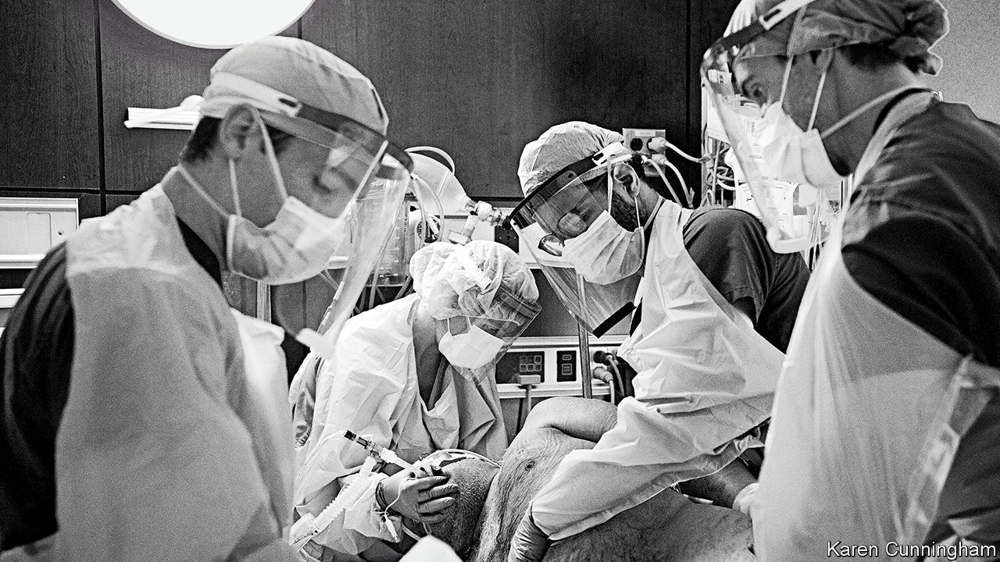
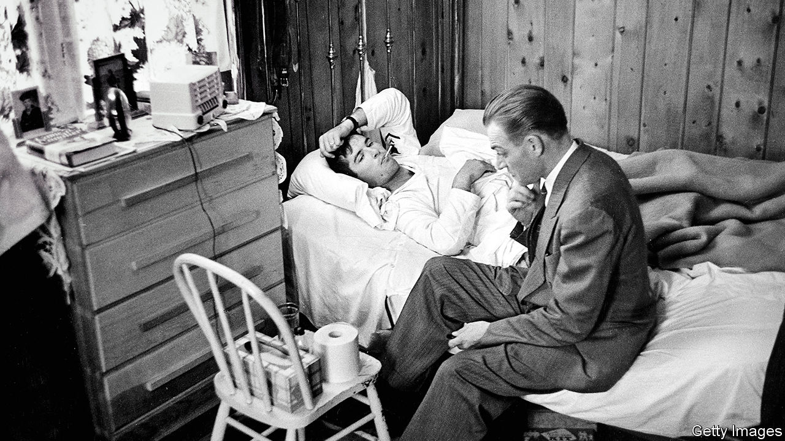
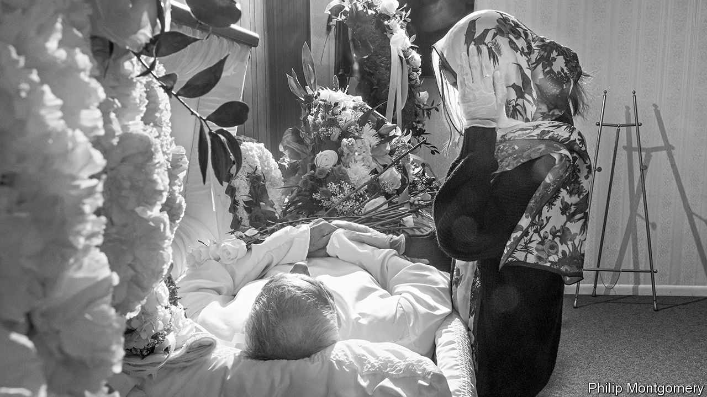

## Decent exposure

# Capturing the pandemic for posterity

> Photographers shooting patients and carers have wrestled anew with thorny ethical questions

> Aug 15th 2020

Editor’s note: Some of our covid-19 coverage is free for readers of The Economist Today, our daily [newsletter](https://www.economist.com/https://my.economist.com/user#newsletter). For more stories and our pandemic tracker, see our [hub](https://www.economist.com//news/2020/03/11/the-economists-coverage-of-the-coronavirus)

IN MID-APRIL of intensive-care beds at Lenox Hill Hospital in New York were occupied by patients with covid-19. Karen Cunningham was caring for them: intubating the worst-affected and responding to countless emergency messages on the hospital’s tannoy. She was also taking photographs, capturing images of medical staff who were, to her surprise, eager to be included. Ms Cunningham says she felt a moral obligation to relay her colleagues’ experiences to the public.

A professional photographer, ten years ago she also became a registered nurse. When a friend at the New Yorker had first suggested she take her camera to work, Ms Cunningham was sceptical. But at the time reporting from inside hospitals was rare, and amid the pandemic photography could be a powerful public-health tool. So she agreed to shoot on the wards, often laying down her camera to help turn patients onto their fronts to ease breathing difficulties.

The results are an intimate depiction of the zone between life and death. In one image of an intubated patient (above), you can see the hair on the man’s chest and beard, his age signalled by the grey swirls among the black. His vulnerable skin contrasts with the armour-like layers of protective equipment worn by the four doctors surrounding him. Around the same time, Philip Montgomery, who previously chronicled America’s opioid epidemic, was touring New York’s public hospitals for the New York Times Magazine (NYTM). He also works in black and white, softening the garish hospital light to convey the motion and intensity of the carers. In Mr Montgomery’s pictures, their limbs blur as they rush through the wards.

Photography, the critic Susan Sontag wrote, “has kept company with death ever since cameras were invented.” This year it has helped tell the story of covid-19. Photographers around the world have documented suffering and treatments that might otherwise have remained unseen. In their tragic subject-matter and informative role, images of the pandemic have resembled war photography—except that, instead of capturing far-away conflicts, photographers have turned their lenses on their own communities. As in a war, sharp ethical questions have arisen: about the camera’s intrusion on pain, and how the story of the disease is told.

The use of black and white is a key choice. Historically, says Jennifer Good, an expert on photojournalism at the London College of Communication, the palette “serves a particular function in the photography of war, because it negates the shocking redness of blood”. Some of the most famous images of the Vietnam war, for instance, were shot this way. But there are illustrious peacetime precedents, too. Ms Cunningham cites “Country Doctor”, W. Eugene Smith’s series for Life magazine in 1948—for which he followed a doctor in rural Colorado—as an inspiration. The subject, Ernest Ceriani, is depicted as a charismatic, slick-haired saviour (see picture below). Black and white, Ms Good says, can be “a distancing measure. It cuts out some of the more striking or shocking aesthetic elements of the picture, creating an elegance and a timelessness.”

Along with these associations, black and white can focus attention. Mr Montgomery used strobe lighting to direct the viewer’s gaze, calling attention to individual actions within the often frantic ward. In one image, the arm of a paramedic performing CPR is tensed, the force of motion clear, but the outcome unknown. When health-care staff look straight into the camera, viewers feel transported to the hospital—admiring the doctors and nurses, yet unsettled by their own voyeurism.

For both viewer and photographer, there is a fine line between compassionate observation and indecent intrusion. Hospital wards are full of sensitive information which must be repositioned or omitted while shooting. Patients and doctors must give their consent before their pictures are taken. Being a nurse, Ms Cunningham says, “gave me a certain moral and ethical freedom. I knew there was a line I would never cross.”

Her perspective inside the hospital was unique. But a series Mr Montgomery did at the Farenga Brothers Funeral Home in the Bronx involved even thornier ethical challenges. His images of the dead and their grieving relatives are meant to humanise the fact of mortality (see picture below). They also restore the individuality of some of the pandemic’s many victims.

“The moral issues were huge,” acknowledges Kathy Ryan of the NYTM. “It’s not very often you see pictures dealing with the dead in our culture in this way.” In one image, editors blurred out a name-tag attached to a body bag. The series includes open coffins and refrigerated corpse trucks, but the most graphic scenes were omitted. The Purewals, the family at the centre of the shoot, were willing to be photographed as a way of honouring their late father. For some who were unable to give their loved ones proper funerals, Mr Montgomery’s pictures became a memorial.

What, for the West, has been an unusually intimate encounter with death has affected views on how suffering elsewhere in the world is portrayed. In March, after seeing the devastation that covid-19 was causing in Lombardy, Nana Kofi Acquah, a Ghanaian photographer, posted an address to white journalists on Instagram. “Can you photograph Africa with the same level of respect and empathy?” he asked. Azu Nwagbogu, director of the African Artists’ Foundation, hopes the global nature of the pandemic will lead to a levelling in the way anguish in different places is covered. “I think there’s now a clear understanding of the dignity and respect for human life that needs to be given to all patients.”

Pictures are, after all, one of the ways posterity will remember the pandemic and the lives it disrupted. Arts institutions are already beginning to shape the way it will be seen—and they are not relying only on professionals. The National Portrait Gallery in London, for example, has received over 30,000 submissions for “Hold Still”, a community photography project launched in response to the virus. “I see people voicing gratitude and manifesting dreams about better times, lives and loves after lockdown,” Magda Keaney, a curator, says of the entries. Professionals still shape perceptions of crises, wrestling with their motives and responsibilities as they shoot. But they are no longer alone. ■

## URL

https://www.economist.com/books-and-arts/2020/08/15/capturing-the-pandemic-for-posterity
