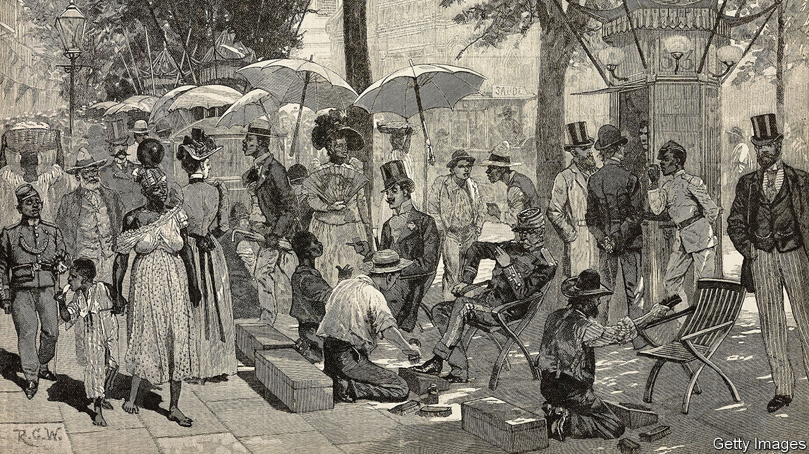

## Home Entertainment

# Discover the riotous prose of a classic Brazilian author

> “The Posthumous Memoirs of Brás Cubas” is an invigorating read

> Aug 15th 2020

HIS GRANDPARENTS were slaves. His father painted houses. His immigrant mother washed laundry. For a poor, mixed-race boy born in Brazil in 1839, their son had done well to become an apprentice typesetter in Rio de Janeiro. But a priest taught him Latin, and a literary gent spotted the gifted lad at the Imprensa Nacional, the government press, and soon he was contributing to newspapers, writing plays and poems and starting a literary circle.

But it was as a novelist that Joaquim Maria Machado de Assis would truly shine. Machado worked as a civil servant and co-founded the Brazilian Academy of Letters; he married happily (although his Portuguese in-laws initially objected to the colour of his skin). Beneath all this outward respectability, his prose was radically ingenious. Ever since “The Posthumous Memoirs of Brás Cubas”, Machado’s fifth novel, appeared in 1881 it has astonished readers with its lordly ironies and scorn for convention. The book’s invigorating style, as much as its backdrop of racial and social injustice, makes it ideal reading for this morbid, insurgent summer.

Brás Cubas, the fictional memoirist, has just died from pneumonia. As a thwarted corpse who failed in almost everything he tried, he wants to set the record straight about his drifting life as an idle, pleasure-seeking dandy in Rio. Beneath his jaunty veneer, Cubas harbours a melancholy pessimism. He sees a freedman lash a slave he has bought—to relieve his own sufferings “by passing them on to someone else”. Yet the novel floats free of the ambient oppression on currents of mischief and urbanity.

Sprinkled with epigrams, dreams, gags and asides, the story teases, dances and delights. Across 160 short chapters (“Long chapters suit long-winded readers”), Machado mocks every rule of the 19th-century novel. A chapter of dialogue is written entirely in punctuation (“!…?…!”). In another the disgraceful narrator acknowledges (in a new translation by Margaret Jull Costa and Robin Patterson),“I have just written an utterly pointless chapter.” Dave Eggers, an American author, recently called this “one of the wittiest, most playful, and therefore most alive and ageless books ever written”.

At its heart lies a passionate love triangle. Cubas pursues a long, clandestine affair with married Virgília while working for her politician husband. Like his creator, he is a romantic as much as a cynic; his worldly, bruised voice reaches out to touch readers today with its rueful comedy and wry sensuality. After one more heartbreak with Virgília, “I ought to be plunged into deep despair, shed a few tears, and certainly not have lunch.” But he does, munching on “Monsieur Prudhon’s finest hors d’oeuvres”. That is two valuable lessons in one passage: don’t throw away your precious love—but don’t skip lunch either. ■

## URL

https://www.economist.com/books-and-arts/2020/08/15/discover-the-riotous-prose-of-a-classic-brazilian-author
