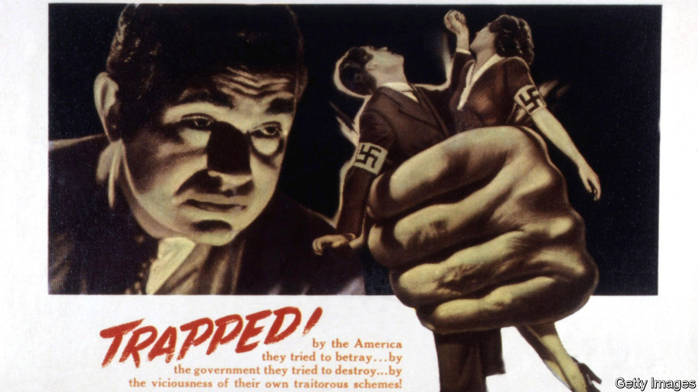

## Nazi spies in America

# The Führer’s man in Manhattan

> In the 1930s America was blind to the threat of German espionage

> Aug 15th 2020

Ring of Spies. By Rhodri Jeffreys-Jones.History Press; 288 pages; £20. Published in America as “The Nazi Spy Ring in America” by Georgetown University Press in September; $29.95.

AS GERMANY PURSUED its territorial expansion in 1938, many Americans wanted nothing more than to be left alone. President Franklin Roosevelt had signed three neutrality acts forbidding involvement in Europe’s troubles. Of the fears that kept his compatriots awake, Hitler was eclipsed by mobsters, dust bowls and unemployment. This was to change, explains Rhodri Jeffreys-Jones in his new book, when the FBI’s unveiling of a Nazi spy ring poisoned relations with Germany and forced America to confront a hostile world.

A historian at Edinburgh University, Mr Jeffreys-Jones draws the reader in with thrilling, but initially disparate, tales of German espionage. The sense of Nazi audacity steadily rises. A widow with a pen-pal in Hamburg suddenly develops a penchant for photographing naval bases. A group of agents smuggle out secret documents as stamp-size pictures hidden in pocket-watches. Another cell plots to snatch mobilisation plans by subduing a colonel with a sedative-loaded fountain pen. Blueprints for American fighter-planes are stolen.

These pieces are gradually put together by Leon Turrou, the story’s fascinating central figure. A Jewish immigrant from Belarus, Turrou was an FBI agent who spent the 1930s fighting fascist and communist saboteurs with equal fervour. In 1938 he made the connections between the German spies, and tracked down a prime suspect. Ignatz Griebl ran a quiet medical practice in Manhattan, but his candid confession confirmed Turrou’s darkest fears (and unites the book’s scattered incidents):

The reader, like Turrou in the dimly lit interrogation room, is suddenly daunted by the scale of the Nazi scheme. German diplomats cut Griebl loose, which helped turn him into an FBI informant. From that point on, the spy ring unravelled.

This is an entertaining tale that doubles as an important work of scholarship. From its first days in power, Mr Jeffreys-Jones shows, the Nazi party strove to undermine American democracy. Along with recent work by other historians, his suggests that Nazi hostility to America—with its bill of rights, balanced constitution and thriving Jewish community—equalled or even exceeded its hatred of the Soviet Union.

Blind to the threat, America had made itself an easy target. The army gave its data on the spread of venereal diseases to a Nazi agent, inadvertently revealing up-to-date statistics on American troops and bases. This was a mix of incompetence and institutional failure. In 1918 America had 1,441 military-intelligence officers. In 1935 it had 69. Mr Jeffreys-Jones touches only lightly on the strategic lessons, observing that the episode “carries a serious message about spies from a foreign country who try to subvert American democracy”.

The agents who had not already fled to Germany were tried in late 1938, as Hitler’s troops were marching into Czechoslovakia. American legislators were clinging to the neutrality doctrine, and the politically astute judge opted for leniency: the four main conspirators received a combined sentence of just 14 years. Dissatisfied, Turrou left the FBI to write newspaper articles about the Nazi threat. In 1939 Hollywood adapted his exhortations into a film, “Confessions of a Nazi Spy”, in which Turrou had a cameo. This was America’s first anti-Nazi blockbuster, and public attitudes were changing.

In 1941 the discovery of another spy ring in New York provoked outrage. Its three leaders were awaiting sentencing when Japan attacked Pearl Harbour. A few weeks later, the spies received a combined sentence of 52 years. ■

## URL

https://www.economist.com/books-and-arts/2020/08/15/the-fuhrers-man-in-manhattan
