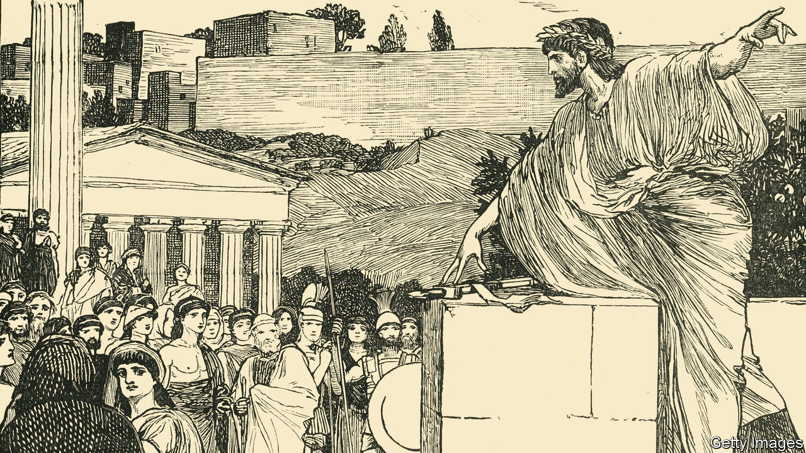

## Beginner’s luck

# Why democracy thrives in some places and not in others

> It’s a matter of history and good fortune, says David Stasavage

> Aug 15th 2020

The Decline and Rise of Democracy: A Global History from Antiquity to Today. By David Stasavage. Princeton University Press; 424 pages; $35 and £30.

TWO COMMON beliefs about democracy are that it began in ancient Athens and, on spreading from there, remained peculiarly Western. David Stasavage, a professor of politics at New York University, finds both views mistaken. Without them, he thinks it will be easier to get hopes and fears for present-day democracy into better perspective and balance.

Understood as government by consultation and consent, democracy, he shows, can be found in many early civilisations, not just classical Greece—including ancient Mesopotamia, Buddhist India, the tribal lands of the American Great Lakes, pre-conquest Mesoamerica and pre-colonial Africa. With that spread in mind, he writes that under given conditions, “democratic governance…comes naturally to humans”. The puzzle is that autocratic governance was just as natural. It, too, was found in many places. In pre-modern China and the Islamic world, for example, autocracy—together with a centralised bureaucracy—was for centuries the norm.

To find out why early democracy occurred where it did, the author draws on evidence from archaeology, soil science, demographics and climate studies. The key, in his account, was information.

Early democracy tended to flourish where rulers knew little of what people were growing and had few ways to find out. They might underguess taxable produce (forgoing revenue) or overguess (provoking non-compliance). It was better to ask people how much they grew and, in return, listen to their demands. That pattern was typical where populations were small and a central state weak or non-existent.

With big populations, consultation was impractical. Rulers instead sent officials to see how much was grown and, before long, how many young men could be drafted into armies. Bureaucracies emerged. With their aid, autocratic rule imposed itself on local custom. In pre-modern settings, this autocratic bureaucracy was more common where soil was good, yields high and know-how advanced, especially in writing and measuring. Such systems were able to tax heavily. Song China (10th-13th centuries) and the Abbasid Caliphate (8th-13th centuries) extracted at their height respectively 10% and 7% of gross yearly product. Medieval European rulers managed barely 1%.

Once established, central bureaucracies were hard to dismantle. They took well to modernity and new technologies. Early democracy, by contrast, was notably—although not fatally—vulnerable to the rise of modern states and rapid economic development. It accordingly vanished in many places, while surviving in others.

Modernity and central states, in other words, allowed for either autocracy or democracy. But was there a pattern? Mr Stasavage thinks so. He calls it “sequencing”. “If the early democratic institutions of government by consent are established first,” he writes, “then it is possible to subsequently build a bureaucracy without veering inevitably into autocracy or despotism.” It depends on what went before.

Awkwardly for this argument, the West is the one part of the world where early democracy of the small-scale, direct kind evolved most securely into modern, representative democracy. Does that not make democracy peculiarly Western after all? In modern democracy’s three waves—in the 19th century, post-1945 and post-1989—Western democracy was first. Despite glaring collapses, it has fared best. Yet, in Mr Stasavage’s telling, there was nothing essential—a liberal outlook, say, or respect for property, or a gift for industry—that tied the West and modern democracy together, beyond the luck of the past.

Pre-modern Europe had (with exceptions) democratic customs and weak rulers without effective bureaucracies. Where it occurs, and is not wiped out by autocracy, consensual government, the author writes, leaves “very deep traces”. Democracy and autocracy each have strong roots. There are good reasons to expect each to endure.

That conclusion may seem small yield for such intellectual labour. But a bracing stringency is one of the virtues of “The Decline and Rise of Democracy”. It sweeps across the globe in command of recent scholarship. It takes an economic view of politics as putative bargaining between rulers and ruled, dispensing with what actual people thought and did and skirting fastidious analysis of key ideas. Its strongest lessons are negative: it shows how complex democracy’s patterns are and, on the evidence, how simpler accounts of its past and prospects stumble. ■

## URL

https://www.economist.com/books-and-arts/2020/08/15/why-democracy-thrives-in-some-places-and-not-in-others
