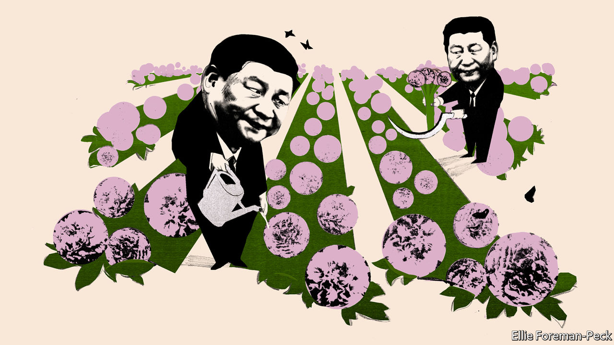
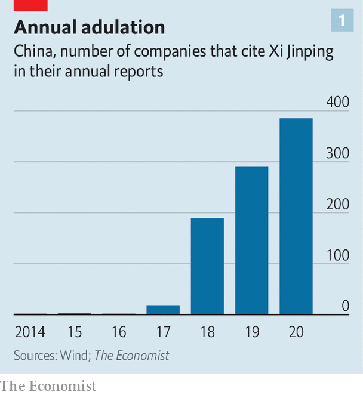
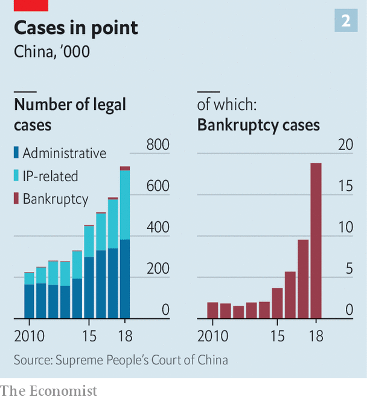
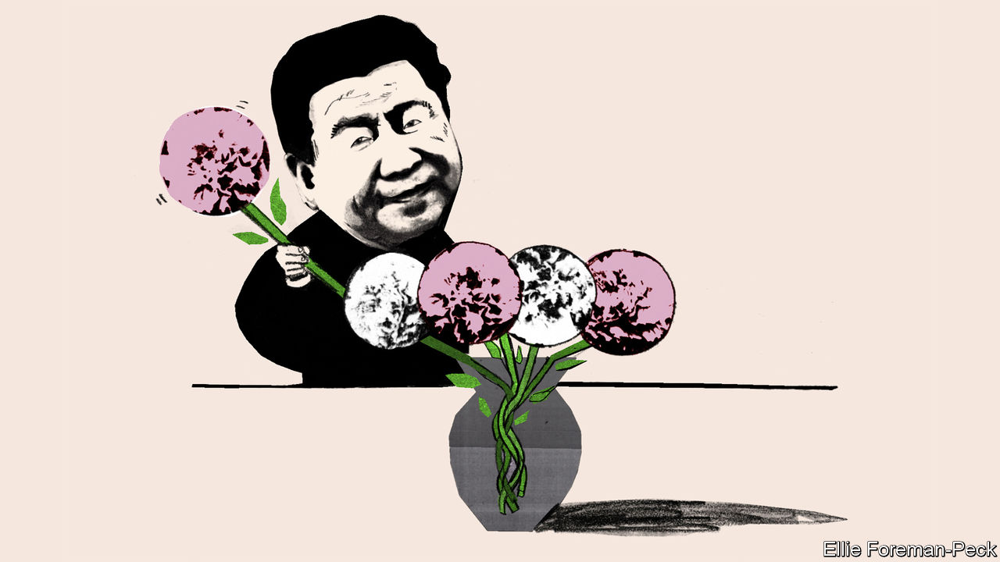
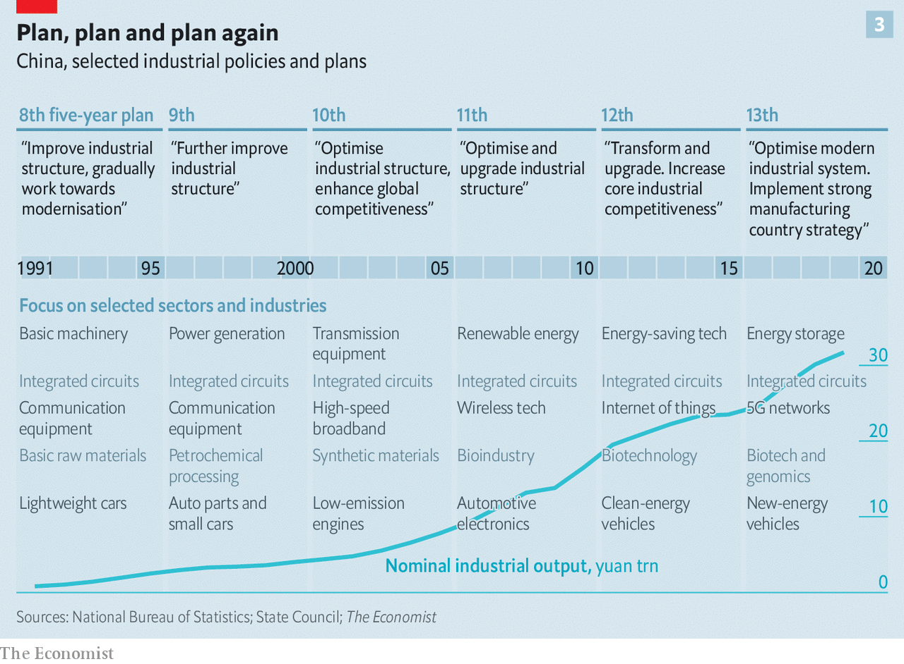
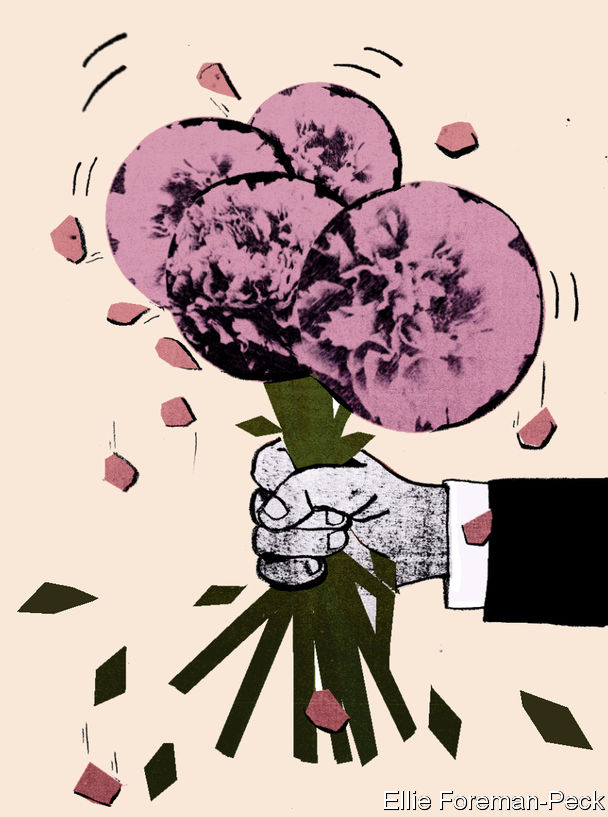
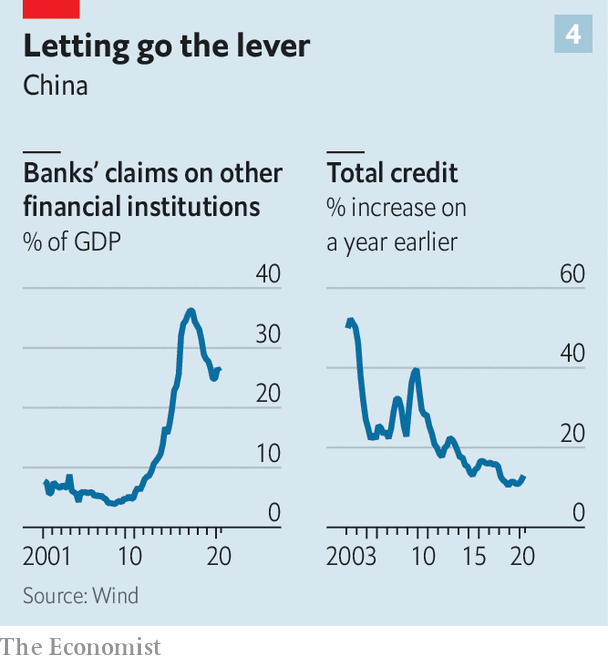

## The new state capitalism

# Xi Jinping is trying to remake the Chinese economy

> Party control is mixed ever more intimately with market mechanisms

> Aug 15th 2020SHANGHAI

LAST YEAR Zotye, a carmaker, used it to tackle weak sales, and Wuliangye, a distiller, to improve the quality of its baiju; it helped Zheshang Bank to digitise its operations and catalysed the development of energy-saving technologies at China National Nuclear Power. “Xi Jinping Thought on Socialism with Chinese Characteristics for a New Era” is, on the basis of these companies’ annual reports, quite the business-practice panacea.

The time when private Chinese companies downplayed their links to the Communist Party is gone. By The Economist’s count, nearly 400 of the 3,900 companies listed on stock exchanges in mainland China paid homage to the Communist Party and its leader in their annual reports this year. References by both state-owned firms and their private-sector peers to Mr Xi’s guidance have increased more than 20-fold since 2017 (see chart 1).

The trend reflects China’s new reality. The Communist Party has greater control over all aspects of life, and Mr Xi has greater control over the party. This does not just mean it is a good idea for companies to butter him up. It means that he is in a position to reshape the economy within which they prosper or fail. What is he doing with it?

Nothing good, say critics at home and abroad. He has brought reforms that liberalised the economy to a halt and has smothered market forces, returning to a top-heavy state-dominated growth model which looks distinctly creaky. Private companies have rushed to set up party committees with an increasing say over strategy. Their once-swashbuckling bosses have adopted lower profiles. The title of a recent book by Nicholas Lardy of the Peterson Institute, an American think-tank, sums up the worries: “The State Strikes Back”.

Those observations are right. The conclusion is misleadingly wrong, encouraging a complacent and dangerous underestimate of China’s potential trajectory. Mr Xi is not simply inflating the state at the expense of the private sector. Rather, he is presiding over what he hopes will be the creation of a more muscular form of state capitalism. The idea is for state-owned companies to get more market discipline and private enterprises to get more party discipline, the better to achieve China’s great collective mission. It is a project full of internal contradictions. But progress is already evident in some areas.

Mr Xi announced his agenda in 2013, vowing that China would “let the market play the decisive role in allocating resources”, while reinforcing “the leading role of the state-owned sector”. When domestic stocks crashed in 2015 the government’s focus shifted to recapitalising its banks, tightening controls on cross-border cash transfers and taming the wildest corners of its financial system. But the party now thinks it has won this “battle against financial risks” and is getting Mr Xi’s agenda back on track in a new, bolder form.

Ever more tense relations with America have persuaded the party that China must be able to get ahead on its own. At the same time, China’s success in stalling its coronavirus epidemic and restarting its economy has reinforced its belief in what Mr Xi calls China’s “institutional advantages”—the idea that, as a strong one-party state, China can pool its economic and social resources to meet critical objectives.

Mr Xi’s push can be broken down into two big segments. The first is to establish clearer boundaries for the fizz and ferment of the Chinese marketplace: a stronger legal system for businesses; simplified rules for day-to-day activities; a financial system better at allocating funds. The second is to make more adroit use of the government’s grip on the economy’s main levers: to make state firms more efficient; and to team them up with private firms in new industrial-policy initiatives.

Entrepreneurs still have considerable latitude, so long as they stay in their lane and move in government-endorsed directions. And they still have powerful incentives. “To get rich is glorious”, a quip attributed to Deng Xiaoping that became a mantra for China in its go-go years, still applies. But only so long as your pursuit of riches also benefits the state.

Many foreign executives and diplomats have little time for the idea that there is real pro-market reform going on; they talk of promise fatigue. Repeated pledges to level the playing field on which Chinese and foreign firms meet have amounted to naught. State firms benefit from reams of subsidies and preferential rules, often opaque. Foreign companies have scant presence in key sectors such as finance and energy.

They are all well-founded complaints. But they ignore the fact that when Mr Xi talks about market reform, it is order, not fairness, that he is after. He wants to define more clearly how businesses and people can work, and within what limits.

Start with the legal system. It is a tool of oppression, as its extension into Hong Kong is making clearer than ever. Mr Xi has been relentless in targeting anyone standing up for human rights. Yet he has also overseen a partial professionalisation of the judicial system and given courts more authority on non-political matters. The economy is simply too complex, and corruption too prevalent, to rely on local officials to adjudicate disputes as they used to.

These changes to the courts have coincided with an explosion in cases. Administrative lawsuits, which typically involve people suing the government, have more than doubled since 2012, the year that Mr Xi became China’s paramount leader (see chart 2). Bankruptcy filings are up ten-fold. Last year Chinese courts accepted more than 480,000 intellectual property cases, nearly five times as many as they did in 2012, with some going to a new national court devoted to the area. Foreign plaintiffs won 89% of all patent infringement cases, according to Rouse, a consultancy.

Local officials have until now always had the option of simply ignoring court rulings: the head of a medical-services company complains that he was blamed for a health scandal in a small inland city caused by a firm that had stolen his company’s name and continued to use it three years after a court ruled against it. It is partly to patch up such holes that the government is developing its “social credit” system. The courts can place people on so-called credit blacklists, in effect recruiting automated agents of the state to enforce their judgments. For example, if a court finds that a debtor owes money, its ruling, via the blacklist system, can stop them from buying a plane ticket or getting a loan. As of the end of 2018, some 290,000 business executives were on the blacklist.

It is easy to imagine the system taking a truly dystopian turn if its reach were to become more all-embracing, with access to everything in society made conditional on a history that extends beyond creditworthiness through social-media activity into political reliability. But many in China support it for now. “It’s a price that must be paid to cultivate a healthy business environment,” says Yan Yiming, a lawyer who focuses on corporate malfeasance.

As the law gets more reliable, administration gets simpler. The World Bank has found that the average time taken to start a business, which was 23 days as recently as 2017, is now just nine days—a little faster than Japan, a little slower than America. Construction permits previously took 247 days; now they take 111. Digitisation has made filing taxes much more straightforward. When a business issues an invoice a copy goes directly to the tax authorities. Indeed, some fear that it is all-too-convenient: back doors in the government-mandated software could give hackers access to a company’s computer network.

The last major focus of Mr Xi’s market-orderliness reforms has been the financial system. For those who think that banking regulation is dry paperwork, his reassertion of government control over banks, brokerages and investment firms has been bracingly hands-on, featuring tactics such as the abduction of Xiao Jianhua, a once-mighty financier, from a luxury hotel in Hong Kong in 2017. Several other tycoons have also disappeared, only to re-emerge either chastened or on trial. The message to bankers has been chilling: fall into line with the new order, or else.

The reform is not purely ad hominem. There is real structural change. Between 2008 and 2016, China’s debt-to-GDP ratio rose by roughly ten percentage points a year; from 2017 to 2019, the annual increase averaged just four percentage points. This year debt will soar as a result of Covid-19. But officials insist that this is a one-off. They are already tapering monetary stimulus as growth rebounds.

The leverage on which the system is based also looks safer. In the 2010s Chinese banks threw themselves into the lucrative business of repackaging assets into opaque investment products: from 2010 until the end of 2017, banks’ claims on other financial institutions rose 20-fold as they layered credit on top of credit. Over the past two years new rules have forced banks to retrench. The shadow-banking sector, a motley universe of thinly regulated lending and investment companies, has begun to shrink.

The bond market, by contrast, has boomed, going from 50% of GDP in 2012 to more than 100% today, and amended rules have made it somewhat easier for companies to raise capital by issuing shares. In many ways, China’s financial system seems ever more reassuringly normal.

In other ways, though, it is what it was. Banks know that the government almost always bails out state firms, whereas private firms are left to their own devices; they are adept at contriving not to hear official calls for them to help small, struggling firms. Instead they direct most of their lending to state-owned firms—a rational choice in a still distorted market. This points to the other side of Mr Xi’s agenda: remaking China Inc.

Since January 2019 a small Chinese rover has been wandering around on the far side of the Moon, sending back crystal-clear panoramic images of a realm no other nation has reached. But for the economy the image that mattered most was Mr Xi’s meeting with hundreds of the scientists and bureaucrats responsible in the Great Hall of the People—an event at which he hailed their success as emblematic of a “new type of whole-nation system”.

Both China’s boosters and its self-declared victims have long promoted a highly idealised view of its industrial policy. Mandarins decide what the country needs and apply a mixture of cheap capital, well-specified research priorities, intellectual-property theft, protectionism and force majeure to get it done.

In truth, Chinese industrial policy has rarely, if ever, been remotely that coherent. It has promoted industrialisation of more or less any type. Cities compete with each other to attract enterprises. Companies pile into whatever seems ripe for a boom. As a detailed study by Carsten Holz of the Hong Kong University of Science and Technology has shown, these investment patterns have borne little relationship to stated industrial policy, which has often been catching up with the facts on the ground. Sometimes this pans out. There are fast trains and safe-looking nuclear power plants. But decades of official emphasis on semiconductors and internal-combustion-powered cars have failed to lift China to the premier league in either. Huge growth in sectors such as solar power and shipbuilding was bought with wasteful investment which produced overcapacity, huge losses and brutal consolidations.

Cheap land and capital, excellent infrastructure, inexpensive labour and, for years, an undervalued currency allowed stellar progress regardless of rickety strategy. But times have changed. The population is ageing, the debt burden has risen and the environmental effects of all-industrialisation-is-good-industrialisation have been recognised. China needs new tools with which to create new wealth. Mr Xi’s new type of whole-nation system is intended to make real the focused and foundational industrial policy of myth.

In this respect “Made in China 2025”, a new industrial strategy announced in 2015, has proved crucial—though not in the way originally intended. Covering more or less all of manufacturing industry, it is anything but focused. “Basically, every department in the industry ministry came up with pet projects. But there was no real action strategy,” says Yu Yongding, an economist involved in developing some of China’s five-year plans. However its ambition, coupled with China’s industrial-policy mystique and habitual spying, prompted America to react. And that has provided Mr Xi with the criteria by which to select its true priorities.

What China needs are the things which America might hurt it by withholding: the term kabozi jishu, “stranglehold technology”, is much in vogue. Rather than targeting whole sectors, planners talk of prioritising the mastery of jet turbines, precision photolithography for semiconductors, high-speed bearings for machine-tools and a handful of other key technologies.

State-owned enterprises (SOEs) are seen as necessary to this process because, though many have some private shareholders, the government’s controlling stake allows it to dictate the firms’ actions. But that is not much of an advantage if they are not up to the job. At present SOEs consistently lag their private-sector peers in productivity. Their bosses, as political appointees, are wary of risks; and they are often burdened with state duties. During the response to covid-19 officials praised SOEs such as PetroChina, an oil major, for creating extra jobs.

Mr Xi has made clear that he does not favour a fundamental overhaul for SOEs. There will be nothing like the wave of closures and privatisations implemented in the 1990s, a cull that carried a steep social price in unemployment but also helped to clear the way for buccaneering entrepreneurs. But it is a mistake to view the situation as static. The state is trying both to get more out of SOEs and to use them to get more out of the private sector.

Last year the government declared that net, not gross, profitability was to be a key measure of an SOE’s success, which could encourage them to be more hard-headed about operating costs. “What makes us somewhat optimistic is that they are talking more about shareholder value,” says a strategist with one of China’s biggest hedge funds. Some are clearly better run than others: shares in China Merchants Bank, for instance, trade at 1.5-times book value, compared with just 0.5-times for Bank of Communications.

Potentially more important—and certainly more misunderstood—is the government’s renewed push for “mixed ownership”. It wants more state firms to attract private-sector investors and private firms to find state-owned partners. Cross-pollination along these lines has happened before (notably, when major SOEs listed on stock exchanges in the early 2000s). But this time it will tie together a wider array of companies, notes Chen Long of Plenum, a research firm. In the past few years, state firms have pulled in more than 1trn yuan ($145bn) of private capital. And in the first half of 2020 nearly 50 private-sector enterprises listed in China attracted chunky investments from state firms.

This is not the only way that the boundaries between the private and state sectors are getting fuzzier. Private companies have always been required to have party committees, but for a long time many did not bother. For the biggest that is no longer an option. Wang Xiaochuan, CEO of Sogou, an internet-search firm, expressed the truths of the new alignment bluntly in 2018. “If you think clearly about this, you really can resonate with the state. You can receive massive support,” he said. Woe betide any company that tries to go its own way. “You’ll probably find that things are painful, more painful than in the past,” he said.

There is some evidence that these changes are having the kind of impact the government wants. Zhang Xiaoqian, an economist at Zhejiang University, has found that both SOEs and private firms increase their spending on research and development after being remade as mixed-ownership firms. State firms benefit from an injection of ideas and risk appetite. Private firms benefit from better state connections which make it easier to raise capital.

Take for example integrated circuits, an area perennially targeted by planners without huge success (see chart 3) and which is now of huge significance. The government is funnelling more than $100bn to SOEs, private firms and, most often, projects that bring the two together. There is a lot of waste. But there are signs of progress. In April Yangtze Memory Technologies Co (YMTC), a semiconductor company founded in 2016 with both public and private capital, announced that it could now make memory chips as technologically advanced as the best Samsung has to offer, boasting 128 distinct layers of circuitry.

Dan Wang of Gavekal Dragonomics, a research firm, says that YMTC’s chips are probably not actually as good as Samsung’s, but that the achievement nonetheless demonstrates China’s progress in both the design and production of chips. One remarkable element of the YMTC story is that it is based in Wuhan, ground-zero of the coronavirus pandemic. The government kept its factory open and supplied, ensuring that workers could clock in every day, even when the rest of the city was in total shutdown. It was the “new type of whole-nation system” in action.

Yet the basic tension in the SOE sector remains unresolved. Yes, the government has put more emphasis on profitability, but that does not mean decisions get made according to commercial logic. Indeed, under Mr Xi national duty—supporting China’s rise—is more important than ever. And stricter party control is confusing lines of responsibility. An executive with a major state-owned insurance firm says that its party committee now controls all senior personnel appointments and expresses “opinions” on all investments worth more than 20% of net-asset value. Opinion is a euphemism. “It is normally the final decision. No one would go against the party secretary,” he said. “But if something goes bad, the board will be responsible.”

In the private sector, for all the criticism outsiders have of Mr Xi’s increasing reach, it is salutary to note how well some of the biggest players have fared on his watch. China’s ten biggest non-state companies have added roughly $2trn to their market capitalisation since he became party chief. Mr Xi’s strengthening of court decisions and disciplining of the financial system helps incumbents to make acquisitions, to sue firms infringing on their patents and to get financing.

This all helps underpin the gradual consolidation taking place across a range of industries—a process which demonstrates that there really are strong market forces at play in the economy, and that they are being channelled more effectively than in the past. In the property sector, for instance, the ten biggest developers now have a 34% market share, up from 20% five years ago, according to UBS, a bank.

But Mr Xi’s rule has not just been a time of consolidation. Many startups have grown up under him, including the company that created TikTok, the social-media app now at the centre of its own geopolitical storm; Pinduoduo, an e-commerce firm taking on China’s incumbent, Alibaba; and SenseTime, an AI company in the vanguard of facial-recognition technology.

The worry—for the economy as for those whom SenseTime’s wares may victimise—is what comes next. An insistence on forming party committees in private companies, even if they are mainly window-dressing for now, and on mixed-ownership initiatives, can but drag entrepreneurs more firmly into the grasp of the state. Can technological advances delivered by the whole-nation system in any way make up for the constraints, second-guessing and divergent incentives which inevitably come with it?

It has always been possible for major decisions—investments, lay-offs and branding—in big Chinese companies, state-owned or not, to be subject to government scrutiny. But that possibility is now more clearly communicated and more deeply felt. All companies, whoever owns them, exist for the glory of China.

A flag-bearer of the new model is a company like BYD, the world’s biggest maker of electric cars. At one level, it epitomises the can-do entrepreneurial spirit that has fuelled China’s growth. Wang Chuanfu, a chemist, left a poorly paid government job in the mid-1990s to strike out on his own, first developing phone batteries, then cars. Today, his company counts Warren Buffett as its biggest investor.

But BYD’s connection to the party is strong. Mr Wang is a party member. Though BYD has never discussed the workings of its party committee in formal disclosures to shareholders, state media report that it helps to guide the company’s decisions. And its business decisions are sometimes strikingly well aligned with government priorities. When America hit Huawei, China’s embattled telecommunications giant, with sanctions last year, BYD started making smartphones for it.

It is getting harder to distinguish between the state and private sectors. It is getting harder to distinguish between corporate and national interests. And for all its inefficiencies, contradictions and authoritarianism, not to mention its increasingly pious cult of personality, it is getting harder to claim that state capitalism will hobble China’s attempts to produce companies and master technologies that put it on the world economy’s leading edge. ■

## URL

https://www.economist.com/briefing/2020/08/15/xi-jinping-is-trying-to-remake-the-chinese-economy
