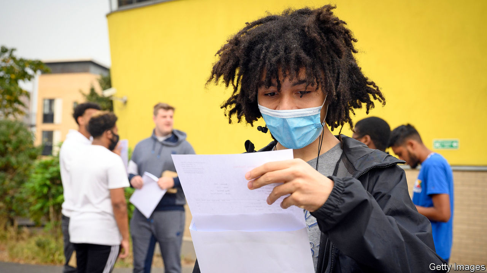

## Exam results

# Arbitrary A-level results are normal

> Complaints have forced a government U-turn, but results are surprisingly random in normal times

> Aug 15th 2020

A-LEVEL RESULTS day is traditionally a busy one for pubs and an excuse for newspapers to publish pictures of young women jumping in celebration. This year, it was like no other.

When the schools closed and lockdown began in March, Gavin Williamson, the education secretary, announced that this year’s exams would be cancelled and Ofqual, the examination watchdog, exam boards and teachers would instead work out a grade for each student. The system they devised looked at how teachers ranked their students as well as the marks they had given them, and calibrated those results against the school’s past performance.

On August 12th, two days before the results were released, the government changed course. A-level students unhappy with their grade, it decreed, will now be able to substitute it for what they had achieved in a mock exam, or instead physically sit the exam in September.

Scotland caused the U-turn. The results of Scottish Highers, the equivalent of A-levels, calculated in much the same way as the English results, were released on August 6th. Some 125,000 results had been downgraded from teacher estimates. And though only 6.9% of marks at affluent schools, which tend to perform better, were downgraded, 15.2% of grades at schools in poorer areas were notched down. Pupils complained of being judged on their postcode rather than their ability. The Scottish government abandoned moderation and announced that only teacher assessments would be used to grade students. As a result, the overall pass rate jumped to 89.2%, up from 74.8% in 2019.

Mr Williamson is aiming to avoid the outrage that followed in Scotland without seeing a similar leap in grades. That will be tricky. Teachers argue that mock exams are a poor substitute for the real thing and practices vary widely between schools, with some marking them more harshly to encourage pupils to work harder.

Judging students by their schools rather than their own achievements strikes many as unfair, but the system may end up being no more inaccurate than it usually is. In 2018 Ofqual published the results of a multi-year investigation into marking. An experienced examiner marked papers in 14 A-level subjects and then compared the grades they gave with the ones awarded by the normal process. In around a quarter of cases the senior examiner awarded a different mark. In maths, only 4% of papers received a different grade but in essay-based subjects such as history, it was 44%. Ofqual insists that this does not mean that 44% of history A-levels are awarded the “wrong grade” but merely that many papers could “legitimately” be marked differently. That is scant consolation for a candidate who has got a C when another examiner might have given them a B.

However things work out for this batch of students, they will have a better-than-usual chance of getting into the college of their choice. Universities are desperate for domestic students to replace the foreigners who won’t be turning up next term.■

## URL

https://www.economist.com/britain/2020/08/15/arbitrary-a-level-results-are-normal
