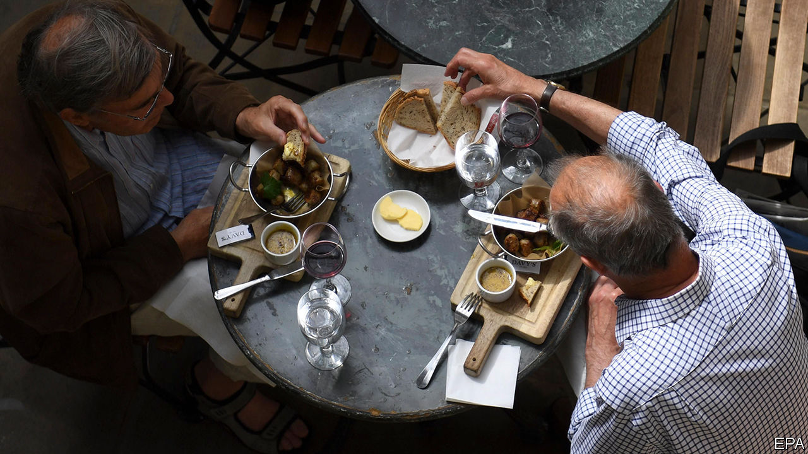
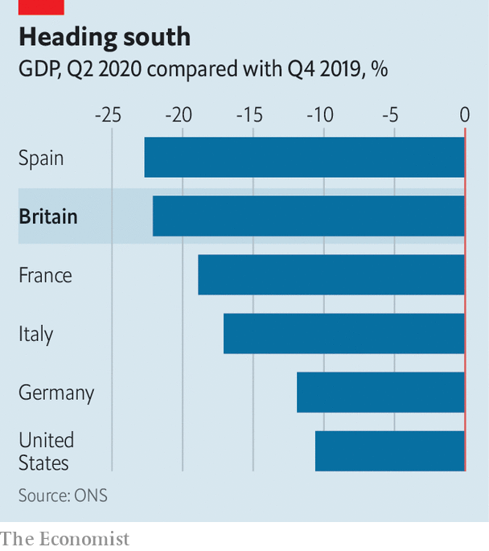

## The economy

# Britain’s disastrous GDP figures

> The economy has been particularly badly hit by the covid-19 recession

> Aug 15th 2020

WHEN BORIS JOHNSON opened the year with a video message promising an “exhilarating decade of growth, prosperity and opportunity”, his supporters were quick to predict a new “roaring 20s”. They were not so wide of the mark. This year has opened with Britain’s deepest recession since the post-first-world-war crash of 1919 and 1920.

A later lockdown than in many other rich countries led to better numbers in the first quarter of 2020, but the 20.4% GDP contraction in the second quarter was the deepest on record. Over the first half of the year as a whole GDP shrank by 22.1%. The length of the lockdown—restaurants and pubs reopened in July, later than in most of the rest of Europe—was the primary cause. School closures made life especially difficult for households in which both parents work, and Britain has a lot of those. Lockdown’s impact on data collection probably means these estimates are less reliable than usual, but the broad picture is clear.

The economy returned to growth in May, and in June GDP grew by 8.7%, the fastest rise on record. But big percentage increases after a huge fall are misleading. Google’s mobility data suggest that Britons have been slower to return to shops, and to start eating and drinking out again, than other Europeans. The climb out of the hole will be a long one.

Editor’s note: Some of our covid-19 coverage is free for readers of The Economist Today, our daily [newsletter](https://www.economist.com/https://my.economist.com/user#newsletter). For more stories and our pandemic tracker, see our [hub](https://www.economist.com//news/2020/03/11/the-economists-coverage-of-the-coronavirus)

## URL

https://www.economist.com/britain/2020/08/15/britains-disastrous-gdp-figures
