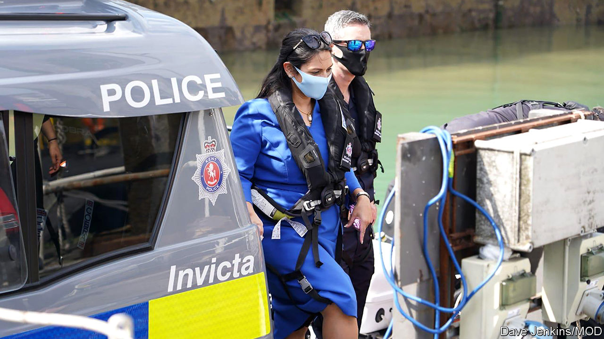

## Immigration

# Britain’s migrant invasion that wasn’t

> A sense of proportion would help

> Aug 15th 2020

AS BRITAIN SWELTERED in a heatwave—or, as most Europeans would describe it, summer—Priti Patel was far from the only Londoner to go southwards in search of sea air. But the home secretary’s outing, on August 10th, was hardly a jolly. Her day was full of pow-wows with border guards, not of ice cream and sandcastles. In Dover she clambered aboard a police vessel named Invicta and conferred with officials, a latter-day Boudicca inspecting her troops.

A steady trickle of migrants attempting to cross the English Channel in dinghies from camps in Calais has inspired a sea of tabloid headlines. Nigel Farage, a loudmouth Brexiteer, made hay. Tory MPs joined in, too: Natalie Elphicke, who represents Dover, accused incomers of “breaking into our country”; a group of 25 members of the parliamentary party saw not bedraggled groups of people desperate enough to risk drowning but hordes of “invading migrants”. Ms Patel’s trip to the seaside was an attempt to placate such critics. “Ministers want to get it off the front page of the Daily Mail,” says David Wood, a former head of immigration enforcement at the Home Office.

Populists in the media and Parliament make much of a steep rise in such crossings, from about 2,000 last year to 4,000 or so this year, according to an unofficial tally. Less remarked on is that this represents a small fraction of those who claim asylum in Britain: last year they numbered 36,000. And despite the myth that most migrants make a beeline for Britain, far more seek asylum in France (about 124,000 last year) or Germany (142,500). Photographs of the needy huddled in unseaworthy craft recall the migrant crisis of five years ago. But, says Laura Padoan of UNHCR, the United Nations’ refugee agency, “it’s really misleading to talk about a crisis. When I was in Greece in 2015, there were 11,000 people arriving on an island every day.”

Britain’s focus on the issue is regarded with some bemusement across the Channel. On August 11th Chris Philp, the immigration minister, was dispatched to Paris where, according to a press release, he held talks with “the French government”. Such circumlocution did not quite disguise the fact that his hastily-arranged meeting was with officials, not his opposite number: neither of the ministers concerned deigned to interrupt their summer break.

Still, hashing out a plan to stop the crossings—ideally by making it easier for migrants to apply to join relatives in Britain as well as by stepping up French intelligence-gathering and border patrols—is a good idea. That is not because this luckless flotilla poses a threat to Britain; rather that the Channel is the world’s busiest shipping lane. No route is safe—migrants who cross by lorry risk asphyxiation—but this one is particularly dangerous.

A crackdown would also deprive organised criminals of a lucrative revenue stream. Migrants pay smugglers between £1,000 ($1,300) and £5,000 for the 21-mile crossing, depending on the seaworthiness of the vessel, says Mr Wood. And it would deter potential migrants from making the long journey to France in the hope of crossing the Channel. “The black-market migration industry can adjust very quickly to how countries manage their borders,” says Henry Sherrell, an immigration wonk. “If you don’t get on top of it, something small can become something large.”

Any solution requires cross-Channel co-operation. When the Brexit transition period ends in December and, with it, Britain’s right to return incomers to the country where they first claimed asylum, ministers will become even more reliant on France. Hostile press briefings implying that the French government is holding Britain to ransom by “demanding” £30m for enhanced border measures are counter-productive. If this really is a crisis, it is an unusually cheap one to tackle. ■

## URL

https://www.economist.com/britain/2020/08/15/britains-migrant-invasion-that-wasnt
