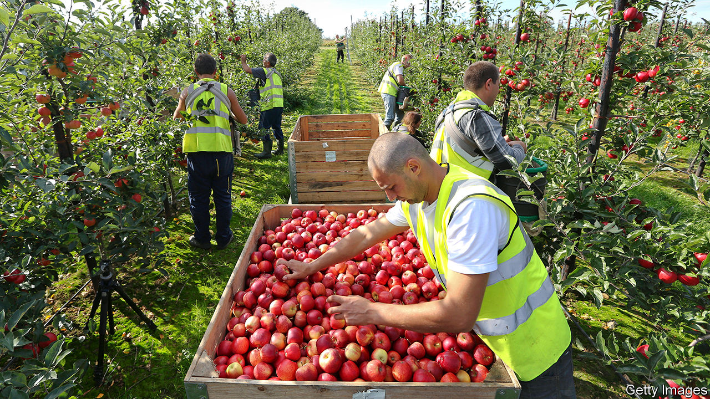

## Farm labour

# Inexperienced workers make for a difficult harvest

> Britain’s migration system is ripe for reform

> Aug 13th 2020

AT STOCKS FARM, on the border between Herefordshire and Worcestershire, where Alison Capper’s family has grown apples and hops for 58 years, the year has a natural rhythm in normal times. Migrants from eastern Europe arrive in February to prepare the orchards—thinning apples, training hops, planting trees. They pick fruit in summer and autumn. By November, they are back home. But this year, they were hard to come by, so Mrs Capper had to supplement her labour force with locals.

Even before covid-19, rising incomes at home and Brexit had put eastern Europeans off. Concerned about labour shortages, the government expanded the seasonal workers’ scheme—a pilot system to allow non-EU farm workers into Britain—from 2,500 to 10,000 in February. Russians, Ukranians and Barbadians filled the gaps in orchards and polytunnels left by Bulgarians, Hungarians and Romanians. Canny farmers continued to bring foreign workers into the country throughout the crisis.

Then came covid-19, and with it travel restrictions. The government created Pick for Britain, a loose network of campaigns, to get British people to fill some 70,000 fruit-picking vacancies. An avalanche of early interest saw Britons make up some 35% of the workforce in May, but they are now down to a tenth. Mrs Capper got a ragged bunch of students, furloughed construction workers and an events worker. Most left before the harvest began.

Despite the difficulties, most farmers still managed to recruit eastern Europeans. Four-fifths of the workers at Angus Growers, a co-operative of 19 soft-fruit farms in Scotland, are from the EU. But many farmers have had to use Britons too, and their productivity has caused problems. At two large soft-fruit farms in south-east England British workers picked at a rate of 15.2kg and 16kg per hour, compared to eastern Europeans’ 28.1kg.

When labour was plentiful, slow workers would have been weeded out and replaced early in the season, but now farmers have to make do with what they can get. Angela Porchez, general manager of Angus Growers, has had to take many British workers off fruit-picking and give them easier husbandry tasks (deflowering, cutting runners, thinning plants and weeding) which are less time-sensitive.

Labour costs—which make up around 70% of total costs—have risen by 9-15%, according to a report by Andersons, a consultancy. Social-distancing measures in packhouses are partly responsible, says John Pelham, author of the report; so is the new workers’ lack of experience. “It takes new workers a period to become commercial. It doesn’t really matter whether they come from Bulgaria or Bolton, they require training in something they haven’t previously done.” This year’s problems come on top of a 34% rise in the minimum wage over the past five years, when prices have stagnated: wholesale strawberry prices are slightly lower now than five years ago.

Rising costs for farmers do not affect supermarket prices, which are agreed with growers long before the season starts. It is profits that have taken the hit, with producers of labour-intensive crops such as strawberries and asparagus most affected. Many crops’ profitability is now “alarmingly marginal”, according to Mr Pelham. In the longer run, labour problems will force prices up, which is likely to reduce demand for British produce.

Farmers fear that, under the current rules, they will have to rely more on Britons in the future. In the short term, they are lobbying for an expansion of the seasonal workers’ scheme to increase the number of temporary non-EU farm workers. In the long term, they want the government to stop prioritising better-paid, better-qualified migrants. “We have an immigration policy that just isn’t fit for the future of farming,” says Tom Bradshaw, vice-chairman of the National Farmers’ Union.

Farmers dream of something like New Zealand’s working-holiday visa, that lets young people travel and work in the country for a year. “There are two choices,” says Mr Bradshaw. “You insist on having a UK workforce and have lower productivity, higher costs of production and higher food costs, or the other way is enabling migrant workers to come over.”■

## URL

https://www.economist.com/britain/2020/08/13/inexperienced-workers-make-for-a-difficult-harvest
