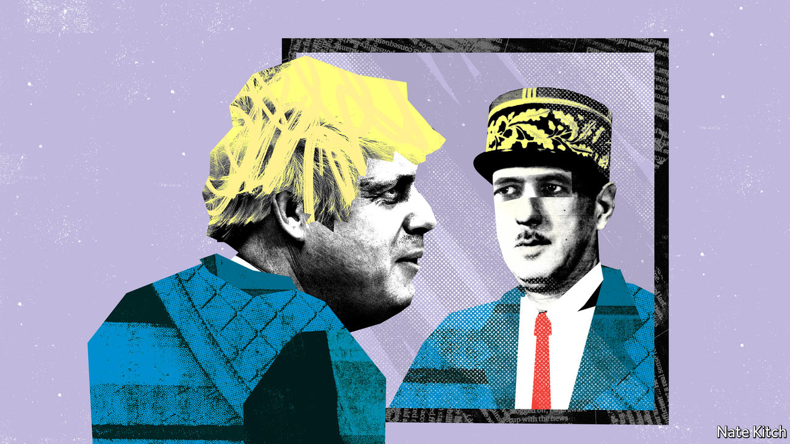

## Bagehot

# What Boris could learn from de Gaulle

> The man who rebuilt post-war France has some important lessons for Britain’s prime minister

> Aug 15th 2020

BORIS JOHNSON is taking a fortnight’s holiday in Scotland, armed with a volume of Lucretius, William Boyd’s novel “Any Human Heart” and Brendan Simms’s “Britain’s Europe: A Thousand Years of Conflict and Cooperation”. Few would begrudge him his break: he has lived a lifetime in the past year, having got divorced and remarried, had another child, almost died of covid-19 and struggled with the worst crisis since the second world war. But Bagehot would nevertheless suggest adding a fourth book to his pile—Julian Jackson’s “A Certain Idea of France: The Life of De Gaulle”. Though hefty, the book is enthralling, and offers a wealth of ideas with which to fill the empty box labelled “Johnsonism”.

Mr Johnson is keen on great men. He has written a biography of his hero Churchill and, modesty not coming naturally to a man who as a child announced that he would become “world king”, has recently taken to comparing himself to Franklin D. Roosevelt. But in many ways de Gaulle is a better fit than either. The French president saw eye to eye with Britain’s prime minister on the biggest issues. He regarded the nation-state as the basic building-block of civilisation. He opposed Britain’s membership of the EU on the grounds that Britain by its nature “looks to the sea, towards wider horizons”. He devoted his post-war career to restoring confidence and dynamism to a country that had lost the first in the war and had fallen behind in the second for decades.

Though Britain’s situation is hardly as desperate as France’s in 1945, there are similarities. The 2016 referendum spoke of profound dissatisfaction with the old regime. Confidence in national institutions is at a low ebb. Sections of the left identify “Britishness” with slavery and plunder while sections of the right want to build walls against modernity.

De Gaulle tackled France’s loss of self-confidence by speaking for “la France profonde” and insisting that “France cannot be France without grandeur”. France could easily have wallowed in despair after the war or—what amounted to the same thing—listened more enthusiastically to Marxist intellectuals such as Jean-Paul Sartre. De Gaulle regarded national pride as the only cure for national suicide. Mr Johnson has the same life-preserving instincts. He likes to think that he speaks for Middle England. He identifies Britain with “greatness” as naturally as the general identified France with “grandeur”. He is repulsed by the left’s characterisation of Britain’s past as nothing but a story of oppression and exploitation. It is not only factually wrong, in his view: it is also damaging to teach children to be ashamed of their country’s past.

The general looked forward as well as back: he knew that the best way to restore France’s grandeur was not just to talk about it but to revitalise the country. He ushered in the Fifth Republic, turning the state into an instrument of modernisation, creating a new technocratic elite, rationalising government and investing in infrastructure. France enjoyed “les trente glorieuses”, from 1945 to 1975, when GDP grew at an average of 6% a year.

Mr Johnson shares some of these instincts. He senses that the old political order is crumbling—hence his bold raid on northern voters. He senses that the Tories need to give a more active role to the state—hence his enthusiasm for big infrastructure projects such as HS2, a new railway, and even HS3 (a high-speed link between Leeds, Manchester and Liverpool). His description of himself as a “Brexity Hezza”—referring to Michael Heseltine, a leading Tory critic of Thatcherism, who believed that the state should take the lead in regenerating poor areas—is almost a way of saying “a Gaullist”. His two closest allies, Michael Gove, the cabinet-office minister, and Dominic Cummings, his chief adviser, want to put reforming the state at the heart of politics.

So far Mr Johnson’s moral laziness has prevented him from making the best of these instincts. He has made a mockery of his talk of reforming the state by dumping a collection of cronies on the House of Lords, for example. A reading of Mr Jackson’s book might remind him of the importance of both dignity and high seriousness in political affairs. Not that he should go the whole de Gaulle—that would produce an absurdity—but he would benefit from mixing some gravity into a persona that was crafted decades ago and is in danger of outliving its usefulness. It might also provide him with some ideas. One of the first things the general did in 1945 was to give the green light to the creation of the École Nationale d’Administration, in order to train hauts fonctionnaires in the arts of modern government. A British ENA would send a powerful message that Britain wants its crème de la crème to serve the state rather than McKinsey or Goldman Sachs.

De Gaulle also has some darker skills to impart. A pragmatist as well as a romantic, he was a master of the art of betrayal. He repeatedly sold his friends down the river, most obviously the pieds noirs French settlers in Algeria by granting the colony independence. But he turned the boiling hatred this provoked into another source of strength by treating hatred of de Gaulle as hatred of France. Mr Johnson is no slouch when it comes to betraying people: during the Brexit talks he was quick to dump his once staunch allies, the Ulster Unionists, by agreeing to a border in the Irish Sea. But he needs to work on managing the hatred he arouses.

De Gaulle did not much care much for the country that gave him refuge while he was in exile, and even came close to declaring war on Britain in 1945 over France’s imperial interests in Syria. His British fan club is, understandably, small; but it includes some influential names on the right, including Peter (now Lord) Lilley, one of the architects of Thatcherism, and David Frost, the new national security adviser. Without joining the club, Mr Johnson might consider borrowing at least a few of the great man’s ideas, as he tries both to revive Britain’s creaking state apparatus and to embrace the wider horizons which de Gaulle saw as its destiny. ■

## URL

https://www.economist.com/britain/2020/08/15/what-boris-could-learn-from-de-gaulle
