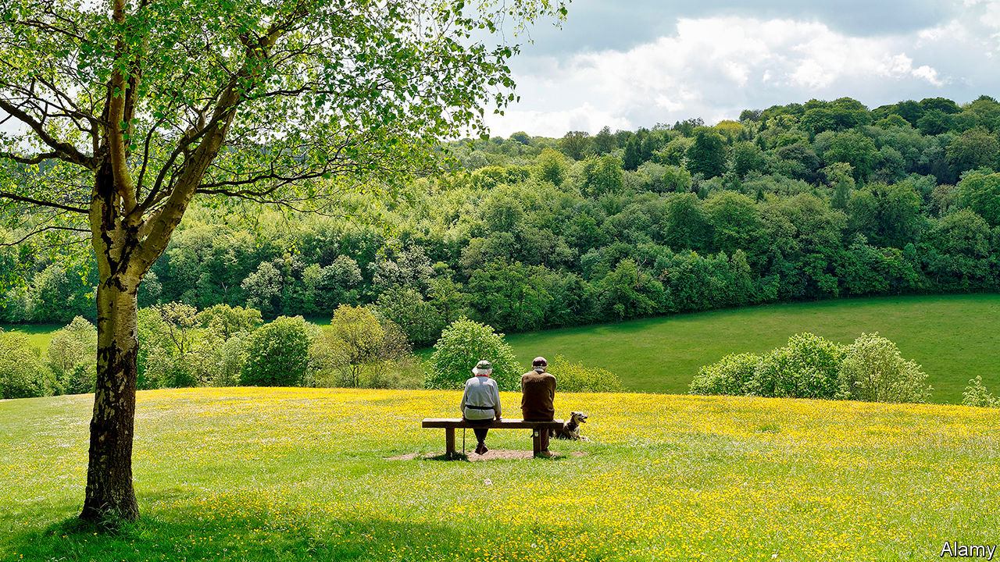
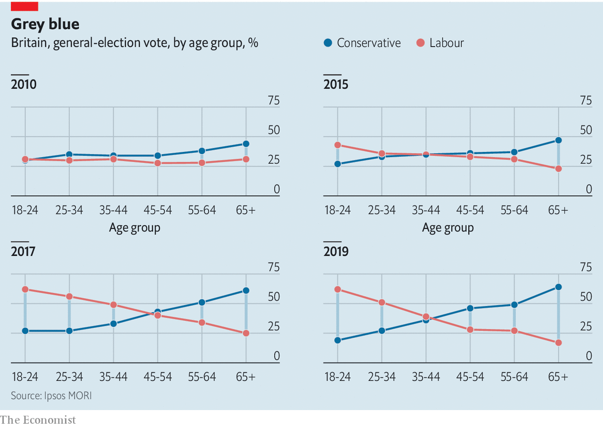
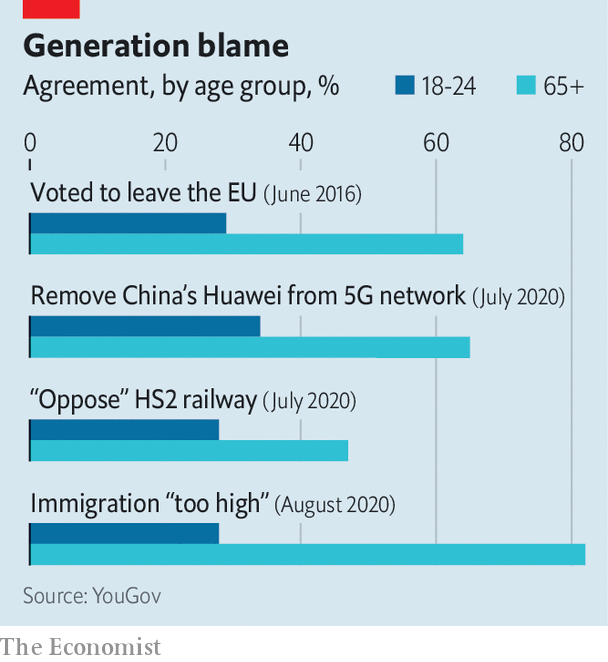

## The economy

# Why Boris Johnson’s grey army is bad for growth

> The Conservative Party relies on old voters. That’s bad news for the economy.

> Aug 15th 2020

CLIVE THINKS immigration has overwhelmed the health service. Pat says her town is swamped by new housing. Elizabeth voted for Brexit, but doesn’t want a trade deal with America, “especially the pharmaceutical side of it, Trump and his chickens.” So did Kathleen, but she now thinks a no-deal exit will mean shortages of groceries and medicines. “I’m prepared to do without stuff,” she says.

They are part of a focus group organised by NatCen, a social-research institute, studying “affluent eurosceptics”, a Conservative-leaning middle-class tribe. Nearly half the group is over retirement age. They lament their children’s europhilia, their grandchildren’s idleness and the decline of Britain’s industrial prowess. Yet the thread that links their views is a preference for policies that harm growth, and an aversion to those which boost it.

Older voters have long leaned Tory, but in the past decade politics has polarised dramatically along age lines. In 2019, 36% of Tory voters were pensioners, up from 29% in 2010, when the Tories came to power; 56% were over 55.

The Conservative Party used to worry about being hip. In 1977, a 16-year-old William Hague told its conference that it faced extinction without first-time voters. Now, he notes, the party has increased its share of the vote in six successive elections without their help. John Major got a bigger slice of the under-35s when he lost in 1997 than Boris Johnson did when he won in 2019.

The Tories still worship at the Church of Thatcher. Boris Johnson preaches deregulation, globalisation and wealth-creation with the same gusto as his predecessors. But the ageing congregation mumbles through the prayers. Growth means spoilt views and social change. Age is a solid predictor of attitudes to Brexit, a process which has seen constitutional principles repeatedly put before cold economic interest. The old are more likely to oppose immigration and to prioritise spending on health care over education.

Onward, a think-tank close to the government, reported last year that the old are especially hostile to the “drivers of prosperity in the modern liberal market economy”. They are more likely to agree with statements such as “globalisation has not benefited most people”, “jobs and wages have been made worse by technological change” and “more people living in cities has made society worse.”

Older voters’ indifference to growth is understandable, for they have less skin in the growth game. Vincenzo Atella and Lorenzo Carbonari of Tor Vergata University of Rome argue that some European countries underinvest in education and technology because “impatient” old elites don’t expect to reap the long-run benefits. Why pay for a railway that you won’t be alive to ride? Working people feel every bump in the economy, but British pensioners’ well-being is decoupled from the economic cycle in part by a “triple lock”: state pensions rise by the highest of wage growth, inflation or 2.5%. Pensioners’ incomes grew by 20.6% in 2009-20, against 5.4% for working-age people. They worry less about paying rent or a mortgage: 46% of Mr Johnson’s voters own their homes outright.

Freeing pensioners from fear of poverty is a worthy policy. But wealth and security leave older voters insulated from the economic consequences of their cultural preferences, argue Nick Pearce and Joe Chrisp of the University of Bath. “You have a group who are able to vote on things like Brexit without regard to the immediate economic consequences that face somebody in work,” says Mr Pearce. An ex-cabinet minister from the Home Counties agrees. “The economic arguments did not resonate with people whose well-being is not dependent on the performance of the economy,” he says. “In my constituency people would say to me, ‘What do we need growth for?’”

Mr Johnson has shown some willingness to confront his voters. Pensioners oppose his decision to support High Speed 2, a new rail line, by more than three to one, while young people were evenly split on it. One of his main policy planks, “levelling up”, implies more growth in poorer areas, but this barely challenges the beliefs of Tory-voting nimbies in the south-east. As far as they are concerned, growth in other people’s back gardens is fine. Mr Johnson’s reforms to the planning system, announced on August 6th, might have threatened their back gardens, but concessions to nimbies ensure that the green belt, which prevents prosperous towns and cities from expanding, remains protected.

Mr Johnson’s plan to offset the costs of Brexit by making Britain a nimbler, globetrotting place is not popular among the old. A trade deal with America will require loosening food regulations, to which pensioners are particularly hostile. Mr Johnson calls himself a Sinophile, but his MPs have pushed him into banning Huawei, a telecoms company, from Britain’s fifth-generation (5G) mobile network on security grounds. Older voters, unlike the young, overwhelmingly support the move even if it harms trade with Beijing.

Yet Brexit itself, the policy that brought Mr Johnson to power, is overwhelmingly popular with the old and unpopular with the young. Government spending over the past decade has greatly favoured the NHS, which the old use much more than the young do, over education: health spending has risen from 6% of GDP to 7% over a decade, while education spending has fallen from 6% to 4%. Mr Johnson continues to prioritise the NHS, while his plans for child care, a productivity-booster as well as a help for young parents, are stingy.

Coronavirus brings new tensions. The health costs have fallen on the old, and the economic toll on the young. Rishi Sunak, the chancellor, will need to suspend at least temporarily the triple lock when wages rebound next year. At some point, taxes must rise or spending fall. Mr Johnson is averse to austerity, and hiking taxes on wages and profits would be unwise in a recession. The Social Market Foundation, a think-tank, argues for higher taxes on property. They would hit minted pensioners the hardest.

Mr Johnson’s choice will reveal whether he wants to appeal to his base or reach out beyond it. Lord Hague thinks the Tories can thrive on an ever-replenishing supply of old people. But David Willetts, a former Tory minister and author of “The Pinch”, a book on intergenerational fairness, argues that “strategically appealing to the older generation of Tory voters at the expense of the young is not a great long-term bet.” The next generation of old people will be less insulated than this one against the impact of a sluggish economy.

Increasingly, Britain is governed in the interests of voters with an insatiable demand for health care and pensions, while a sluggish economy struggles to fund them. But it would take a brave Tory to make the grey voter pay more tax. “Everything I’ve got I’ve earned,” says Kathleen. “The generation under me just seems to expect everything to be given to them.”■

## URL

https://www.economist.com/britain/2020/08/15/why-boris-johnsons-grey-army-is-bad-for-growth
