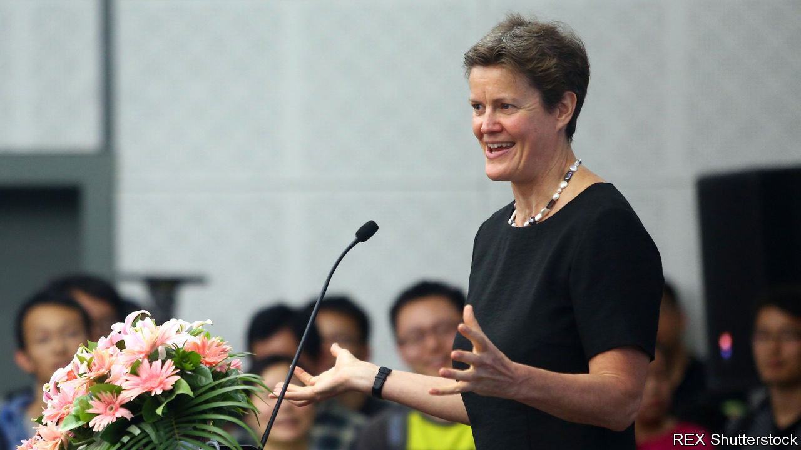
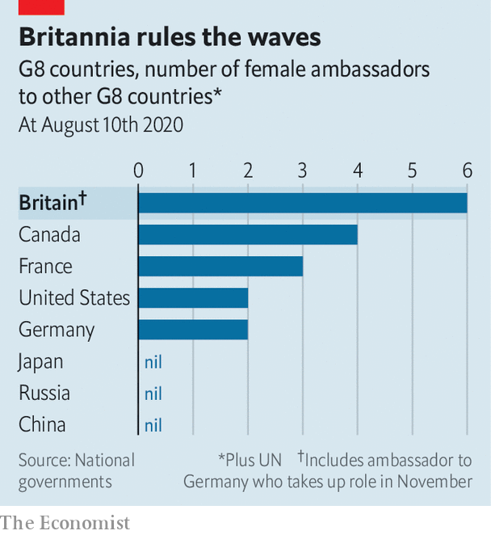

## Government jobs

# Why most top Foreign Office posts are held by women

> Bureaucrats’ lessons for business

> Aug 15th 2020

BEFORE 1946, women seeking a role in the Foreign Office could become typists, cleaners or diplomats’ wives, although in 1934 a forward-thinking ambassador suggested they help pick out soft furnishings for the Office of Works. Until 1972 they had to leave the service on getting married; “pestering”, as Dame Nicola Brewer, a former High Commissioner to South Africa, would later recall, was a scourge in the 1980s. “Making a fuss would be career-limiting.” Such treatment left a long shadow. After the current head of the service, Sir Simon McDonald, was knighted in 2014, there were as many men called Sir Simon in the top two grades of officials as women.

But in the past few months, women have seized a clutch of the top jobs. In February Dame Karen Pierce was appointed ambassador to America, becoming the first woman to hold the role since it was created in 1791. Her old job of permanent representative to the United Nations was filled by Dame Barbara Woodward on August 6th. Women fill the ambassadorships to Britain’s other best pals in the Five Eyes intelligence-sharing pact: Australia, Canada and New Zealand. Sarah MacIntosh speaks for Britain at NATO. Women hold the ambassadorships in Beijing, Moscow, Rome, Mexico City, Stockholm and the Vatican, and are soon to take up post in Germany and the Netherlands. They fly the Union Flag in the stickiest spots: Afghanistan, Zimbabwe and Belarus. In total, nearly a third of Britain’s ambassadors, heads of mission or governors are women.

Firms that wish to deal with their own gender imbalances can take some lessons. One is that the leadership needs to be candid about the problem. In 2018, Sir Simon had a wall of mirrors erected in the Foreign Office’s headquarters, each representing a top job that a woman had yet to fill, and encouraging passing women to put their face in the frame. Over time the mirrors have been replaced by portraits of those who got the posts. Some field-seasoned officials find the exercise “a bit cringe”, but it sends an unambiguous message.

Another lesson is the need to build a reliable pipeline. The current crop of female ambassadors began their careers several decades ago. The Foreign Office receives thousands of applications from top graduates each year, which means there’s no excuse for not creating a diverse intake. This year’s fast-stream intake was 60% female, and nearly a quarter non-white. And it’s no good scrabbling round for Mandarin-speaking women the moment a plum China post is advertised. The field of potential applicants for senior jobs is surveyed several years in advance, and potential candidates head-hunted and given advice on how to get themselves qualified.

Another practice is to bunch vacancies together. Filling them one-by-one can result in women becoming the serial runners-up, whereas interviewing for half a dozen at a time forces management to look at the bigger picture.

Then there is flexibility. Diplomatic life has traditionally meant moving a whole family from country to country every few years. But the life of a “trailing spouse” is increasingly unattractive for modern couples. The FCO no longer expects husbands or wives to toil on the cocktail circuit; some diplomats in posts close to Britain commute between their home and their posting each week.

The diplomatic corps is still some way short of its aspiration of looking like the Britain it serves. NneNne Iwuji-Eme, Britain’s High Commissioner in Mozambique since 2018, is the first black woman to hold the rank. Officials would like to see more non-white diplomats follow. Sir Simon will be succeeded next month by Sir Philip Barton as the permanent under-secretary, a post a woman is yet to hold, and women are outnumbered on the management board. But next month Britain’s aid department, which is a bit more diverse, will be subsumed into the Foreign Office. As in the private sector, a merger brings the opportunity to shake things up at the top.■

## URL

https://www.economist.com/britain/2020/08/15/why-most-top-foreign-office-posts-are-held-by-women
