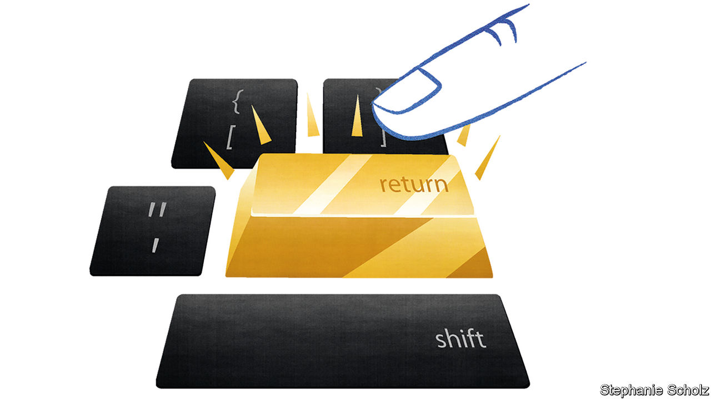

## Schumpeter

# Big Tech is the new dividend royalty

> Slashed payouts reveal a shifting balance of corporate power

> Aug 15th 2020

IN THE SHARP-ELBOWED world of business, the dividends that firms pay to their shareholders are often considered a bloodless topic. Compared with share prices, they rarely set pulses racing. Corporate-finance theory says that dividends are largely irrelevant to a company’s underlying value and its shareholders’ wealth—just as withdrawing cash from an ATM machine doesn’t make you richer. Accountants grumble that dividends can increase tax bills. Cynics shrug them off as hush money to shareholders. In America over the past few decades, they have increasingly been overshadowed by the more controversial practice of share buy-backs.

For business historians, though, dividends are full of drama. Their spiritual home is Europe, where they were born as ways of divvying up the spoils of Dutch and British shipping monopolies in the 17th century. On both sides of the Atlantic they accelerated during the railway boom of the 19th century, often through nefarious schemes to keep payments flowing so as to lure gullible new investors. Egregious payouts in the Roaring Twenties helped fuel the Wall Street crash of 1929, yet after the Depression they were seen as the best way to restore investor faith. Psychologically, they are intriguing. The promise of hard cash provides a conduit between managers and investors that some consider more reliable than earnings reports. Those seemingly bland dividend cheques provide a wealth of information that is easy to overlook.

The story they revealed as they dropped through shareholders’ letter boxes—or not—during the covid-19 pandemic only added to the cooped-up recipients’ woes. In Europe especially, a rash of dividend cuts showed how sick many of the region’s most blue-blooded firms were. Royal Dutch Shell and BP, two European oil majors, bowed to the inevitable toll of collapsing oil prices and took an axe to their dividends. Across Europe banks and life insurers, mainstays for many income-hungry pension funds, have suspended payouts under pressure from financial regulators. The unmistakable picture is of corporate Europe’s fragility and decline.

In America it is a different story. Firms there tend to prefer share buy-backs. Last year, for instance, the biggest American companies paid out an average of 41% of profits as dividends; comparable European firms paid out 66%. The respective shares for buy-backs were 59% and 23%. One reason for the preference is that American rules make repurchases a more tax-efficient way to return cash to shareholders than dividends. Many critics complain that American firms irrationally gorge on buy-backs as a result. But 2020 has highlighted the great benefit of this type of payout: its flexibility. As the economy tanked many big firms instantly dialled down their repurchases in order to conserve cash.

What about dividends in America? As in Europe, some so-called dividend aristocrats—ie, those who have increased the base dividend consecutively for years—were living beyond their means even before the pandemic struck, shovelling more money to shareholders than they made in profits. They include ExxonMobil as well as AT&T. The risk is that their bosses view dividend cuts as career suicide, and damage their firms’ balance-sheets in an attempt to maintain them, much as GE, a conglomerate, did in the latter years of Jeff Immelt, its ex-boss.

But overall the signal that dividends send about America Inc is of relative resilience. North American dividends (including Canadian ones) inched up in the second quarter, compared with the same period in 2019, according to Janus Henderson, an investment firm. Most big financial firms have managed to sustain their payouts even as regulators insist they build up buffers against a wave of bad debts (Wells Fargo is an exception). That fits into a longer-term pattern of American muscle: the dollar value of dividends from big firms has risen from $342bn in 2013 to $535bn in 2019, growing three times faster than dividends in Europe did.

That rise reflects the increasing generosity of a group of American companies which not long ago scoffed at dividends as condescendingly as they did suits and ties: technology firms. Strange as it sounds in the land of the buy-back, Big Tech is ascending to the ranks of the world’s dividend royalty, thanks to its prodigious and fast-growing cashflows. Since 2016, even with low payouts relative to earnings, Apple and Microsoft have been among the world’s five biggest payers of dividends in absolute terms, alongside Shell, its American rival ExxonMobil and AT&T. And because of the pandemic what would have seemed unthinkable not long ago may happen: Microsoft will probably take Shell’s crown as the world’s biggest payer among listed firms (with the exception of Saudi Aramco, the Gulf kingdom’s state-controlled oil colossus).

Once the pandemic passes it is likely that buy-backs in America will resume. Even so, the trend of growing dividends could continue, too. Many big payers have room to fork out more: Microsoft’s $15bn dividend in the financial year ending in June was barely a third of its $44bn in net profit. It had money left over even after adding a $23bn buy-back. Apple is in a similarly enviable position.

Other well-endowed firms in America could join the ranks of the payout elite—if they choose to. They include remaining Big Tech giants—Alphabet, Amazon and Facebook—and Berkshire Hathaway, Warren Buffett’s investment behemoth. None of these pays dividends. In the brave new world of near-zero interest rates, the promise of a regular dividend yield, even a relatively low one, may become increasingly enticing to investors, who may lobby stingy managers for bigger payouts.

The tech firms might fear this would make them look middle-aged. Microsoft and Apple show that dividends need not thwart corporate ambition—at least if you make enough money, which Alphabet, Amazon and Facebook do. As investors’ desperation for yield increases, these firms may sooner or later face irresistible demands to join the dividend royalty. Long may they reign. ■

## URL

https://www.economist.com/business/2020/08/15/big-tech-is-the-new-dividend-royalty
