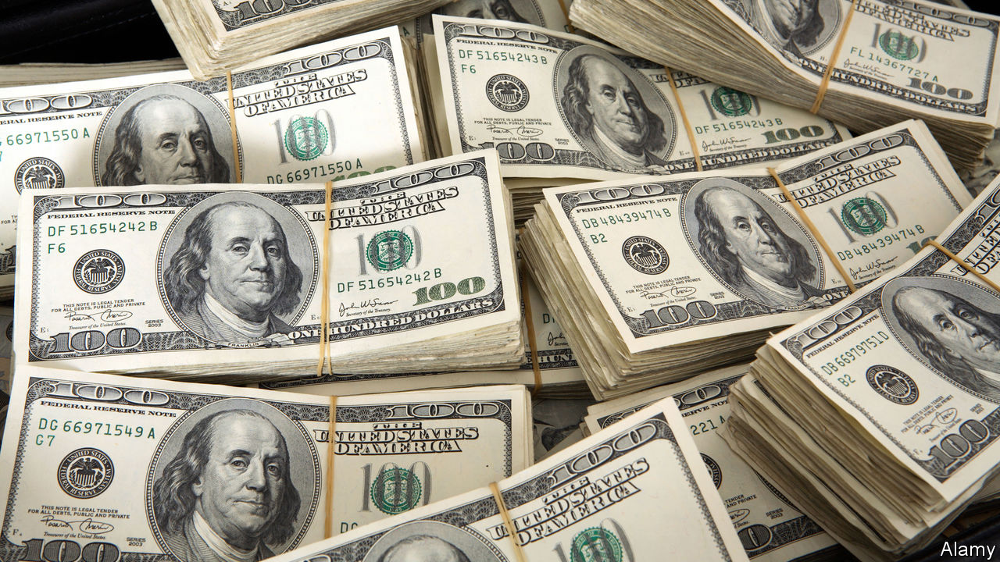

## The nuclear option

# How America might wield its ultimate weapon of mass disruption

> Freezing China out of the global payments system could have unthinkable consequences

> Aug 15th 2020

PRESIDENT DONALD TRUMP’S sabre-rattling against corporate China has had a real but, so far, limited impact on relations between the world’s two biggest economies (see [article](https://www.economist.com//node/21790864)). That could change if he decided to go all out and cut China off from the global payments system, which America controls thanks to the dollar’s status as the world’s reserve currency and lubricant of commerce.

Mr Trump has three main ways to constrain another country financially. He can refuse its banks access to CHIPS, a New York-based clearing house through which 95% of all dollar transactions are routed. He can try to force SWIFT, a Belgium-based messaging system which 11,000 banks worldwide use to make cross-border payments, to expel members from the offending state. And he can slap an embargo on its financial system, threatening to punish any foreign or domestic financial institution that uses dollars—as virtually all do—but continues to transact with the embargoed firms.

These tactics have been tested on Iran, North Korea, Venezuela and Myanmar—small economies with which America had few dealings. Mr Trump’s predecessor, Barack Obama, stopped short of deploying them against Russia after its invasion of Crimea in 2014. Doing so against China, with which America trades $560bn-worth of goods annually and whose four mega-banks are the world’s largest by assets, with large dollar loan books and liabilities, looks incomparably more fraught.

What would happen if Mr Trump nevertheless tried it? A huge shock wave would hit financial markets, already knocked about by the pandemic. The Chinese currency, along with those which track it, such as the Taiwanese dollar or the South Korean won, would suffer, says Claire Huang of Amundi, an asset manager. Hong Kong would run down its dollar reserves to try to support its peg with the greenback. Money would pour into gold.

In response, China would increasingly resort to its home-grown alternative to SWIFT, called CIPS. It would also try to persuade America’s allies in Europe and elsewhere that Washington was behaving irresponsibly. Many would not take much convincing. CIPS and the yuan, currently of marginal importance in international finance and commerce, would gain in stature at America’s expense.

China would also retaliate. It could shut its markets to Western banks and firms, block them from its infrastructure projects and limit America’s access to natural resources and basic goods it controls. And it, too, has a last-ditch deterrent: selling its $1.1trn stock of American treasury bills, equivalent to 4% of the total outstanding. America’s highly liquid bond markets may prove capable of absorbing the shock. Then again, they might not. Most observers do not consider dumping its T-bills a serious option for China, which has little interest in destabilising its system of currency reserves. But America is not the only country capable of self-harm apparently in the service of national security. ■

## URL

https://www.economist.com/business/2020/08/15/how-america-might-wield-its-ultimate-weapon-of-mass-disruption
