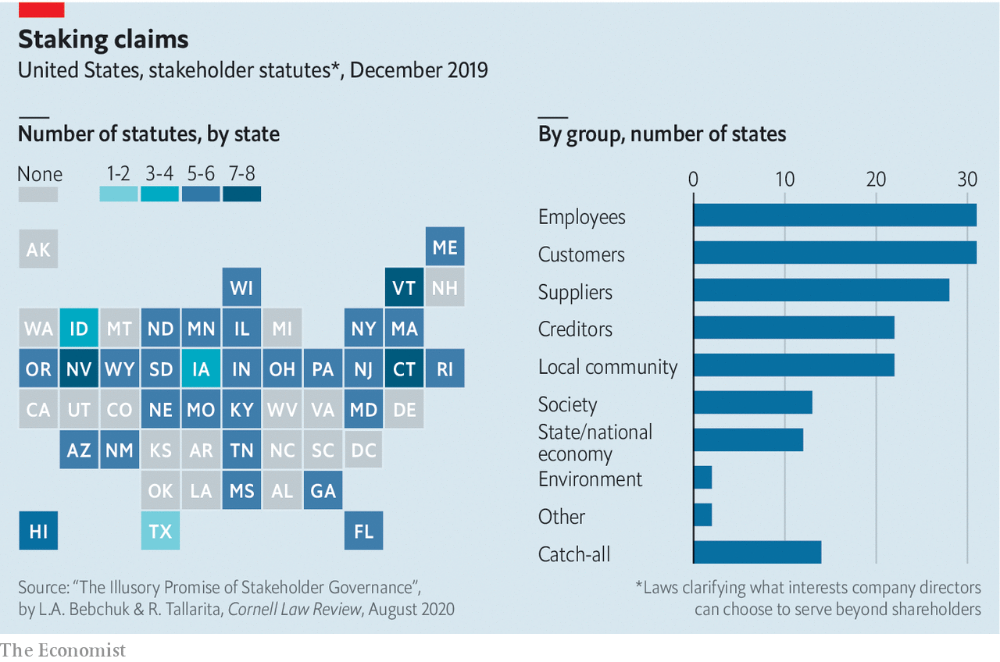

## Profits v purpose

# How American bosses juggle profits and purpose

> Of America’s 50 states, 32 have at least one law that lets a firm’s fiduciaries take some non-shareholder interests into account

> Aug 15th 2020

LAST YEAR 184 of America’s mightiest bosses vowed to manage their firms in the interest not just of company owners but also of other stakeholders—from employees to the environment. Of America’s 50 states, 32 have at least one law that lets a firm’s fiduciaries take some non-shareholder interests into account. Still, as new research from Harvard Law School suggests, many firms are only paying lip-service to the fashion for purpose. Tellingly, it finds that ceos did not consult their boards before signing the pledge: of the 48 firms for which data are available, just one boss got the board’s express approval.■

## URL

https://www.economist.com/business/2020/08/15/how-american-bosses-juggle-profits-and-purpose
