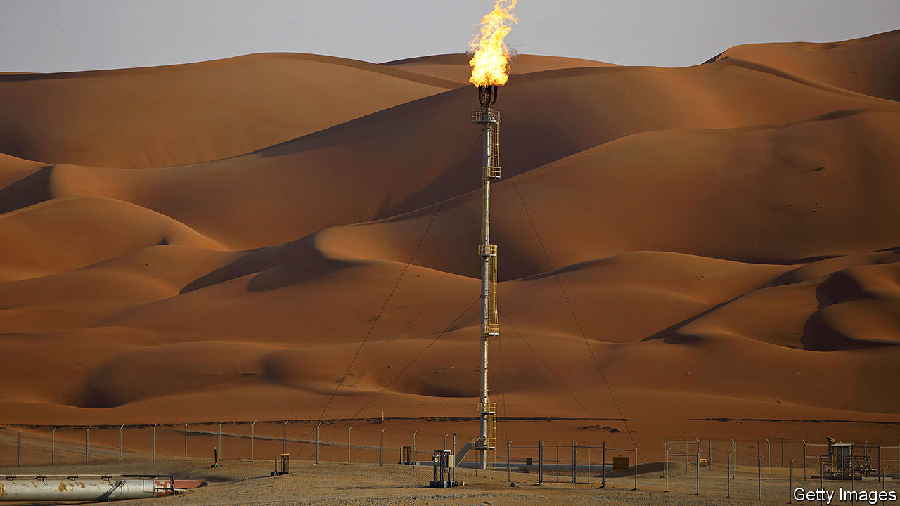
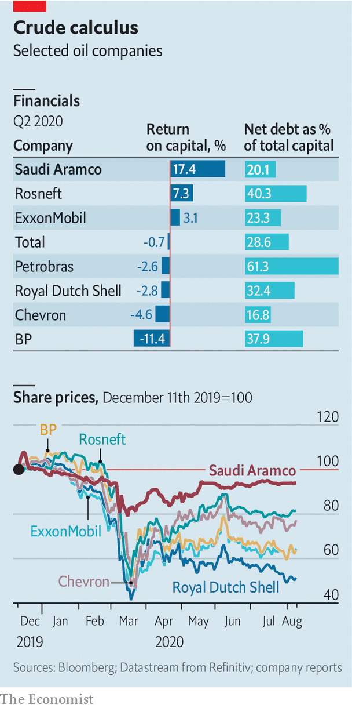

## Trial by fire

# Profits fall sharply at Saudi Aramco, the world’s biggest oil firm

> In its first six months as a public company it has shown unrivalled strength—and unusual weakness

> Aug 13th 2020NEW YORK

IN DECEMBER, WHEN Saudi Aramco listed 1.5% of its shares on the Riyadh stock exchange, it became the world’s most valuable listed company, with a market capitalisation of $1.9trn or so. The state-backed oil behemoth’s bosses assured investors that low costs and vast reserves would make it resilient in a downturn. Since then Saudi Arabia and Russia waged a short but brutal price war, covid-19 has provoked the most sudden collapse in oil demand on record, and Aramco lost its stockmarket crown to Apple, whose market value has risen by nearly 50% this year to $1.9trn, while Aramco’s has edged down by 6%. Then, on August 9th, the firm reported a 73% year-on-year fall in second-quarter profits.

The events are a Rorschach test both for Aramco’s boosters and its critics. Proponents see a firm that can produce more oil, more profitably than anyone on Earth. Sceptics point to unusual vulnerabilities, notably its majority owner’s dependence on its profits. As with all Rorschach tests, there is no one right assessment.

Start with the optimists. On August 10th Amin Nasser, Aramco’s chief executive, touted its “resilience across oil-price cycles”. Aramco may have endured more of a cyclone than a cycle this year, but Mr Nasser’s claim rings true. His firm has fared well, at least relative to rivals. It still made money, $6.8bn in the three months to June, in contrast to the likes of Royal Dutch Shell and BP, two European giants, which lost $18.1bn and $16.8bn, respectively.

Or take Aramco’s debt. At 20.1% of capital, it is above the range of between 5% and 15% the firm had promised, in part owing to its $69bn purchase of a 70% stake in SABIC, a Saudi state-controlled petrochemicals company. Yet it remains less indebted than other oil majors. Critically, its investors enjoy juicier returns (see chart). In a world where many firms are reluctantly choosing to cut their dividends (see [Schumpeter](https://www.economist.com//node/21790857))—as BP has done by half and Shell by two-thirds—Aramco is keeping its pledge to return $75bn to shareholders this year.

Aramco’s 262bn barrels of crude reserves and low production costs also allow it to limit spending without threatening future output, unlike America’s frackers, forced to pare back activity as investors sour on shale. Big international companies are slashing capital spending, too. BP and Eni, an Italian major, plan to reduce crude production over the next decade, amid investor disenchantment with oil’s returns and rising concern over climate change. If that continues, Aramco may gain market share with no need for another price war.

To the sceptics, saying Aramco is more resilient than rivals is like boasting that milk is sour but not curdled—neither prospect is appetising. The outlook for oil remains uncertain as consumer habits change, electric cars get cheaper and governments mull new climate regulations.

A bigger short-term worry is Saudi Arabia’s sway over Aramco. The firm now has minority shareholders but they remain powerless. And recent months have shown how complicated royal control can be.

Aramco’s production depends not on market forces, but on Saudi priorities. At the height of the price war in April Aramco pumped 12.1m barrels a day—an impressive feat that helped drive down global prices and lower Aramco’s profits. For every dollar the oil price falls, Aramco’s cashflow generally declines by $1.5bn, reckons Neil Beveridge of Bernstein, a research firm.

As Saudi Arabia made peace with Russia and others in an attempt to balance crude markets in May and June, Aramco has returned to its role as oil’s central banker. That is better than waging a price war in a pandemic, but still awkward for Aramco. The kingdom calibrates its output not just to support oil prices but to encourage other petrostates to do the same.

Aramco’s interests and the kingdom’s can diverge in other ways. For example, even as the market value of SABIC, which is also listed in Riyadh, has fallen over the past year Aramco did not renegotiate the $69bn purchase price agreed in 2019. Aramco’s chairman, Yasir Al-Rumayyan, also leads Saudi Arabia’s Public Investment Fund, which sold Aramco its 70% stake in SABIC and which is also tasked with investing to diversify the Saudi economy.

That economy is strained. Last year Saudi Arabia needed an oil price of more than $80 a barrel to balance its budget. Brent crude, the international benchmark, has not fetched more than $50 since February. Despite spending cuts Saudi Arabia still faces a yawning deficit.

All of Aramco’s shareholders covet the same thing: payouts. To lure investors before listing, Aramco said it would give priority to non-state shareholders’ dividends for five years, come hell, high water or cheap oil. No one really thought it would have to make that choice. Now it has borrowed to meet its $75bn dividend pledge. As Mr Beveridge notes, that stategy is unsustainable at current oil prices. Those prioritised payments remain subject to approval by the board. Sooner or later Aramco will have to decide: keep the promise to minority owners or renege? That will be a real test of its bona fides as a public company. ■

## URL

https://www.economist.com/business/2020/08/13/profits-fall-sharply-at-saudi-aramco-the-worlds-biggest-oil-firm
